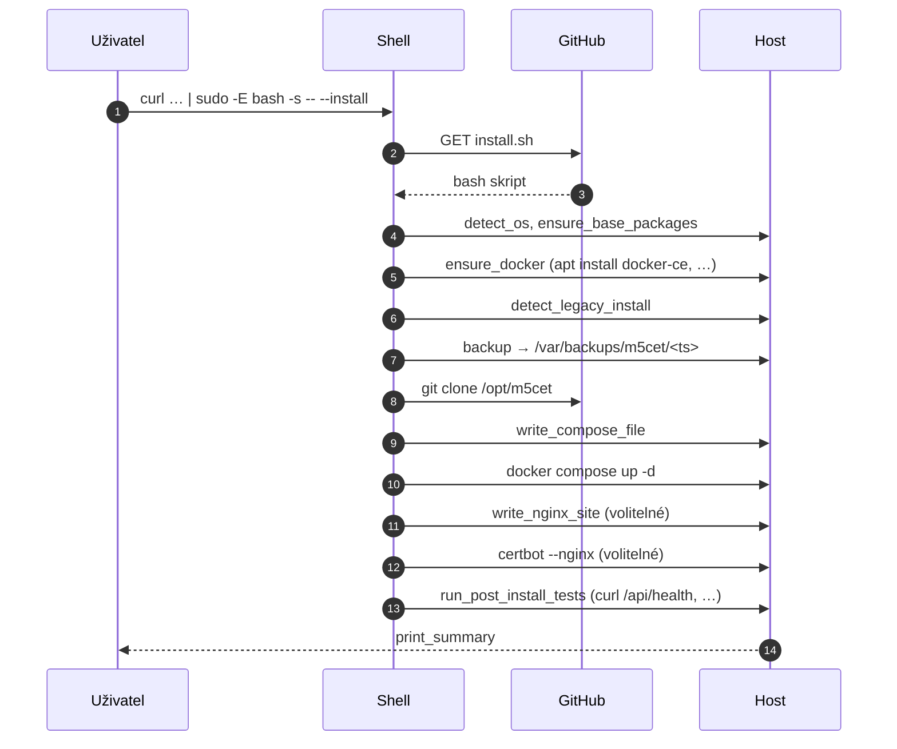

# M5cet — INSTALL.md

Detailní průvodce instalací, aktualizací, testováním a odinstalací pro
Linux / Docker / Debian-Ubuntu / generic.

> Pro rychlý start stačí `curl … | sudo -E bash -s -- --install`. Tady jsou
> všechny varianty — interaktivní, GUI menu, headless update, dry-run,
> doctor, behind Nginx + TLS.

## Obsah

1. [Požadavky](#požadavky)
2. [One-liner instalace](#one-liner-instalace)
3. [Z lokální kopie repo](#z-lokální-kopie-repo)
4. [Režimy instalátoru](#režimy-instalátoru)
5. [Update](#update-stávající-instalace)
6. [Test / doctor](#test--doctor)
7. [GUI menu](#gui-menu)
8. [Uninstall](#uninstall)
9. [Debian / Ubuntu workflow](#debian--ubuntu-workflow)
10. [Generic Linux + Docker](#generic-linux--docker)
11. [Behind Nginx + TLS](#behind-nginx--tls)
12. [Konfigurace přes ENV / .env](#konfigurace-přes-env--env)
13. [Migrace ze staré CipherRoom verze](#migrace-ze-staré-cipherroom-verze)
14. [Bezpečnostní poznámky](#bezpečnostní-poznámky)
15. [Příklady](#příklady)

---

## Požadavky

- Linux 64-bit (Debian 11+, Ubuntu 22.04+, Fedora 38+, Alpine 3.18+,
  Raspberry Pi OS 64-bit). Generic glibc systém s `bash`, `curl`, `git`, `tar`.
- `sudo` nebo přímý root přístup.
- ≥ 1 GB volného disku, ≥ 512 MB RAM.
- Docker 24+ a Docker Compose plugin v2 (instalátor je doinstaluje, pokud
  chybí — pokud máte `SKIP_DOCKER_INSTALL=1`, musíte je mít předem).
- Otevřený TCP port pro hlavní službu (default `5000`, override
  `HOST_PORT=…`).
- Pro WSS / WebRTC v produkci: HTTPS terminace na reverse proxy, ideálně
  bundlovaný `--enable-nginx --enable-tls` flow.

---

## One-liner instalace

```bash
curl -fsSL https://raw.githubusercontent.com/m5ike/cipherroom-secure-chat/release/m5cet-v-next-hardening/install.sh \
  | sudo -E bash -s -- --install
```



Skript je interaktivní. Když nechcete dotazy, použijte `--non-interactive --yes`.

---

## Z lokální kopie repo

```bash
git clone https://github.com/m5ike/cipherroom-secure-chat /opt/m5cet
cd /opt/m5cet
sudo -E ./install.sh --install
```

Po první instalaci je skript zkopírovaný do `/opt/m5cet/install.sh`, takže
další operace (update / status / restart) lze volat odtamtud.

---

## Režimy instalátoru

| Režim                            | Příkaz                                |
|----------------------------------|---------------------------------------|
| Instalace / upgrade              | `sudo -E ./install.sh --install`      |
| Update (pull + redeploy)         | `sudo -E ./install.sh --update`       |
| Test / health (read-only)        | `./install.sh --test`                 |
| Doctor (synonymum --test)        | `./install.sh --doctor`               |
| Status                           | `./install.sh --status`               |
| Logy (follow)                    | `./install.sh --logs`                 |
| Restart                          | `sudo -E ./install.sh --restart`      |
| Stop                             | `sudo -E ./install.sh --stop`         |
| Uninstall (project files zachová)| `sudo -E ./install.sh --uninstall`    |
| GUI menu                         | `sudo -E ./install.sh --gui`          |
| Verze instalátoru                | `./install.sh --version`              |
| Nápověda                         | `./install.sh --help`                 |

Globální flagy:

- `--yes, -y` — odpověz "ano" na vše,
- `--non-interactive` — nikdy se neptej,
- `--dry-run` — vypiš plán, neměň disk,
- `--skip-tests` — vynech post-install probes,
- `--branch <name>` — jiná git větev,
- `--domain <host>` — pro Nginx site,
- `--install-dir <path>` — netradiční instalační adresář,
- `--enable-nginx` / `--enable-tls`.

---

## Update stávající instalace

```bash
sudo -E /opt/m5cet/install.sh --update
```

Co dělá:

1. Detekuje existující git repo v `INSTALL_DIR`.
2. `git fetch && git reset --hard origin/<BRANCH>` (žádný interaktivní merge,
   žádný `git pull` s konflikty — předpokládá, že lokální změny tam nepatří).
3. Regeneruje `docker-compose.yml` pouze pokud existující soubor nese marker
   *Managed by M5cet install.sh*. Operátorovy customizace zůstávají.
4. `docker compose up -d --build`.
5. Spustí post-install probes (`/api/health`, `/api/modules`,
   `/api/push/status`, opt-in `/api/events/recent`, WS handshake).

Pokud `INSTALL_DIR` není git checkout, spadne na `--install` flow.

---

## Test / doctor

```bash
sudo -E /opt/m5cet/install.sh --test
# nebo
sudo -E /opt/m5cet/install.sh --doctor
```

Read-only sanity checky:

- bash / git / curl / tar / docker / docker compose binárky,
- existence `INSTALL_DIR`,
- HTTP probes na `/api/health` a `/api/modules` (pokud služba běží),
- nikdy nemění stav systému.

Vhodné pro CI / cron sanity probe.

---

## GUI menu

```bash
sudo -E /opt/m5cet/install.sh --gui
```

```text
┌─────────────────────────────────────────────┐
│      M5cet installer (v2.1.0-rc.1)          │
├─────────────────────────────────────────────┤
│  1) Install / first-time setup              │
│  2) Update (pull new code, redeploy)        │
│  3) Test / doctor (read-only health probes) │
│  4) Status                                  │
│  5) Logs (follow)                           │
│  6) Restart                                 │
│  7) Stop                                    │
│  8) Uninstall (keep project files)          │
│  9) Help                                    │
│  0) Quit                                    │
└─────────────────────────────────────────────┘
```

Každá volba volá stejnou funkci jako přímý flag — žádné nové chování, jenom
přívětivější UX.

---

## Uninstall

```bash
sudo -E /opt/m5cet/install.sh --uninstall
```

- `docker compose down`.
- Smaže Nginx site, který nese marker *Managed by M5cet install.sh*.
- **Project files zachová** v `/opt/m5cet`. Pokud je chcete smazat ručně:
  ```bash
  sudo rm -rf /opt/m5cet
  sudo rm -rf /var/backups/m5cet     # včetně záloh starých CipherRoom installů
  ```

---

## Debian / Ubuntu workflow

```bash
# 1. Předpoklady
sudo apt-get update
sudo apt-get install -y curl ca-certificates

# 2. Instalátor stáhne a doinstaluje docker, docker-compose-plugin, certbot,
#    pokud nejsou přítomny.
curl -fsSL https://raw.githubusercontent.com/m5ike/cipherroom-secure-chat/release/m5cet-v-next-hardening/install.sh \
  -o /tmp/m5cet-install.sh
chmod +x /tmp/m5cet-install.sh

# 3. Interaktivní upgrade z případné staré CipherRoom verze
sudo -E /tmp/m5cet-install.sh --install

# 4. Behind Nginx + TLS pro chat.example.com
sudo -E DOMAIN=chat.example.com ACME_EMAIL=admin@example.com \
  /tmp/m5cet-install.sh --install --enable-nginx --enable-tls --yes
```

---

## Generic Linux + Docker

Pokud máte jen Docker bez systemd (LXC, container, Docker Desktop), jeďte
přímo přes Compose:

```bash
git clone https://github.com/m5ike/cipherroom-secure-chat /opt/m5cet
cd /opt/m5cet
cp .env.example .env  # pokud existuje, nebo:
cat > .env <<EOF
ADMIN_API_TOKEN=$(openssl rand -base64 32)
VAPID_SUBJECT=mailto:admin@example.org
LOG_EVENTS=0
EOF
docker compose up -d                 # jen app
docker compose --profile admin up -d # app + admin + admin-ui
```

---

## Behind Nginx + TLS

Variantní jednorázový flow:

```bash
sudo -E DOMAIN=chat.example.com ACME_EMAIL=admin@example.com \
  ./install.sh --install --enable-nginx --enable-tls --yes
```

Co skript vygeneruje:

- `/etc/nginx/sites-available/m5cet.conf` (managed marker).
- Symlink do `/etc/nginx/sites-enabled/m5cet.conf`.
- WebSocket upgrade location `/ws`.
- `Strict-Transport-Security`, `X-Robots-Tag: noindex, nofollow`.
- `proxy_read_timeout 3600s` aby idle WSS přežil dlouhé pauzy.

Renewal certifikátů zajistí systemd timer od certbotu.

> Operátorské customizace v Nginx site jsou **zachovány** — instalátor
> přepisuje pouze soubor s naším markerem nebo když nastavíte `FORCE_NGINX=1`.

---

## Konfigurace přes ENV / `.env`

Klíčové proměnné (default v závorce):

| Proměnná              | Default                              | Význam                                      |
|-----------------------|--------------------------------------|---------------------------------------------|
| `INSTALL_DIR`         | `/opt/m5cet`                         | Kořen instalace                             |
| `BRANCH`              | release/m5cet-v-next-hardening    | git větev                              |
| `APP_PORT`            | `5000`                               | Vnitřní port Node                            |
| `HOST_PORT`           | `5000`                               | Externí port                                 |
| `BIND_ADDRESS`        | `127.0.0.1`                          | `0.0.0.0` pro veřejnou expozici              |
| `DOMAIN`              | (prázdné)                            | hostname pro Nginx                           |
| `ENABLE_NGINX`        | `auto`                               | `1` / `0` / `auto`                           |
| `ENABLE_TLS`          | `0`                                  | certbot --nginx                              |
| `ACME_EMAIL`          | (prázdné)                            | povinné pro `ENABLE_TLS=1`                   |
| `ADMIN_API_TOKEN`     | (prázdné)                            | bez něj admin služba neodpoví                |
| `ADMIN_PORT`          | `5050`                               | port admin API                               |
| `ADMIN_UI_PORT`       | `5051`                               | port admin GUI (nginx static)                |
| `ENABLE_ADMIN`        | `0`                                  | profil "admin" v compose                     |
| `VAPID_PUBLIC_KEY`    | (prázdné)                            | Web Push                                     |
| `VAPID_PRIVATE_KEY`   | (prázdné)                            | Web Push                                     |
| `VAPID_SUBJECT`       | `mailto:admin@example.org`           | povinné pole pro VAPID                       |
| `LOG_EVENTS`          | `0`                                  | metadata logging                              |
| `DATABASE_URL`        | (prázdné)                            | SQLite/Postgres pro events                   |
| `BACKUP_ROOT`         | `/var/backups/m5cet`                 | kam se ukládají snapshoty                    |
| `FORCE_NGINX`         | `0`                                  | přepiš operátorský Nginx site                |
| `FORCE_COMPOSE`       | `0`                                  | přepiš operátorský docker-compose.yml        |
| `FORCE_RECLONE`       | `0`                                  | smaž a znovu naklonuj repo                   |
| `SKIP_DOCKER_INSTALL` | `0`                                  | nepokoušej se doinstalovat Docker            |
| `FIREWALL_OPEN`       | `0`                                  | `ufw allow` pro `HOST_PORT` (jen Debian/Ubuntu) |
| `SKIP_TESTS`          | `0`                                  | vynech post-install probes                   |

Proměnné lze předat třemi způsoby:

```bash
# 1) Inline před skriptem
sudo -E DOMAIN=chat.example.com ./install.sh --install

# 2) Přes flag
sudo -E ./install.sh --install --domain chat.example.com

# 3) `.env` v INSTALL_DIR (instalátor ho zdrojuje při každém běhu)
echo "DOMAIN=chat.example.com" | sudo tee -a /opt/m5cet/.env
```

---

## Migrace ze staré CipherRoom verze

Instalátor automaticky detekuje:

- `/opt/cipherroom-secure-chat`,
- `/opt/cipherroom`,
- `/srv/cipherroom`.

Postup migrace (interaktivně i `--non-interactive --yes`):

1. **Stop legacy** — `docker compose down` ve staré složce.
2. **Backup** — `.env`, `data/`, `docker-compose.yml`, Nginx site → 
   `/var/backups/m5cet/<timestamp>/`.
3. **Migrace adresáře** in-place na `/opt/m5cet` (preferováno) nebo fresh
   clone, když to není bezpečné.
4. **Stop legacy systemd unit** — `cipherroom`, `cipherroom-secure-chat`,
   pokud existují.
5. **Vytažení nového kódu**, regenerace compose, `up -d`.
6. **Health probes**.

Záloha `/var/backups/m5cet/` zůstává neomezeně; smažte ji ručně, až ověříte,
že nová verze funguje.

---

## Bezpečnostní poznámky

- `ADMIN_API_TOKEN` musí být **alespoň 32 B random** (`openssl rand -base64 32`).
  Bez tokenu admin služba vrací `503` na vše kromě `/admin/health`.
- Admin port (`5050`) **nedávejte na public internet**, pouze za reverse
  proxy s IP allowlistem nebo na private síti.
- TLS je *povinný* pro WebRTC mimo `localhost`. Bez TLS neproběhne handshake.
- `LOG_EVENTS=1` zapíná opt-in metadata logging. Žádný plaintext zprávy
  se nikdy neukládá.
- `install.sh` zapisuje `Cache-Control: no-store` na všech response.

---

## Příklady

### Headless instalace, public Docker port:

```bash
curl -fsSL https://raw.githubusercontent.com/m5ike/cipherroom-secure-chat/release/m5cet-v-next-hardening/install.sh \
  | sudo env BIND_ADDRESS=0.0.0.0 FIREWALL_OPEN=1 \
    bash -s -- --non-interactive --yes
```

### Nginx + Let's Encrypt:

```bash
curl -fsSL https://raw.githubusercontent.com/m5ike/cipherroom-secure-chat/release/m5cet-v-next-hardening/install.sh \
  | sudo env DOMAIN=chat.example.com ACME_EMAIL=admin@example.com \
    bash -s -- --non-interactive --yes --enable-nginx --enable-tls
```

### Update existující instalace:

```bash
sudo -E /opt/m5cet/install.sh --update
```

### Doctor / health probe (cron-friendly):

```bash
sudo -E /opt/m5cet/install.sh --test
echo $?    # 0 = vše OK, !=0 = něco chybí
```

### Kompletní reset (pozor, smaže lokální data):

```bash
sudo -E /opt/m5cet/install.sh --uninstall
sudo rm -rf /opt/m5cet
sudo FORCE_RECLONE=1 ./install.sh --install --yes
```

### Custom port a vlastní `.env`:

```bash
sudo -E HOST_PORT=8080 BIND_ADDRESS=0.0.0.0 \
  ./install.sh --install --non-interactive --yes
echo "ADMIN_API_TOKEN=$(openssl rand -base64 32)" | sudo tee -a /opt/m5cet/.env
echo "ENABLE_ADMIN=1" | sudo tee -a /opt/m5cet/.env
sudo -E /opt/m5cet/install.sh --restart
```

### Behind Cloudflare proxy:

```bash
# Cloudflare → public IP : 80/443. Náš Nginx vyřídí SSL; Cloudflare může
# být v "Flexible" módu, ale doporučujeme "Full (strict)".
sudo -E DOMAIN=chat.example.com ACME_EMAIL=admin@example.com \
  ./install.sh --install --enable-nginx --enable-tls --yes
```

---

Více detailů: [`docs/deployment.md`](docs/deployment.md),
[`docs/troubleshooting.md`](docs/troubleshooting.md),
[`docs/security-model.md`](docs/security-model.md).
