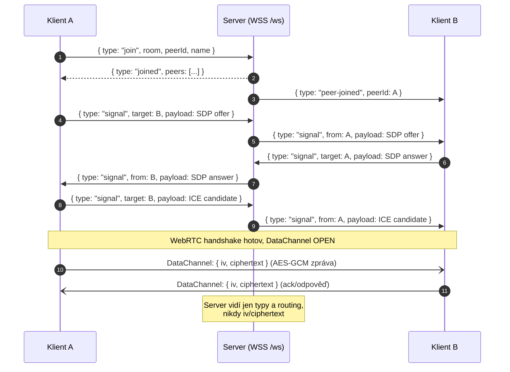
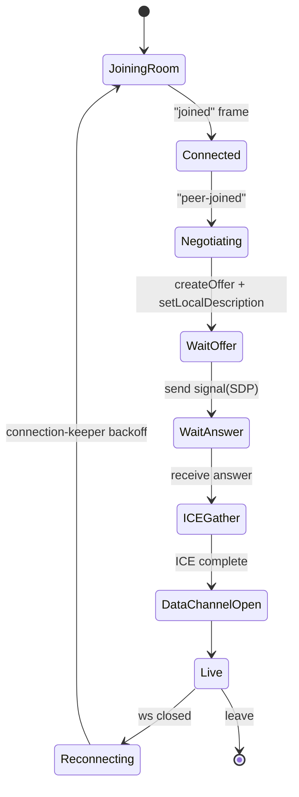
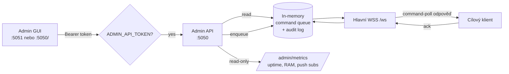
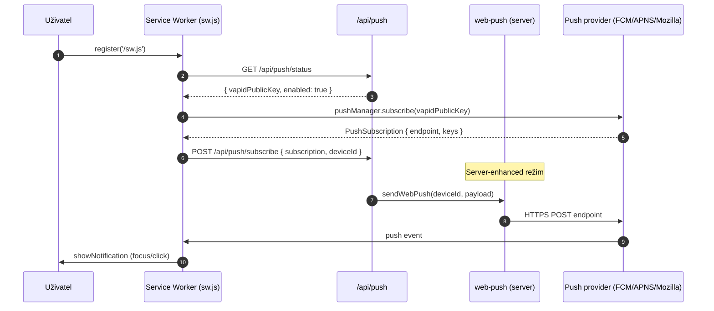
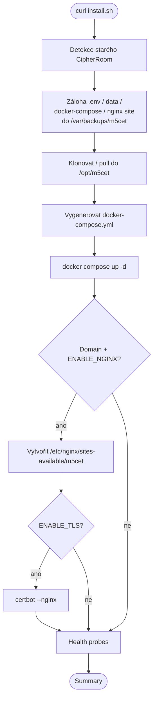

# M5cet — bezpečný workspace v prohlížeči

> Aktuální vývojová větev: `feature/m5cet-realtime-admin-media-modules`
> Release-hardening větev: `release/m5cet-v-next-hardening`
> Verze: **2.1.0-rc.1** (release candidate)

M5cet (rebrand CipherRoom) je end-to-end šifrovaný workspace, který běží
**zcela v prohlížeči**. Dva nebo více účastníků si v ad-hoc místnosti
vyměňují text, soubory, audio, video, polohu, NFC tagy a stav přítomnosti
přes WebRTC DataChannel (DTLS) a media DTLS-SRTP. Server je pouze
signalizační relé (WebSocket `/ws`) a nikdy nevidí ani obsah zpráv, ani klíč
místnosti.

```text
┌──────────────────┐       /ws (WSS, signaling only)        ┌──────────────────┐
│   Prohlížeč A    │ ◀───────────────────────────────────▶ │   Prohlížeč B    │
│  (Web Crypto +   │                                        │  (Web Crypto +   │
│   WebRTC PC)     │                                        │   WebRTC PC)     │
└────────┬─────────┘                                        └─────────┬────────┘
         │                                                            │
         │   DataChannel (DTLS, AES-GCM-256 envelope per zpráva)      │
         └────────────────────────────────────────────────────────────┘
                              │
                              ▼
                       Žádná persistence
                       Žádný plaintext
                       Žádný server-side klíč
```

---

## Obsah

1. [Hlavní vlastnosti](#hlavní-vlastnosti)
2. [Architektura](#architektura)
3. [Režimy: Light / P2P vs. Server-enhanced](#režimy)
4. [Šifrovací model](#šifrovací-model)
5. [Tok zpráv](#tok-zpráv)
6. [WebRTC signalizace](#webrtc-signalizace)
7. [Admin API a monitoring](#admin-api-a-monitoring)
8. [Pluginy / moduly](#pluginy--moduly)
9. [Push notifikace](#push-notifikace)
10. [Volání (audio/video)](#volání)
11. [Speech (TTS/STT/revoice)](#speech)
12. [Soubory](#soubory)
13. [Mapy / lokace](#mapy--lokace)
14. [NFC](#nfc)
15. [Privacy / audit erase / TTL](#privacy--audit-erase--ttl)
16. [Omezení prohlížečů](#omezení-prohlížečů)
17. [Rychlá instalace](#rychlá-instalace)
18. [Lokální vývoj](#lokální-vývoj)
19. [Verzování](#verzování)
20. [Další dokumentace](#další-dokumentace)
21. [Licence](#licence)

---

## Hlavní vlastnosti

- **End-to-end šifrované zprávy** — AES-GCM 256 s IV 12 B na frame, klíč odvozen
  PBKDF2-SHA-256 (250 000 iterací) lokálně v prohlížeči.
- **WebRTC DataChannel mesh** — text, JSON eventy a metadata po DTLS.
- **Audio/video hovory** — `getUserMedia` + WebRTC, šifrované DTLS-SRTP.
- **Speech modul** — TTS / STT / "revoice" (rozpoznat → znovu syntetizovat)
  v prohlížeči, Web Speech API.
- **Soubory** — chunked šifrovaný přenos po DataChannel, default 100 MB,
  konfigurovatelný strop, žádný 512 kB inline cap.
- **Connection keeper** — heartbeat na signalizační WS, exponential backoff,
  tři strategie (conservative / balanced / aggressive), online/visibility hooks.
- **Web Push** — `web-push` server-side, VAPID, service worker, click/focus.
- **Admin API + GUI** — samostatný Node service za `ADMIN_API_TOKEN`, telemetrie,
  whitelisted příkazy přes signalizační kanál.
- **Mapy / lokace** — Geolocation + OSM deep linky, žádný bundling Leafletu.
- **Web NFC** — Android Chrome, číst/zapisovat zašifrované konfigurace na tag,
  PIN + PBKDF2/AES-GCM. Plug-in registry pro hardware čtečky.
- **Privacy panel + TTL** — automatické mazání starších zpráv, audit purge
  endpoint.
- **3 témata** — Motorsport (dark), Glass (light), Terminal (mono CRT).
- **i18n** — čeština / English / Deutsch.
- **PWA** — manifest + service worker, instalace bez App Store.

---

## Architektura

```mermaid
flowchart LR
    subgraph Prohlížeč A
        A_UI[React UI<br/>App.tsx]
        A_LIB[lib/* moduly<br/>calls / files / push / nfc / speech / maps]
        A_CRYPTO[Web Crypto<br/>PBKDF2 → AES-GCM]
        A_RTC[RTCPeerConnection<br/>DataChannel + media]
        A_UI --> A_LIB --> A_CRYPTO --> A_RTC
    end
    subgraph Prohlížeč B
        B_RTC[RTCPeerConnection]
        B_CRYPTO[Web Crypto]
        B_LIB[lib/*]
        B_UI[React UI]
        B_RTC --> B_CRYPTO --> B_LIB --> B_UI
    end
    subgraph Server M5cet
        WS[/WSS /ws<br/>signalizační relé/]
        API[/HTTPS /api<br/>health · modules · push · events · audit · settings/]
        ADMIN[/Admin API<br/>:5050 token-protected/]
        EVENTS[(Optional metadata<br/>LOG_EVENTS=1<br/>SQLite/in-memory)]
    end
    A_RTC <-- ICE/SDP --> WS
    B_RTC <-- ICE/SDP --> WS
    A_RTC <======= DTLS DataChannel + DTLS-SRTP =======> B_RTC
    A_LIB -.metadata.-> API
    B_LIB -.metadata.-> API
    API -.opaque.-> EVENTS
    ADMIN -.read.-> EVENTS
    ADMIN -.allowlisted command.-> WS
```

Klíčové vlastnosti:

- Server **není** v cestě obsahu zprávy. Vidí pouze SDP / ICE rámce nutné pro
  navázání WebRTC a (volitelně) opaque metadata jako `peerId`, `roomId`,
  `kind`, `timestamp`.
- Klient drží klíč místnosti pouze v paměti. Nikdy se neserializuje do
  `localStorage` ani na server.
- Admin služba (`server/admin.ts`) je nasazená jako **samostatný proces** s
  vlastním portem a samostatným Bearer tokenem, takže ji lze provozovat na
  jiném subdomain / behind firewall.

---

## Režimy

### Light / P2P (default)

Server pouze předává SDP/ICE. `LOG_EVENTS=0` ⇒ žádný metadata logging,
žádné push, žádný admin appendix. Vhodné pro:

- ad-hoc relace mezi známými stranami,
- maximální privacy bez compliance overhead,
- prostředí bez jakékoli evidence.

### Server-enhanced

Operátor zapne kombinaci:

| Funkce            | ENV proměnné                                  | Co server vidí navíc            |
|-------------------|-----------------------------------------------|----------------------------------|
| Metadata events   | `LOG_EVENTS=1` (+ volitelně `DATABASE_URL`)   | `{ts, peerId, room, kind}`       |
| Web Push          | `VAPID_PUBLIC_KEY` / `VAPID_PRIVATE_KEY`      | endpoint URL, p256dh/auth keys   |
| Admin API         | `ADMIN_API_TOKEN`, `ENABLE_ADMIN=1`           | jen co je vyjmenované v `/admin` |
| Settings sync     | `POST /api/settings/sync` (opt-in v UI)        | per-device JSON preferences      |

**Žádný režim** nikdy neumožní serveru číst obsah zpráv — to je nemožné z
podstaty (klíč je odvozen v prohlížeči).

---

## Šifrovací model

```mermaid
flowchart TB
    subgraph Klient
        ROOM[room id<br/>např. "alfa-bravo"]
        PWD[passphrase<br/>uživatel zadá ručně]
        SALT["salt = 'CipherRoom:v1:' || roomId"]
        PBKDF2[PBKDF2-SHA256<br/>250 000 iter]
        K[AES-GCM 256<br/>non-extractable]
        IV[IV 12 B<br/>crypto.getRandomValues]
        PT[Plaintext JSON]
        CT[Ciphertext + tag]
        PWD --> PBKDF2
        ROOM --> SALT --> PBKDF2
        PBKDF2 --> K
        IV --> AES
        PT --> AES[AES-GCM encrypt]
        K --> AES
        AES --> CT
    end
    CT --> Wire[Wire: { iv: base64, ciphertext: base64 }]
```

Důležité:

- **Salt prefix `CipherRoom:v1:`** je součástí formátu. Změna = breaking
  migrace, prefix se musí povýšit na `v2:` a klient i druhá strana to musí
  vědět. (Viz `client/src/App.tsx` JSDoc nad `deriveRoomKey`.)
- **IV se nikdy necachuje.** Vždy `crypto.getRandomValues(new Uint8Array(12))`.
  Reuse IV se stejným klíčem GCM zcela rozbije.
- **Klíč je `extractable: false`.** Web Crypto neumožní `exportKey`, takže
  ani malicious extension uvnitř page-scopu si jej nepřečte (až na komplexní
  útoky na běžící process).
- **Ověření integrity** — GCM tag je 16 B součástí ciphertextu. Změna kteréhokoli
  bytu = `OperationError` při dekrypci. UI to převádí na hlášku
  *"zpráva přišla, ale nedá se rozšifrovat — druhá strana má jiný klíč"*.
- **Sdílení klíče** — passphrase se sdílí **mimo M5cet** (Signal, papír, ústně).
  Server tu možnost nemá poskytnout.

---

## Tok zpráv



---

## WebRTC signalizace



Spolu s tím běží `lib/connection-keeper.ts`:

- heartbeat (ping/pong) přes signalizační WS,
- exponenciální backoff s jitterem (default 1 s … 30 s),
- intent flag — když uživatel klikne *Leave*, neopětuje se reconnect,
- `visibilitychange` + `online/offline` hooks (s vědomím, že prohlížeče v
  pozadí throttlují timery, viz [omezení](#omezení-prohlížečů)).

---

## Admin API a monitoring



- Endpointy: `/admin/health`, `/admin/metrics`, `/admin/clients`,
  `/admin/modules`, `/admin/commands/enqueue`, `/admin/commands/audit`,
  `/admin/test/push`, `/admin/plugins/debug`, `/admin/logs/recent`.
- **Allowlist příkazů** (server-side): `refresh-settings`, `reconnect`,
  `purge-local`, `show-notification`, `run-diagnostic`,
  `download-file-from-admin`. Cokoli mimo seznam je odmítnuto s `400`.
- `download-file-from-admin` na klientovi **vyžaduje uživatelské potvrzení** —
  žádné tiché stahování.
- Token chrání všechno kromě `/admin/health`. Bez tokenu = `503`.

Detaily v [`docs/admin.md`](docs/admin.md).

---

## Pluginy / moduly

Frontend (`client/src/lib/`) i backend (`server/modules.ts`) drží registr modulů.
`/api/modules` vrací manifest, který si frontend přečte, aby zjistil, co je
zapnuté. Detaily v [`docs/modules.md`](docs/modules.md).

---

## Push notifikace



Vyžaduje:

- HTTPS / WSS,
- VAPID klíče (`VAPID_PUBLIC_KEY`, `VAPID_PRIVATE_KEY`, `VAPID_SUBJECT`),
- udělené povolení v prohlížeči,
- nainstalovaný service worker.

Browser **nemůže** být donucen běžet na pozadí. Push doručení je *best effort* —
mobilní OS může endpoint zmrazit. Detaily: [`docs/push.md`](docs/push.md),
[`docs/browser-limitations.md`](docs/browser-limitations.md).

---

## Volání

Audio i video sdílí `RTCPeerConnection` instance s chatem (žádný druhý handshake).
- Šifrování: DTLS-SRTP — řeší prohlížeč.
- Lokální capture: `navigator.mediaDevices.getUserMedia`.
- Zapnout/vypnout mikrofon/kameru = `track.enabled = false` (žádný
  re-negotiation).

Viz [`docs/calls.md`](docs/calls.md).

---

## Speech

Web Speech API obal v `lib/speech.ts`:

- `speak(text, lang)` — TTS (`SpeechSynthesisUtterance`).
- `recognize({lang, continuous})` — STT (`SpeechRecognition`).
- `revoice(text, lang)` — STT → text → TTS, užitečné pro hlasové filtry.

**Omezení**: STT je dostupné jen v Chromium-based prohlížečích a Androidu.
Firefox a desktopové Safari nemají `SpeechRecognition`. UI proto schovává
ovládací prvky na základě `capabilities.ts`.

Viz [`docs/speech.md`](docs/speech.md).

---

## Soubory

```mermaid
flowchart LR
    User[Uživatel<br/>vybere soubor]
    Read[FileReader → ArrayBuffer]
    Chunk[Split do chunků 32 KiB]
    Enc[AES-GCM encrypt per chunk]
    DC[DataChannel send<br/>backpressure aware]
    Recv[Recv buffer<br/>list ArrayBufferů]
    Blob[Blob join<br/>na úplném konci]
    Save[showSaveFilePicker / a[download]]
    User --> Read --> Chunk --> Enc --> DC --> Recv --> Blob --> Save
```

- Default strop 100 MB, lze měnit v Settings (`Preferences.maxAttachmentBytes`).
- Inline (data-URL) cap pro malé přílohy: 512 kB.
- Velké soubory drží paměťovou stopu — prohlížeč rozhoduje o limitech.

Viz [`docs/files.md`](docs/files.md).

---

## Mapy / lokace

`navigator.geolocation` + odkaz na OpenStreetMap (`?mlat=…&mlon=…#map=15/lat/lon`).
Zachycené souřadnice cestují stejným šifrovaným DataChannelem jako text.
Volitelný preview tile fetch z OSM tile serveru (operátor opt-in).
Detaily: [`docs/maps-location.md`](docs/maps-location.md).

---

## NFC

Web NFC (Android Chrome). Schopnosti:

- Číst NDEF tag → JSON konfigurace + room link.
- Zapsat NDEF tag, šifrované AES-GCM, klíč odvozen PBKDF2 z PIN (4–16 číslic).

Plugin registry umožňuje rozšíření o hardware čtečky (PC/SC, EMV) nasazené
serverem — viz [`docs/nfc.md`](docs/nfc.md).

---

## Privacy / audit erase / TTL

- **TTL zpráv** — uživatel nastaví v Privacy panelu (např. 5 minut, 1 hodinu,
  24 h). Lokální buffer si zprávy vyhodí po expiraci.
- **Audit purge** — `POST /api/audit/purge` smaže serverový stav vázaný na
  `deviceId` (settings sync, audit ledger, push subscription).
- **`X-Robots-Tag: noindex, nofollow`** — pokud používáte bundlované Nginx
  vhost.
- **`Cache-Control: no-store`** — na všem.

---

## Omezení prohlížečů

- **Background execution** — žádný browser nepustí stránku donekonečna na
  pozadí. Timery se throttlí (~1 minuta), WebSocket může být odpojen, push
  doručení je *best effort*.
- **Web NFC** — pouze Android Chrome.
- **SpeechRecognition** — Chromium + Android; iOS Safari má jen omezenou podporu;
  Firefox nemá vůbec.
- **WebRTC** vyžaduje secure context (HTTPS / WSS) mimo `localhost`.
- **Web Push** vyžaduje HTTPS, registrovaný service worker, VAPID klíče a
  uživatelovo povolení.
- **`getUserMedia`** vyžaduje secure context a explicitní permission.

Plný přehled: [`docs/browser-limitations.md`](docs/browser-limitations.md).

---

## Rychlá instalace

### Linux / Docker (one-liner)

```bash
curl -fsSL https://raw.githubusercontent.com/m5ike/cipherroom-secure-chat/release/m5cet-v-next-hardening/install.sh \
  | sudo -E bash -s -- --install
```



Detaily: [`INSTALL.md`](INSTALL.md).

```bash
sudo -E /opt/m5cet/install.sh --status     # stav služby
sudo -E /opt/m5cet/install.sh --logs       # follow logů
sudo -E /opt/m5cet/install.sh --restart    # restart
sudo -E /opt/m5cet/install.sh --update     # pull + redeploy
sudo -E /opt/m5cet/install.sh --test       # alias pro --doctor
sudo -E /opt/m5cet/install.sh --gui        # interaktivní menu
sudo -E /opt/m5cet/install.sh --uninstall  # zastaví stack, files zachová
sudo -E /opt/m5cet/install.sh --help       # všechny flagy
```

---

## Lokální vývoj

```bash
npm ci
npm run check    # tsc --noEmit
npm run dev      # tsx server/index.ts + Vite middleware
npm run build    # client (Vite) + server (esbuild --minify)
PORT=5000 npm start
```

Admin API samostatně:

```bash
ADMIN_API_TOKEN=secret ENABLE_ADMIN=1 ADMIN_PORT=5050 npm run admin:dev
```

Docker:

```bash
docker build -t m5cet .
docker run --rm -p 5000:5000 -e PORT=5000 m5cet
# nebo
docker compose up -d --profile admin
```

---

## Verzování

Projekt používá [Semantic Versioning](https://semver.org/lang/cs/). Změny jsou
v [`CHANGELOG.md`](CHANGELOG.md).

| Verze        | Stav                  |
|--------------|-----------------------|
| 2.1.0-rc.1   | aktuální RC (this branch) |
| 2.0.0        | stable, předchozí      |
| 1.0.0        | initial public        |

---

## Další dokumentace

| Dokument                                                | Obsah                                          |
|---------------------------------------------------------|------------------------------------------------|
| [`docs/architecture.md`](docs/architecture.md)          | Hlubší architektura, transport, crypto vrstvy  |
| [`docs/api.md`](docs/api.md)                            | `WSS /ws` rámce + všechny `/api/*` endpointy   |
| [`docs/admin.md`](docs/admin.md)                        | Admin API + GUI                                |
| [`docs/modules.md`](docs/modules.md)                    | Modulový registr, frontend i server            |
| [`docs/user-help.md`](docs/user-help.md)                | Uživatelská nápověda (CZ + EN)                 |
| [`docs/developer-guide.md`](docs/developer-guide.md)    | Vývojářský průvodce, build, struktura          |
| [`docs/security-model.md`](docs/security-model.md)      | Bezpečnostní model, threat model               |
| [`docs/deployment.md`](docs/deployment.md)              | Nasazení, hosting, TLS, reverse proxy          |
| [`docs/troubleshooting.md`](docs/troubleshooting.md)    | Řešení potíží                                  |
| [`docs/calls.md`](docs/calls.md)                        | Audio / video volání                           |
| [`docs/connection-keeper.md`](docs/connection-keeper.md)| Heartbeat + reconnect                          |
| [`docs/files.md`](docs/files.md)                        | Šifrovaný file transfer                        |
| [`docs/maps-location.md`](docs/maps-location.md)        | Mapy / lokace                                  |
| [`docs/nfc.md`](docs/nfc.md)                            | Web NFC + plugin čtečky                        |
| [`docs/push.md`](docs/push.md)                          | Web Push                                       |
| [`docs/speech.md`](docs/speech.md)                      | Web Speech API                                 |
| [`docs/browser-limitations.md`](docs/browser-limitations.md) | Co prohlížeč (ne)umí                       |
| [`docs/build-and-deploy.md`](docs/build-and-deploy.md)  | npm workflow, PWA, sanity checky               |
| [`INSTALL.md`](INSTALL.md)                              | Detailní průvodce instalací                    |
| [`DEPLOYMENT.md`](DEPLOYMENT.md)                        | DigitalOcean / Railway / Render / Fly.io / Nginx |
| [`CHANGELOG.md`](CHANGELOG.md)                          | Historie verzí                                 |

---

## Licence

MIT — viz `package.json`. Není BMW M trademark, není dotčen Munich automotive
heritage. Logo je inspirované motorsport pruhy a chevronem.
