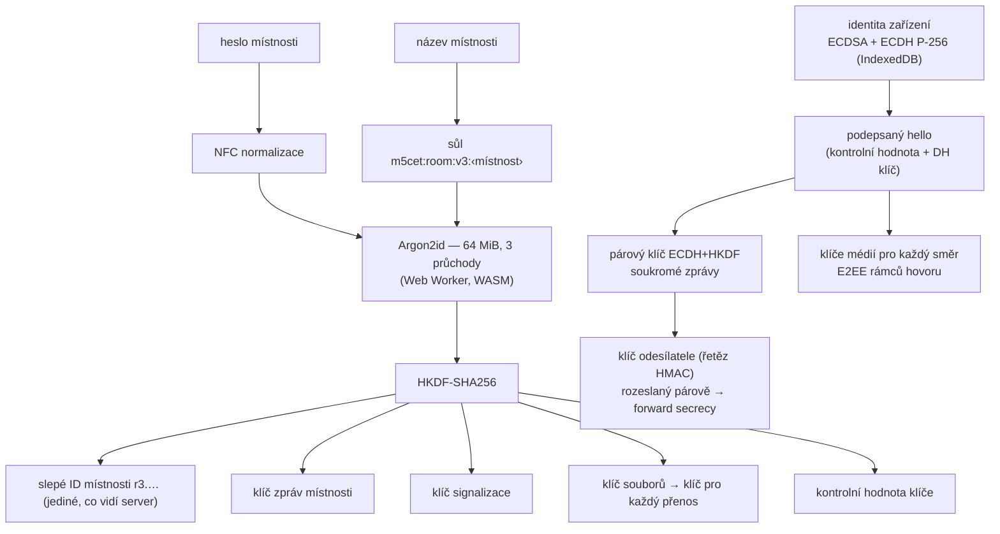
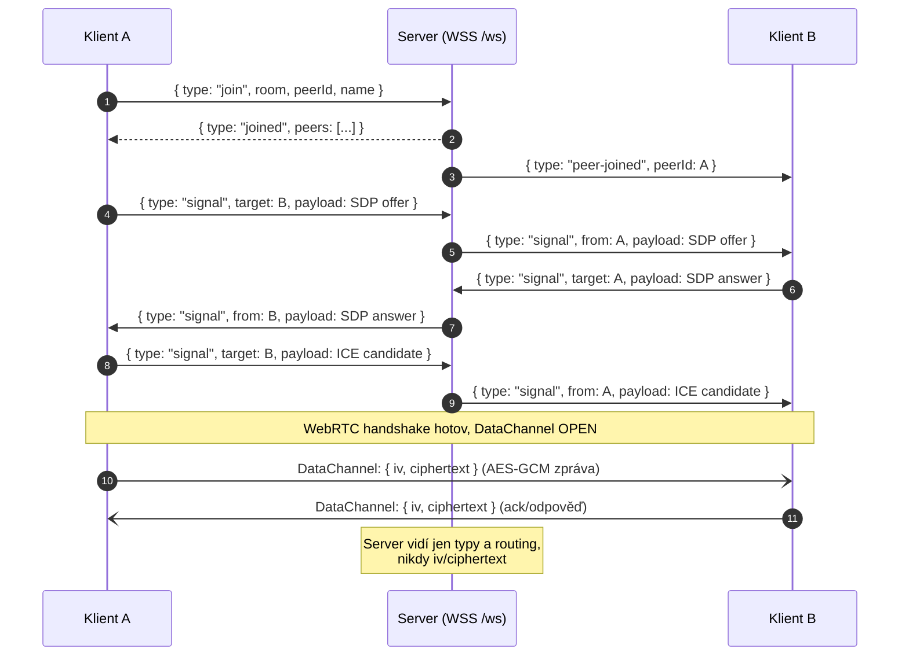
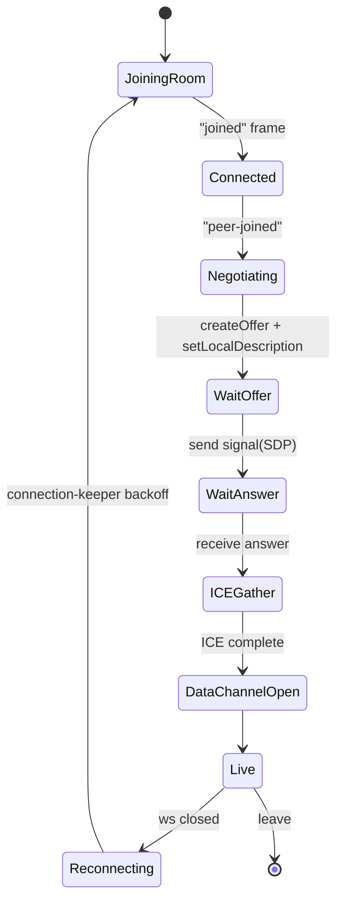
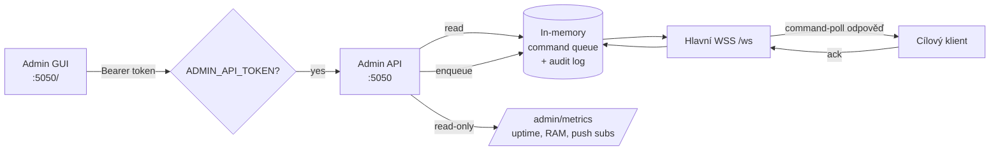
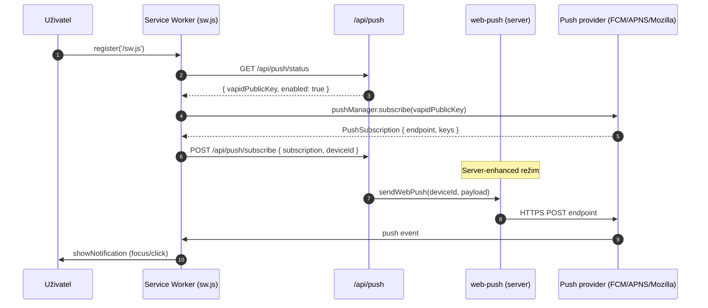
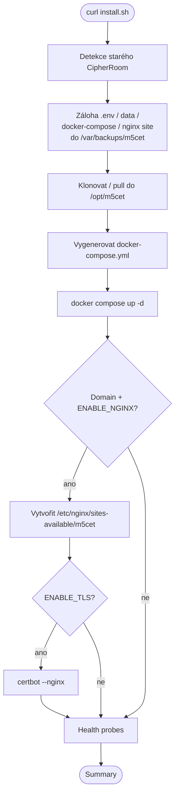

# M5cet — bezpečný workspace v prohlížeči

> Verze: **4.0.0** · Node.js **≥ 22** (doporučeno 24 LTS) · React 19 · Vite 8 · TypeScript 7 · Express 5
> Stabilní větev: `master` · historie změn: [`CHANGELOG.md`](CHANGELOG.md)
> **Dokumentace 4.0 (HTML + PDF, s vyhledáváním a diagramy):** [`docs/site/index.html`](docs/site/index.html) ·
> [`docs/site/m5cet-dokumentace-4.0.0.pdf`](docs/site/m5cet-dokumentace-4.0.0.pdf) — PDF se generuje `npm run docs:pdf`.

M5cet (rebrand CipherRoom) je end-to-end šifrovaný workspace, který běží
**zcela v prohlížeči**. Dva nebo více účastníků si v ad-hoc místnosti
vyměňují text, soubory, audio, video, polohu, NFC tagy a stav přítomnosti
přes WebRTC DataChannel (DTLS) a media DTLS-SRTP. Server je pouze
signalizační relé (WebSocket `/ws`) a nikdy nevidí ani obsah zpráv, ani klíč
místnosti.

```text
┌──────────────────┐       /ws (WSS, signaling only)        ┌──────────────────┐
│   Prohlížeč A    │ ◀───────────────────────────────────▶ │   Prohlížeč B    │
│  (Web Crypto +   │                                        │  (Web Crypto +   │
│   WebRTC PC)     │                                        │   WebRTC PC)     │
└────────┬─────────┘                                        └─────────┬────────┘
         │                                                            │
         │   DataChannel (DTLS, AES-GCM-256 envelope per zpráva)      │
         └────────────────────────────────────────────────────────────┘
                              │
                              ▼
                       Žádná persistence
                       Žádný plaintext
                       Žádný server-side klíč
```

---

## Obsah

1. [Hlavní vlastnosti](#hlavní-vlastnosti)
2. [Architektura](#architektura)
3. [Režimy: Light / P2P vs. Server-enhanced](#režimy)
4. [Šifrovací model](#šifrovací-model)
5. [Tok zpráv](#tok-zpráv)
6. [WebRTC signalizace](#webrtc-signalizace)
7. [Admin API a monitoring](#admin-api-a-monitoring)
8. [Pluginy / moduly](#pluginy--moduly)
9. [Push notifikace](#push-notifikace)
10. [Volání (audio/video)](#volání)
11. [Speech (TTS/STT/revoice)](#speech)
12. [Soubory](#soubory)
13. [Mapy / lokace](#mapy--lokace)
14. [NFC](#nfc)
15. [Privacy / audit erase / TTL](#privacy--audit-erase--ttl)
16. [Omezení prohlížečů](#omezení-prohlížečů)
17. [Známá omezení](#známá-omezení)
18. [Rychlá instalace](#rychlá-instalace)
19. [Lokální vývoj](#lokální-vývoj)
20. [Verzování](#verzování)
21. [Další dokumentace](#další-dokumentace)
22. [Licence](#licence)

---

## Hlavní vlastnosti

- **End-to-end šifrované zprávy** (šifrování v3) — heslo místnosti →
  **Argon2id** (64 MiB, ve Web Workeru) → HKDF klíče podle účelu; živé zprávy
  pod **klíči odesílatele s ratchetem** (forward secrecy), soukromé zprávy
  **párovými klíči** (ECDH), podpisy zařízení svázané s **účtem**,
  bezpečnostní čísla s **QR kódem**. Server zná jen **slepé ID** místnosti.
- **WebRTC DataChannel mesh** — text, JSON eventy a metadata po DTLS.
- **Audio/video hovory** — `getUserMedia` + WebRTC (DTLS-SRTP) a navíc
  **E2EE každého rámce** klíčem páru (`RTCRtpScriptTransform`).
- **Speech modul** — TTS / STT / "revoice" (rozpoznat → znovu syntetizovat)
  v prohlížeči, Web Speech API.
- **Soubory** — chunked šifrovaný přenos po DataChannel (32 KiB chunky,
  **binární rámce**), když P2P nejde, **šifrovaně přes relay serveru**;
  volitelný strop velikosti (výchozí neomezeno), malé přílohy ≤ 512 KiB inline.
- **Udržování spojení** — heartbeat na signalizační WS, full-jitter exponential
  backoff, tři strategie (conservative / balanced / aggressive),
  online/visibility hooks.
- **Web Push** — `web-push` server-side, VAPID, service worker, click/focus.
- **Operátorská konzole** (`/console/`) — živý provoz, spojení, místnosti,
  uživatelé, fronta, úložiště, audit; **role** vlastník / operátor / auditor,
  přihlášení **passkey**, **neměnný audit** (hash řetěz + podepsané body),
  **zálohy**, **Prometheus `/metrics`** a **alerty** s webhookem; panel
  **Client & addons** řídí uložená připojení (limity, další signalizační
  servery) a šablony GUI (povolené, výchozí, zámek); **Modules & groups**
  zapíná moduly pro skupiny uživatelů a **Menu builder** skládá menu
  aplikace (přetahování, HTML s proměnnými, styly a stavy, živý náhled).
- **Identita a přihlášení (4.0)** — Server-enhanced jen s přihlášením
  **passkey**; účet má jedinečné **uživatelské jméno** vygenerované serverem
  a uložené v passkey (primární klíč dat účtu), jméno v místnosti je jen
  přezdívka. Přihlášení ověří passkey, **globální šifrovací klíč** (důkaz z
  PRF), databázi i trezor a vše zapíše do auditu; adresy `/signin` a
  `/signup`. Viz [dokumentace › Přihlášení a identita](docs/site/index.html#prihlaseni).
- **Ochrana navigace a kontrola verzí (4.0)** — během spojení zpět / obnovení
  / jiná adresa nejdřív vyzve k odpojení; aplikace porovná své soubory,
  knihovny a service worker s `version-manifest.json` serveru a nesoulad
  opraví vymazáním mezipaměti a čistým stažením.
- **Více instancí** — místnosti přes Redis pub/sub (`REDIS_URL`), podepsané
  zprávy clusteru.
- **Mapy / lokace** — Geolocation + OSM deep linky, žádný bundling Leafletu.
- **Web NFC** — Android Chrome, číst/zapisovat zašifrované konfigurace na tag,
  PIN + PBKDF2/AES-GCM. Plug-in registry pro hardware čtečky.
- **Privacy panel + TTL** — automatické mazání starších zpráv, audit purge
  endpoint.
- **13 šablon celého GUI × 6 barevných variací × 4 rozvržení** — systémové
  **iOS 27** (Liquid Glass, bubliny jako iMessage, spodní listy) a **Windows 11**
  (Mica, akryl, Fluent), klasické Motorsport, Glass, Terminal, Midnight,
  Paper, Kontrast a studiové Aurora, Nord, Sakura, Ocean, Graphite; tón
  světlý / tmavý / podle systému a pět stylů ikon. Které šablony smějí
  uživatelé vybrat, určuje správce.
  Viz [dokumentace › Šablony vzhledu](docs/site/index.html#vzhled).
- **Pozastavení a probuzení okna** — přepnutí na jinou záložku či aplikaci,
  zamrznutí i back/forward cache hlásí jeden pár hooků. Při odložení se
  uloží stav a server (u přihlášených) přebírá zprávy; při návratu se
  spojení vrátí do stejného stavu a čekající zprávy dorazí najednou.
- **Systémové zprávy jako flash oznámení** — v chatu je jen komunikace
  lidí; hlášení bliknou nahoře po jednom, 10 s, kliknutím se zavřou a
  naskočí další. Vše nastavitelné (čas, pozice, barvy, písmo, ikona,
  animace), volitelně je lze psát i do chatu.
- **Fronta odchozích zpráv v light režimu** — když příjemce není online,
  zpráva čeká, bublina ukazuje *odesílá se* a pokusy běží dál.
  Viz [`docs/lifecycle-and-notices.md`](docs/lifecycle-and-notices.md).
- **Serverové úložiště** — globální SQLite databáze pro server (uživatelé,
  passkeys, index šifrovaných databází, logy, přenosy) a **SQLCipher
  databáze pro každého uživatele**: klíč z passkey u přihlášených, klíč
  serveru s jednodenním TTL u ostatních. Po registraci passkey se data
  z dočasné databáze převedou do nové, klíčované passkeyem.
  Viz [`docs/storage.md`](docs/storage.md).
- **Data a historie chatu** — tři volby: nové připojení vše smaže (výchozí),
  chat žije do konce sezení (šifrovaně v prohlížeči), nebo leží na serveru
  zašifrovaný **passkeyem**. Server ověří podpis WebAuthn, ale obsah nepřečte.
- **Účty s více passkeys a obnovovacím kódem**, relace přežívající restart
  a seznam zařízení.
- **Uložená připojení** (přihlášení, režim Server-enhanced) — místnost s
  klíčem, jménem, serverem, TTL a dalším nastavením; výchozí připojení,
  připojení po přihlášení, automatické znovupřipojení, přepínač v záhlaví,
  jiný obslužný server, statistiky a log. Zapečetěné klíčem účtu v
  prohlížeči — server má jen šifrovaný blok a počet. Každé jde **sdílet
  pozvánkou** (kód 12 číslic, jméno pro pozvaného, i s jiným serverem).
  Viz [dokumentace › Uložená připojení](docs/site/index.html#pripojeni).
- **Okno Místnost** (logo vlevo nahoře) — typ připojení jako záložky v
  záhlaví: *Light · P2P* s ručním zadáním, *Server-enhanced* s výběrem
  uloženého připojení (ozubené kolo otevře jejich správu); Připojit /
  Odpojit a Sdílet místnost vždy dole; během spojení nic nepřepnete.
  Viz [dokumentace › Okno Místnost](docs/site/index.html#okno-mistnost).
- **Přihlášený uživatel a stav away** — odznak „přihlášen" s oknem účtu
  (velikosti, data, počty, serverový log), adresa `/signin` pro automatické
  přihlášení, a relay: když je přihlášený účastník pryč, server jeho zprávy
  podrží, probudí ho push zprávou a po návratu doručí — s potvrzením
  *doručeno* / *přečteno* u odesílatele.
  Viz [`docs/accounts-away.md`](docs/accounts-away.md).
- **Relace a pozvánky** — šifrovaná session cache (reload = automatické
  připojení, konec se zavřením karty nebo po hodině nečinnosti), pozvánka
  odkazem + 12místným kódem s limitem použití, „Smazat vše a odejít".
  Viz [`docs/session-and-sharing.md`](docs/session-and-sharing.md).
- **i18n** — čeština / English / Deutsch.
- **PWA** — manifest + service worker, instalace bez App Store.

---

## Architektura

```mermaid
flowchart LR
    subgraph Prohlížeč A
        A_UI[React UI<br/>App.tsx]
        A_LIB[lib/* moduly<br/>calls / files / push / nfc / speech / maps]
        A_CRYPTO[Web Crypto<br/>PBKDF2 → AES-GCM]
        A_RTC[RTCPeerConnection<br/>DataChannel + media]
        A_UI --> A_LIB --> A_CRYPTO --> A_RTC
    end
    subgraph Prohlížeč B
        B_RTC[RTCPeerConnection]
        B_CRYPTO[Web Crypto]
        B_LIB[lib/*]
        B_UI[React UI]
        B_RTC --> B_CRYPTO --> B_LIB --> B_UI
    end
    subgraph Server M5cet
        WS[/WSS /ws<br/>signalizační relé/]
        API[/HTTPS /api<br/>health · modules · push · events · audit · settings/]
        ADMIN[/Admin API<br/>:5050 token-protected/]
        EVENTS[(Optional metadata<br/>LOG_EVENTS=1<br/>SQLite/in-memory)]
    end
    A_RTC <-- ICE/SDP --> WS
    B_RTC <-- ICE/SDP --> WS
    A_RTC <======= DTLS DataChannel + DTLS-SRTP =======> B_RTC
    A_LIB -.metadata.-> API
    B_LIB -.metadata.-> API
    API -.opaque.-> EVENTS
    ADMIN -.read.-> EVENTS
    ADMIN -.allowlisted command.-> WS
```

Klíčové vlastnosti:

- Server **není** v cestě obsahu zprávy. Vidí pouze SDP / ICE rámce nutné pro
  navázání WebRTC a (volitelně) opaque metadata jako `peerId`, `roomId`,
  `kind`, `timestamp`.
- Klient drží klíč místnosti pouze v paměti. Nikdy se neserializuje do
  `localStorage` ani na server.
- Admin služba (`server/admin.ts`) je nasazená jako **samostatný proces** s
  vlastním portem a samostatným Bearer tokenem, takže ji lze provozovat na
  jiném subdomain / behind firewall.

---

## Režimy

### Light / P2P (default)

Server pouze předává SDP/ICE. `LOG_EVENTS=0` ⇒ žádný metadata logging,
žádné push, žádný admin appendix. Vhodné pro:

- ad-hoc relace mezi známými stranami,
- maximální privacy bez compliance overhead,
- prostředí bez jakékoli evidence.

### Server-enhanced

Operátor zapne kombinaci:

| Funkce            | ENV proměnné                                  | Co server vidí navíc            |
|-------------------|-----------------------------------------------|----------------------------------|
| Metadata events   | `LOG_EVENTS=1` (+ volitelně `DATABASE_URL`)   | `{ts, peerId, room, kind}`       |
| Web Push          | `VAPID_PUBLIC_KEY` / `VAPID_PRIVATE_KEY`      | endpoint URL, p256dh/auth keys   |
| Admin API         | `ADMIN_API_TOKEN`, `ENABLE_ADMIN=1`           | jen co je vyjmenované v `/admin` |
| Settings sync     | `POST /api/settings/sync` (opt-in v UI)        | per-device JSON preferences      |
| Passkey účty      | `WEBAUTHN_RP_ID`, zapisovatelný `DATA_DIR`     | uživatelské jméno, veřejný klíč, hash důkazu klíče, velikosti, časy, ciphertext trezoru a schránky |
| Úložiště          | `STORAGE_MASTER_KEY` (volitelně), `DATA_DIR`   | šifrované databáze, index, logy, přenosy (detaily zapečetěné) |

Od 4.0 je Server-enhanced **jen pro přihlášené passkey** — nepřihlášený
uživatel má volby neaktivní s odkazem do okna *Spojení* (tam jediném se
passkey vytváří a přihlašuje).

**Žádný režim** nikdy neumožní serveru číst obsah zpráv — to je nemožné z
podstaty (klíč je odvozen v prohlížeči).

---

## Šifrovací model

Šifrování v3 (od 3.1.0; podrobně v [dokumentaci › Šifrování v3](docs/site/index.html#sifrovani-v3)):


```mermaid
flowchart TB
    PWD[heslo místnosti] --> NFC[NFC normalizace]
    ROOM[název místnosti] --> SALT["sůl m5cet:room:v3:‹místnost›"]
    NFC --> ARGON["Argon2id — 64 MiB, 3 průchody<br/>(Web Worker, WASM)"]
    SALT --> ARGON
    ARGON --> HKDF[HKDF-SHA256]
    HKDF --> RID["slepé ID místnosti r3.… (jediné, co vidí server)"]
    HKDF --> KM[klíč zpráv místnosti]
    HKDF --> KS[klíč signalizace]
    HKDF --> KF[klíč souborů → klíč pro každý přenos]
    HKDF --> CHK[kontrolní hodnota klíče]
    ID["identita zařízení<br/>ECDSA + ECDH P-256 (IndexedDB)"] --> HELLO["podepsaný hello<br/>(kontrolní hodnota + DH klíč)"]
    HELLO --> PAIR["párový klíč ECDH+HKDF<br/>soukromé zprávy"]
    HELLO --> MEDIA["klíče médií pro každý směr<br/>E2EE rámců hovoru"]
    PAIR --> SK["klíč odesílatele (řetěz HMAC)<br/>rozeslaný párově → forward secrecy"]
```

Důležité:

- **Každá zpráva má vlastní klíč** z řetězu odesílatele; klíč se po použití
  zahodí a řetěz se po 500 zprávách, hodině nebo odchodu člena vymění — kdo
  později získá heslo, starší zachycený provoz nepřečte.
- **Associated data** všude (místnost + ID zprávy, odesílatel + příjemce
  signálu, přenos + pořadí chunku, prefix kodeku u rámců hovoru): šifrový text
  nejde přesunout jinam.
- **IV se nikdy neopakuje** (náhodný, u rámců hovoru sůl + čítač); **klíče
  jsou neexportovatelné** (`extractable: false`).
- **Podpisy uvnitř šifrování**: zprávy i soubory podepisuje klíč zařízení,
  ten je potvrzený klíčem účtu; změnu klíče aplikace ohlásí a bezpečnostní
  číslo (60 číslic / QR) ji dovolí ověřit mimo aplikaci.
- **Heslo se sdílí mimo M5cet** (osobně, jiným kanálem, pozvánkou s kódem).
  Server ho nikdy nedostane — ani název místnosti.
- Obálky v2 (PBKDF2, fronta z 3.0) se dál otevřou; klienti 3.0 a 3.1 se v
  místnosti nepotkají (jiné ID i klíče).

---

## Tok zpráv


```mermaid
sequenceDiagram
    autonumber
    participant A as Klient A
    participant S as Server (WSS /ws)
    participant B as Klient B
    A->>S: { type: "join", room, peerId, name }
    S-->>A: { type: "joined", peers: [...] }
    S->>B: { type: "peer-joined", peerId: A }
    A->>S: { type: "signal", target: B, payload: SDP offer }
    S->>B: { type: "signal", from: A, payload: SDP offer }
    B->>S: { type: "signal", target: A, payload: SDP answer }
    S->>A: { type: "signal", from: B, payload: SDP answer }
    A->>S: { type: "signal", target: B, payload: ICE candidate }
    S->>B: { type: "signal", from: A, payload: ICE candidate }
    Note over A,B: WebRTC handshake hotov, DataChannel OPEN
    A-)B: DataChannel: { iv, ciphertext } (AES-GCM zpráva)
    B-)A: DataChannel: { iv, ciphertext } (ack/odpověď)
    Note over S: Server vidí jen typy a routing,<br/>nikdy iv/ciphertext
```

---

## WebRTC signalizace


```mermaid
stateDiagram-v2
    [*] --> JoiningRoom
    JoiningRoom --> Connected: "joined" frame
    Connected --> Negotiating: "peer-joined"
    Negotiating --> WaitOffer: createOffer + setLocalDescription
    WaitOffer --> WaitAnswer: send signal(SDP)
    WaitAnswer --> ICEGather: receive answer
    ICEGather --> DataChannelOpen: ICE complete
    DataChannelOpen --> Live
    Live --> Reconnecting: ws closed
    Reconnecting --> JoiningRoom: connection-keeper backoff
    Live --> [*]: leave
```

Spolu s tím běží `lib/connection-keeper.ts`:

- heartbeat (ping/pong) přes signalizační WS,
- exponenciální backoff s jitterem (default 1 s … 30 s),
- intent flag — když uživatel klikne *Leave*, neopětuje se reconnect,
- `visibilitychange` + `online/offline` hooks (s vědomím, že prohlížeče v
  pozadí throttlují timery, viz [omezení](#omezení-prohlížečů)).

---

## Admin API a monitoring


```mermaid
flowchart LR
    Admin[Admin GUI<br/>:5050/]
    Token{ADMIN_API_TOKEN?}
    AdminAPI[Admin API<br/>:5050]
    Queue[(In-memory<br/>command queue<br/>+ audit log)]
    WS[Hlavní WSS /ws]
    Klient[Cílový klient]

    Admin -- Bearer token --> Token
    Token -- yes --> AdminAPI
    AdminAPI -- read --> Queue
    AdminAPI -- enqueue --> Queue
    AdminAPI -- read-only --> Metrics[/admin/metrics<br/>uptime, RAM, push subs/]
    Queue --> WS
    WS -- "command-poll" odpověď --> Klient
    Klient -- ack --> WS --> Queue
```

- Endpointy: `/admin/health`, `/admin/metrics`, `/admin/clients`,
  `/admin/modules`, `/admin/commands/enqueue`, `/admin/commands/audit`,
  `/admin/test/push`, `/admin/plugins/debug`, `/admin/logs/recent`.
- **Allowlist příkazů** (server-side): `refresh-settings`, `reconnect`,
  `purge-local`, `show-notification`, `run-diagnostic`,
  `download-file-from-admin`. Cokoli mimo seznam je odmítnuto s `400`.
- `download-file-from-admin` na klientovi **vyžaduje uživatelské potvrzení** —
  žádné tiché stahování.
- Token chrání všechno pod `/admin/*` kromě `/admin/health` (porovnání
  v konstantním čase). Bez tokenu = `503`, špatný token = `401`.
- ⚠️ Diagram výše popisuje **cílový stav**. Dnes je fronta Map v paměti admin
  procesu a hlavní služba (jiný proces) ji nevidí, takže příkaz ke klientovi
  nedorazí. Viz [`docs/admin.md`](docs/admin.md).

Detaily v [`docs/admin.md`](docs/admin.md).

---

## Pluginy / moduly

Frontend (`client/src/lib/`) i backend (`server/modules.ts`) drží registr modulů.
`/api/modules` vrací manifest, který si frontend přečte, aby zjistil, co je
zapnuté. Detaily v [`docs/modules.md`](docs/modules.md).

Od 4.0 správce v konzoli (*Modules & groups*) zapíná každý modul aplikace
pro všechny, jen pro některé skupiny (`guest`, `user` a vlastní skupiny
uživatelských jmen), nebo ho vypne: aplikace jeho ovládání schová a server
jeho endpointy odmítne (`403 module-disabled`). Viz
[dokumentace › Moduly a skupiny](docs/site/index.html#moduly).

---

## Push notifikace


```mermaid
sequenceDiagram
    autonumber
    participant U as Uživatel
    participant SW as Service Worker (sw.js)
    participant API as /api/push
    participant WP as web-push (server)
    participant FCM as Push provider (FCM/APNS/Mozilla)
    U->>SW: register('/sw.js')
    SW->>API: GET /api/push/status
    API-->>SW: { vapidPublicKey, enabled: true }
    SW->>FCM: pushManager.subscribe(vapidPublicKey)
    FCM-->>SW: PushSubscription { endpoint, keys }
    SW->>API: POST /api/push/subscribe { subscription, deviceId }
    Note over WP: Server-enhanced režim
    API->>WP: sendWebPush(deviceId, payload)
    WP->>FCM: HTTPS POST endpoint
    FCM->>SW: push event
    SW->>U: showNotification (focus/click)
```

Vyžaduje:

- HTTPS / WSS,
- VAPID klíče (`VAPID_PUBLIC_KEY`, `VAPID_PRIVATE_KEY`, `VAPID_SUBJECT`),
- udělené povolení v prohlížeči,
- nainstalovaný service worker.

Browser **nemůže** být donucen běžet na pozadí. Push doručení je *best effort* —
mobilní OS může endpoint zmrazit. Detaily: [`docs/push.md`](docs/push.md),
[`docs/browser-limitations.md`](docs/browser-limitations.md).

---

## Volání

Audio i video sdílí `RTCPeerConnection` instance s chatem (žádný druhý handshake).
- Šifrování: DTLS-SRTP — řeší prohlížeč.
- Lokální capture: `navigator.mediaDevices.getUserMedia`.
- Zapnout/vypnout mikrofon/kameru = `track.enabled = false` (žádný
  re-negotiation).

Viz [`docs/calls.md`](docs/calls.md).

---

## Speech

Web Speech API obal v `lib/speech.ts`:

- `speak(text, lang)` — TTS (`SpeechSynthesisUtterance`).
- `recognize({lang, continuous})` — STT (`SpeechRecognition`).
- `revoice(text, lang)` — STT → text → TTS, užitečné pro hlasové filtry.

**Omezení**: STT je dostupné jen v Chromium-based prohlížečích a Androidu.
Firefox a desktopové Safari nemají `SpeechRecognition`. UI proto schovává
ovládací prvky na základě `capabilities.ts`.

Viz [`docs/speech.md`](docs/speech.md).

---

## Soubory

```mermaid
flowchart LR
    User[Uživatel<br/>vybere soubor]
    Read[FileReader → ArrayBuffer]
    Chunk[Split do chunků 32 KiB]
    Enc[AES-GCM encrypt per chunk]
    DC[DataChannel send<br/>backpressure aware]
    Recv[Recv buffer<br/>list ArrayBufferů]
    Blob[Blob join<br/>na úplném konci]
    Save[showSaveFilePicker / a[download]]
    User --> Read --> Chunk --> Enc --> DC --> Recv --> Blob --> Save
```

- Tlačítka *Soubor* / *Obrázek* u zprávy volí cestu sama: do 512 KiB inline,
  větší automaticky po šifrovaných 32 KiB částech.
- Strop velikosti je výchozí **neomezený**; v Settings lze zvolit nižší
  (`Preferences.maxAttachmentBytes`, např. 100 MB).
- Inline (data-URL) cap pro malé přílohy: 512 KiB.
- Přenos vyžaduje připojeného peera (otevřený DataChannel); bez něj se
  nespustí a aplikace to řekne. Serverová „proxy" cesta data nedoručuje.
- Velké soubory drží paměťovou stopu — prohlížeč rozhoduje o limitech.

Viz [`docs/files.md`](docs/files.md).

---

## Mapy / lokace

`navigator.geolocation` + odkaz na OpenStreetMap (`?mlat=…&mlon=…#map=15/lat/lon`).
Zachycené souřadnice cestují stejným šifrovaným DataChannelem jako text.
Volitelný preview tile fetch z OSM tile serveru (operátor opt-in).
Detaily: [`docs/maps-location.md`](docs/maps-location.md).

---

## NFC

Web NFC (Android Chrome). Schopnosti:

- Číst NDEF tag → JSON konfigurace + room link.
- Zapsat NDEF tag, šifrované AES-GCM, klíč odvozen PBKDF2 z PIN (4–16 číslic).

Plugin registry umožňuje rozšíření o hardware čtečky (PC/SC, EMV) nasazené
serverem — viz [`docs/nfc.md`](docs/nfc.md).

---

## Privacy / audit erase / TTL

- **TTL zpráv** — uživatel nastaví v Privacy panelu (např. 5 minut, 1 hodinu,
  24 h). Lokální buffer si zprávy vyhodí po expiraci.
- **Audit purge** — `POST /api/audit/purge` smaže serverový stav vázaný na
  `deviceId` (settings sync, audit ledger, push subscription).
- **`X-Robots-Tag: noindex, nofollow`** — pokud používáte bundlované Nginx
  vhost.
- **`Cache-Control: no-store`** — na HTML, API, service workeru a
  `build.json`; jen soubory s hashem v názvu (`/assets/`) mají roční
  `immutable` cache a jdou předkomprimované (brotli / gzip).

---

## Omezení prohlížečů

- **Background execution** — žádný browser nepustí stránku donekonečna na
  pozadí. Timery se throttlí (~1 minuta), WebSocket může být odpojen, push
  doručení je *best effort*.
- **Web NFC** — pouze Android Chrome.
- **SpeechRecognition** — Chromium + Android; iOS Safari má jen omezenou podporu;
  Firefox nemá vůbec.
- **WebRTC** vyžaduje secure context (HTTPS / WSS) mimo `localhost`.
- **Web Push** vyžaduje HTTPS, registrovaný service worker, VAPID klíče a
  uživatelovo povolení.
- **`getUserMedia`** vyžaduje secure context a explicitní permission.

Plný přehled: [`docs/browser-limitations.md`](docs/browser-limitations.md).

---

## Známá omezení

Projekt je poctivý v tom, co (zatím) neumí. Stav 4.0.0; co zbývá z plánu,
je v [dokumentaci › Návrhy a roadmapa](docs/site/index.html#navrhy).

- **Účty z doby před 4.0** mají jako uživatelské jméno své dosavadní ID (ne
  tvar `slovo-slovo-xxxx`) — nepřejmenovávají se, protože ID je v jejich
  passkeys, neměnném auditu, frontě i indexu databází.
- **Skupinové hovory jsou mesh** (každý s každým): nad 4–5 účastníků roste
  upload. Rámce hovoru jsou šifrované end-to-end tak, aby prošly SFU, ale SFU
  součástí není.
- **E2EE rámců hovoru** potřebuje `RTCRtpScriptTransform`; jinde hovor chrání
  „jen“ DTLS-SRTP (panel hlasu to ukáže).
- **Více instancí**: účty jsou JSON soubory ve sdíleném adresáři — dvě
  instance měnící účet ve stejné milisekundě mohou jednu změnu ztratit
  (pomohou sticky sessions). Limity spojení a rámců platí pro každou instanci
  zvlášť. SQLite úložiště sdílejí instance na jednom hostiteli.
- **Relay souborů**: nejvýš 64 souběžných přenosů na instanci a ~2 MiB/s na
  socket; velké soubory patří na P2P nebo TURN.
- Settings sync, consent, push subskripce anonymních zařízení a event log žijí
  jen v paměti procesu (retenční sweep je maže průběžně, restart úplně).
- `App.tsx` (~4 000 řádků) pokrývají hlavně e2e testy.
- Historii prohlížeče web smazat neumí; pozvánky nepřežijí restart serveru.

---

## Rychlá instalace

### Linux / Docker (one-liner)

```bash
curl -fsSL https://raw.githubusercontent.com/m5ike/cipherroom-secure-chat/master/install.sh \
  | sudo -E bash -s -- --install
```


```mermaid
flowchart TB
    Start([curl install.sh])
    Detect[Detekce starého CipherRoom]
    Backup[Záloha .env / data /<br/>docker-compose / nginx site<br/>do /var/backups/m5cet]
    Clone[Klonovat / pull do /opt/m5cet]
    Compose[Vygenerovat docker-compose.yml]
    Up[docker compose up -d]
    Nginx{Domain + ENABLE_NGINX?}
    NginxSite[Vytvořit /etc/nginx/sites-available/m5cet]
    TLS{ENABLE_TLS?}
    Cert[certbot --nginx]
    Doctor[Health probes]
    Done([Summary])

    Start --> Detect --> Backup --> Clone --> Compose --> Up --> Nginx
    Nginx -- ano --> NginxSite --> TLS
    TLS -- ano --> Cert --> Doctor
    TLS -- ne --> Doctor
    Nginx -- ne --> Doctor --> Done
```

Detaily: [`INSTALL.md`](INSTALL.md).

```bash
sudo /opt/m5cet/install.sh --status | --logs | --restart | --doctor
sudo /opt/m5cet/install.sh --menu                 # hlavní menu (--gui = whiptail/dialog)
sudo /opt/m5cet/update.sh                         # nové zdrojáky + rebuild, při chybě sám vrátí zálohu
sudo /opt/m5cet/update.sh --set APP_PORT=8080     # změna parametru
sudo /opt/m5cet/update.sh --set INSTALL_MODE=native   # přepnutí docker <-> native
sudo /opt/m5cet/update.sh --repair                # oprava rozbité instalace
sudo /opt/m5cet/uninstall.sh [--keep-files|--purge]
./install.sh --list-params                        # všechny parametry
```

---

## Lokální vývoj

Požadavky: **Node.js ≥ 22** (Node 20 je od dubna 2026 EOL; CI i Docker běží na 24 LTS).

```bash
npm ci
npm run check        # tsc --noEmit (TypeScript 7)
npm test             # vitest — unit + komponentové testy (happy-dom)
npm run check:menu   # guard invariantů MainMenu (stejný běží v pre-commit hooku)
npm run dev          # tsx server/index.ts + Vite middleware
npm run build        # client (Vite/oxc) + oba server bundly (esbuild), souběžně
PORT=5000 npm start
npm run test:e2e     # Playwright smoke; jednorázově: npx playwright install chromium
```

> **macOS:** port `5000` obvykle drží *AirPlay Receiver* (proces ControlCenter).
> Spouštěj s jiným portem, např. `PORT=5173 npm run dev`.

Konfigurace se čte z `.env` v kořeni projektu vestavěným
`process.loadEnvFile()` (balíček `dotenv` už není potřeba); proměnné ze
skutečného prostředí mají přednost před souborem.

Pre-commit hook (volitelné, jednorázově v každém klonu):

```bash
git config core.hooksPath .githooks
```

Admin API samostatně:

```bash
ADMIN_API_TOKEN=secret ENABLE_ADMIN=1 ADMIN_PORT=5050 npm run admin:dev
```

Docker:

```bash
docker build -t m5cet .
docker run --rm -p 5000:5000 -e PORT=5000 m5cet
# nebo
docker compose up -d --profile admin
```

---

## Verzování

Projekt používá [Semantic Versioning](https://semver.org/lang/cs/). Změny jsou
v [`CHANGELOG.md`](CHANGELOG.md).

| Verze        | Stav                  |
|--------------|-----------------------|
| 4.0.0        | aktuální — Server-enhanced jen s passkey, jedinečné uživatelské jméno, ověřené přihlášení (globální klíč, databáze, trezor) s auditem, `/signin` a `/signup`, ochrana navigace, kontrola verzí s opravou, moduly a skupiny, Menu builder |
| 3.3.0        | okno Místnost se záložkami a výběrem uložených připojení, sdílení uloženého připojení pozvánkou, relace si pamatuje server |
| 3.2.0        | uložená připojení (klíč, jméno, server, TTL, statistiky a log, výchozí a automatické připojení), 13 šablon GUI včetně iOS 27 a Windows 11, konzole *Client & addons*, předkomprimované assety |
| 3.1.0        | šifrování v3 (Argon2id, slepé ID místností, klíče odesílatele, párové klíče, E2EE hovorů), binární přenos a relay souborů, cluster přes Redis, účty s více passkeys a obnovou, role, neměnný audit, zálohy, metriky a alerty |
| 3.0.0        | protokol v2, šifrování v2 (podpisy, zapečetěná signalizace, ověřené soubory), fronta s lease, nová administrace s živým provozem a auditem |
| 2.7.0 – 2.11.0 | šifrovaná relace, pozvánky s kódem, passkey účty, úložiště SQLCipher, lifecycle a flash oznámení |
| 2.6.0        | instalační sada, oprava odesílání souborů, nové menu a kompozér |
| 2.5.0        | modernizace toolchainu, úklid závislostí, opravy |
| 2.4.2        | oprava speed-dial menu na dotykových zařízeních, CI |
| 2.4.1        | speed-dial panel přes portál, pre-commit guard |
| 2.1.0-rc.1   | release-hardening RC   |
| 2.0.0        | stable                 |
| 1.0.0        | initial public        |

---

## Další dokumentace

| Dokument                                                | Obsah                                          |
|---------------------------------------------------------|------------------------------------------------|
| [`docs/architecture.md`](docs/architecture.md)          | Hlubší architektura, transport, crypto vrstvy  |
| [`docs/api.md`](docs/api.md)                            | `WSS /ws` rámce + všechny `/api/*` endpointy   |
| [`docs/admin.md`](docs/admin.md)                        | Admin API + GUI                                |
| [`docs/modules.md`](docs/modules.md)                    | Modulový registr, frontend i server            |
| [`docs/user-help.md`](docs/user-help.md)                | Uživatelská nápověda (CZ + EN)                 |
| [`docs/developer-guide.md`](docs/developer-guide.md)    | Vývojářský průvodce, build, struktura          |
| [`docs/security-model.md`](docs/security-model.md)      | Bezpečnostní model, threat model               |
| [`docs/deployment.md`](docs/deployment.md)              | Ruční nasazení, PaaS (DO / Railway / Render / Fly.io), TLS, reverse proxy |
| [`docs/troubleshooting.md`](docs/troubleshooting.md)    | Řešení potíží                                  |
| [`docs/calls.md`](docs/calls.md)                        | Audio / video volání                           |
| [`docs/connection-keeper.md`](docs/connection-keeper.md)| Heartbeat + reconnect                          |
| [`docs/files.md`](docs/files.md)                        | Šifrovaný file transfer                        |
| [`docs/maps-location.md`](docs/maps-location.md)        | Mapy / lokace                                  |
| [`docs/nfc.md`](docs/nfc.md)                            | Web NFC + plugin čtečky                        |
| [`docs/push.md`](docs/push.md)                          | Web Push                                       |
| [`docs/accounts-away.md`](docs/accounts-away.md)        | Passkey účty, data chatu, stav away + relay    |
| [`docs/storage.md`](docs/storage.md)                    | Serverové úložiště: SQLite + SQLCipher, API    |
| [`docs/lifecycle-and-notices.md`](docs/lifecycle-and-notices.md) | Pozastavení okna, flash oznámení, fronta zpráv |
| [`docs/speech.md`](docs/speech.md)                      | Web Speech API                                 |
| [`docs/browser-limitations.md`](docs/browser-limitations.md) | Co prohlížeč (ne)umí                       |
| [`docs/build-and-deploy.md`](docs/build-and-deploy.md)  | npm workflow, PWA, sanity checky               |
| [`INSTALL.md`](INSTALL.md)                              | `install.sh` / `update.sh` / `uninstall.sh`: režimy, parametry, zálohy, rollback |
| [`CHANGELOG.md`](CHANGELOG.md)                          | Historie verzí                                 |
| [`docs/modes.md`](docs/modes.md)                        | Režimy Light / Server-enhanced, jejich parametry a soubory; Firebase |
| [`docs/session-and-sharing.md`](docs/session-and-sharing.md) | Session cache, vynucený stav, pozvánky s kódem, Smazat vše a odejít |
| [`docs/telephony.md`](docs/telephony.md)                | Hovory a SMS (Twilio / Telnyx / Vonage vč. JWT), volba providera, perzistentní SIP trunky + `.env`, webhooky `/wh/*` s ověřením podpisů |
| [`docs/layout-builder.md`](docs/layout-builder.md)      | Admin Layout / template builder: styly komponent, šablony se zástupnými parametry a includes, živý náhled, sbalování systémových zpráv |
| [`docs/appearance.md`](docs/appearance.md)              | Obrazovka Vzhled (71 Google Fonts, paleta, typografie), mobilní layout podle zařízení a prohlížeče, celá obrazovka, Edit Mode s inspektorem CSS |
| [`docs/knowledge-base.md`](docs/knowledge-base.md)      | Znalostní báze: mapa kódu, co server vidí, známé mezery |
| [`docs/optimizations.md`](docs/optimizations.md)        | Změřené optimalizace a jak je reprodukovat     |

---

## Licence

MIT — viz `package.json`. Není BMW M trademark, není dotčen Munich automotive
heritage. Logo je inspirované motorsport pruhy a chevronem.
