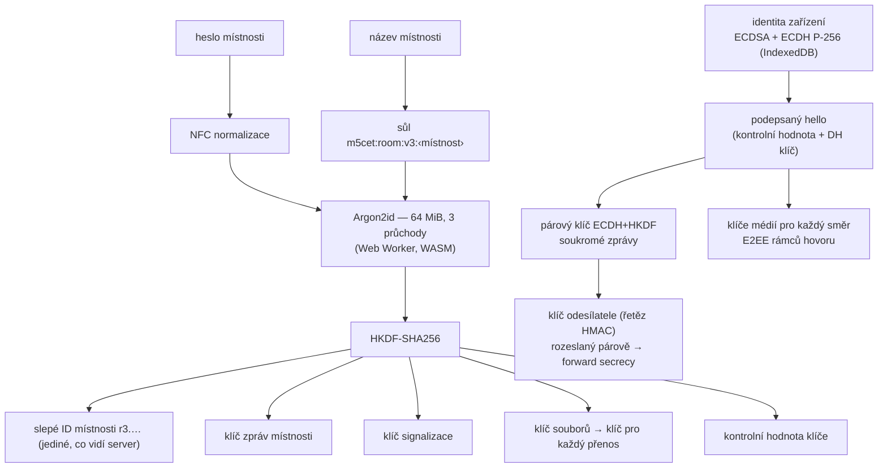
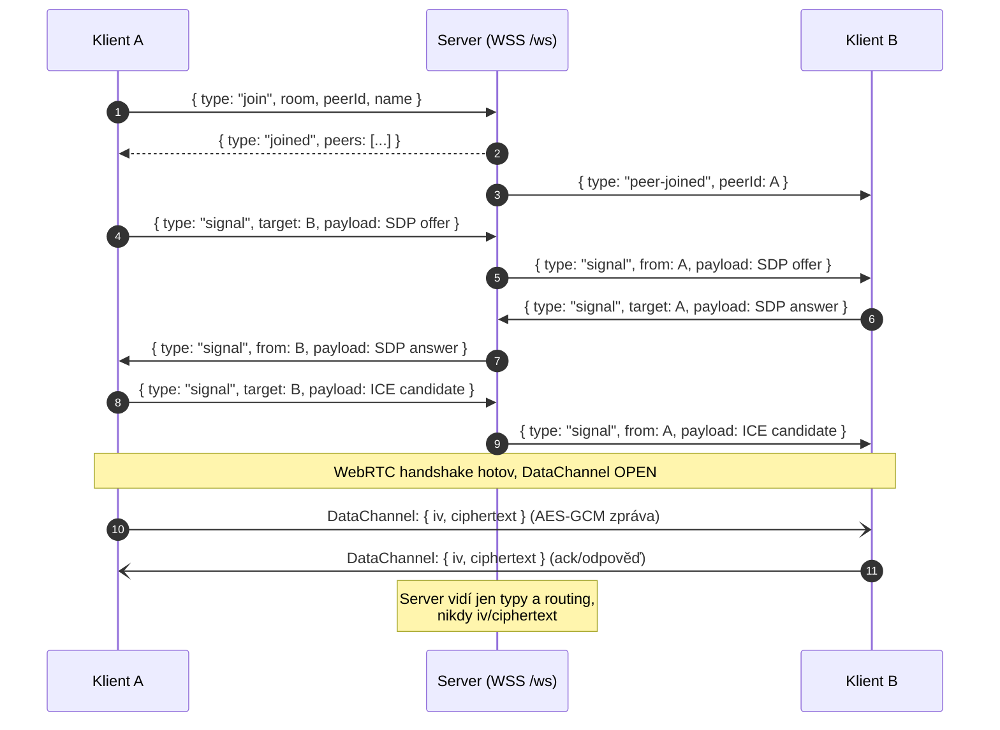
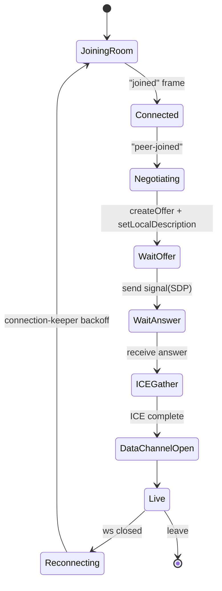
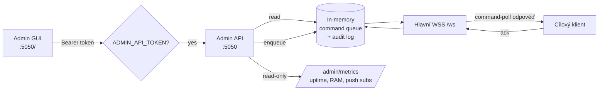
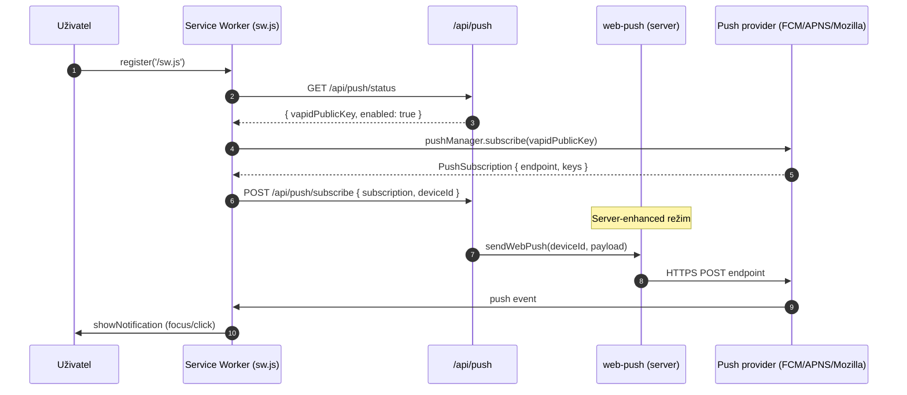
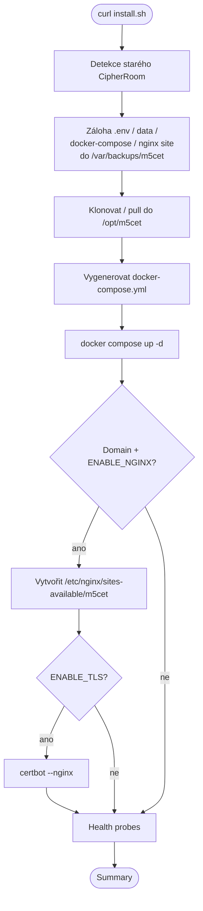

# M5cet — bezpečný workspace v prohlížeči

> Verze: **6.14.0** · Node.js **≥ 22** (doporučeno 24 LTS) · React 19 · Vite 8 · TypeScript 7 · Express 5
> Stabilní větev: `master` · historie změn: [`CHANGELOG.md`](CHANGELOG.md)
> **Dokumentace 6.14.0 (HTML + PDF, s vyhledáváním a diagramy):** [`docs/site/index.html`](docs/site/index.html) ·
> [`docs/site/m5cet-dokumentace-6.14.0.pdf`](docs/site/m5cet-dokumentace-6.14.0.pdf) — PDF se generuje `npm run docs:pdf`.

M5cet (rebrand CipherRoom) je end-to-end šifrovaný workspace, který běží
**zcela v prohlížeči**. Dva nebo více účastníků si v ad-hoc místnosti
vyměňují text, soubory, audio, video, polohu, NFC tagy a stav přítomnosti
přes WebRTC DataChannel (DTLS) a media DTLS-SRTP. Server je pro chat
signalizační relé (WebSocket `/ws`) a nikdy nevidí klíč místnosti ani obsah
end-to-end šifrovaných zpráv — zprávy pro nepřítomné, zapečetěnou historii
a soubory přes relay drží jen jako šifrový text. **Čitelně** dostane jen to,
co uživatel pošle službám serveru: příkazy Functions (`/příkaz`), AI
asistentovi, řeči (přepis, převod textu na řeč), telefonii a veřejné části
profilu (6.7) — vše volitelné a zapínané provozovatelem. Kód webu doručuje
server, takže proti zlému provozovateli web nechrání; podrobný model důvěry
je v [`docs/security-analysis.md`](docs/security-analysis.md). **M5cet Desktop**
(6.13, macOS a Windows) má kód klienta v podepsané aplikaci, ne ze serveru —
viz [M5cet Desktop](#m5cet-desktop-macos-windows). Aplikace pro **Android** (6.0) a
**iPhone, iPad a Apple Watch** (6.14) jsou nativní — viz
[M5cet pro iPhone, iPad a Apple Watch](#m5cet-pro-iphone-ipad-a-apple-watch).

```text
┌──────────────────┐       /ws (WSS, signaling only)        ┌──────────────────┐
│   Prohlížeč A    │ ◀───────────────────────────────────▶ │   Prohlížeč B    │
│  (Web Crypto +   │                                        │  (Web Crypto +   │
│   WebRTC PC)     │                                        │   WebRTC PC)     │
└────────┬─────────┘                                        └─────────┬────────┘
         │                                                            │
         │   DataChannel (DTLS, AES-GCM-256 envelope per zpráva)      │
         └────────────────────────────────────────────────────────────┘
                              │
                              ▼
                       Žádná persistence
                       Žádný plaintext
                       Žádný server-side klíč
```

---

## Obsah

1. [Hlavní vlastnosti](#hlavní-vlastnosti)
2. [Architektura](#architektura)
3. [Režimy: Light / P2P vs. Server-enhanced](#režimy)
4. [Šifrovací model](#šifrovací-model)
5. [Tok zpráv](#tok-zpráv)
6. [WebRTC signalizace](#webrtc-signalizace)
7. [Admin API a monitoring](#admin-api-a-monitoring)
8. [Pluginy / moduly](#pluginy--moduly)
9. [Push notifikace](#push-notifikace)
10. [Volání (audio/video)](#volání)
11. [Speech (TTS/STT/revoice)](#speech)
12. [Soubory](#soubory)
13. [Mapy / lokace](#mapy--lokace)
14. [NFC](#nfc)
15. [Privacy / audit erase / TTL](#privacy--audit-erase--ttl)
16. [Omezení prohlížečů](#omezení-prohlížečů)
17. [Známá omezení](#známá-omezení)
18. [M5cet Desktop (macOS, Windows)](#m5cet-desktop-macos-windows)
19. [M5cet pro iPhone, iPad a Apple Watch](#m5cet-pro-iphone-ipad-a-apple-watch)
20. [Rychlá instalace](#rychlá-instalace)
21. [Lokální vývoj](#lokální-vývoj)
22. [Verzování](#verzování)
23. [Další dokumentace](#další-dokumentace)
24. [Licence](#licence)

---

## Hlavní vlastnosti

- **Devět jazyků** (6.13) — angličtina, čeština, němčina, španělština, italština,
  francouzština, slovenština, slovinština a finština na webu, v Androidu, v desktopové
  aplikaci, v upozorněních a e-mailech; jazyk podle prohlížeče / telefonu, data, čísla,
  řazení a množná čísla podle jazyka ([`docs/i18n.md`](docs/i18n.md)).
- **iPhone, iPad a Apple Watch** (6.14) — nativní aplikace ve Swiftu se všemi funkcemi
  aplikace pro Android (stejný protokol, stejný design řízený z konzole, Secure Enclave,
  CallKit, APNs, Core NFC), na hodinkách společník iPhonu; v konzoli menu **iOS** vedle
  **Android** ([`docs/ios-architecture.md`](docs/ios-architecture.md),
  [`docs/ios-server.md`](docs/ios-server.md), [`ios/README.md`](ios/README.md)).
- **Web, Android, iOS, macOS a Windows** — M5cet Desktop (6.13) je 1:1 webová aplikace, ale
  klientský kód nese podepsaná aplikace, ne server ([`docs/desktop.md`](docs/desktop.md)).
- **End-to-end šifrované zprávy** (protokol 4, od 6.12) — mezi každou dvojicí
  zařízení **hybridní post-kvantové ustavení klíče** (ECDH P-256 + ML-KEM-768)
  a **Double Ratchet s post-kvantovým ratchetem** (dopředná utajenost, obnova po
  kompromitaci); zprávy místnosti pod **klíči odesílatele** s podpisovým klíčem
  řetězu; zprávy pro nepřítomné **šifrované pro každé zařízení příjemce**;
  **průhlednost klíčů** (ověřitelný log účtů a zařízení), bezpečnostní čísla
  s **QR kódem**. Heslo místnosti → **Argon2id** (64 MiB) → HKDF; server zná jen
  **slepé ID** místnosti a hub pozná, kdo klíč skutečně zná. Se staršími klienty
  protokol 3.
- **WebRTC DataChannel mesh** — text, JSON eventy a metadata po DTLS.
- **Audio/video hovory** — `getUserMedia` + WebRTC (DTLS-SRTP) a navíc
  **E2EE každého rámce** klíčem páru (`RTCRtpScriptTransform`).
- **Speech modul** — TTS / STT / "revoice" (rozpoznat → znovu syntetizovat)
  v prohlížeči, Web Speech API.
- **Soubory** — chunked šifrovaný přenos po DataChannel (32 KiB chunky,
  **binární rámce**), když P2P nejde, **šifrovaně přes relay serveru**;
  volitelný strop velikosti (výchozí neomezeno), malé přílohy ≤ 512 KiB inline.
- **Udržování spojení** — heartbeat na signalizační WS, full-jitter exponential
  backoff, tři strategie (conservative / balanced / aggressive),
  online/visibility hooks.
- **Web Push** — `web-push` server-side, VAPID, service worker, click/focus.
- **Operátorská konzole** (`/console/`) — živý provoz, spojení, místnosti,
  uživatelé, fronta, úložiště, audit; **role** vlastník / operátor / auditor,
  přihlášení **passkey**, **neměnný audit** (hash řetěz + podepsané body),
  **zálohy**, **Prometheus `/metrics`** a **alerty** s webhookem; panel
  **Client & addons** řídí uložená připojení (limity, další signalizační
  servery) a šablony GUI (povolené, výchozí, zámek); **Modules & groups**
  zapíná moduly pro skupiny uživatelů a **Menu builder** skládá menu
  aplikace (přetahování, HTML s proměnnými, styly a stavy, živý náhled).
  Od 6.1 se menu sbalí na ikony (s tooltipy) a stránky jdou po odemčení
  zámku uspořádat — přesunout a zvětšit panely, zalomit, skrýt, zarovnat;
  zamčení je uloží do nastavení administrátora.
- **AI a řeč (4.14)** — poskytovatelé Claude, OpenAI, Open WebUI,
  Perplexity, Ollama, llama.cpp, GPT4All, Hugging Face a ElevenLabs s klíči
  zašifrovanými na serveru, modely načtené od poskytovatele (uvažování,
  ceny), skupiny, které je smí používat, **limity** (měsíc, uživatel a den;
  výchozí 0 = AI vypnutá, dokud je vlastník nenastaví), **zkušebna** se
  streamem a požadavkem, test řeči, **žurnál všech volání** (tokeny, cena,
  doba; obsah jen při dočasném ladění), a v aplikaci **asistent** s
  odpověďmi psanými průběžně (Markdown, uvažování, zdroje). První etapa
  frameworku funkcí ([`docs/functions-architecture.md`](docs/functions-architecture.md)).
  Viz [dokumentace › AI a řeč](docs/site/index.html#ai).
- **Funkce — programovatelné moduly (5.0)** — operátor napíše model
  v **JavaScriptu** (QuickJS) nebo **Pythonu** (Pyodide), publikuje ho v
  konzoli (editor, verze, zkušební běh, živé logy) a v chatu ho kdokoli
  spustí přes **`/klíčové-slovo`** (jako roboti v messengerech). Každý běh
  má **oddělený proces** s interpretem ve WASM a limity času a paměti, takže
  neohrozí hlavní službu; SDK `m5` (výstupy, session, cache, codec, id,
  crypto) je stejné v obou jazycích. Server nečte místnost — výstup do ní
  šifruje klient. Zapíná `ENABLE_FUNCTIONS` nebo přepínač v konzoli. Druhá
  etapa frameworku funkcí.
- **Vizuální tvůrce a profesionální editor (5.1)** — v konzoli *Functions*
  se kód píše v **CodeMirror 6**: barevné zvýraznění (funkce, proměnné,
  vlastnosti, volání `m5.*`), **našeptávač** SDK se signaturami a poli
  k vyplnění (Tab), automatické `await`, šablony, nápověda při najetí myší
  i během psaní volání, kontrola syntaxe, hledání, formátování. **Builder**
  skládá funkci **bez kódu**: uzly (vstupy, logika, text, data, výstupy,
  HTTP, AI a řeč, kódy, úložiště…) a dráty mezi porty se přeloží do
  JavaScriptu nebo Pythonu; běh ukáže hodnotu každého uzlu přímo na plátně
  a z toku jedním klikem vznikne balíček i model (`/příkaz`). Běhy
  z konzole jsou **živé** — logy a výstupy průběžně, na `m5.prompt` /
  `m5.form` se odpovídá přímo v konzoli.
- **Aplikace pro Android (6.0)** — nativní aplikace v Javě (Android 10+),
  která je zároveň **frameworkem** řízeným z konzole: obrazovky, téma,
  animace, texty, menu a knihovny akcí se v *Android › Design* navrhují
  s živým náhledem telefonu, build je **zašifrovaný a podepsaný** balíček
  a telefon se při chybě vrátí k poslední funkční verzi. Chat stejným
  protokolem a šifrováním jako web, **víc místností naráz** (zaškrtnutí,
  odznaky lidí a nepřečtených, přepínání gestem), panel lidí u okraje
  s automatickým schováním, hovory v systémovém záznamu hovorů,
  notifikace s odpovědí. Otevření chrání **biometrie nebo PIN** s wipe po
  opakovaných chybách, všechna data v telefonu jsou šifrovaná klíči z
  Android Keystore, server řídí zařízení **řídicími zprávami přes FCM**
  (šifrované pro zařízení, podepsané) a nabízí **vydání APK** se stejným
  certifikátem. `npm run android:build`; podrobnosti v
  [`docs/android-architecture.md`](docs/android-architecture.md).
- **Víc místností a seznam lidí u okraje (6.0)** — na webu jde být ve víc
  místnostech naráz: lišta místností nad chatem s odznaky lidí a
  nepřečtených, přepnutí klepnutím nebo `Alt`+šipkou, místnosti na pozadí
  se stejným protokolem a upozorněním, výběr zaškrtnutím v okně Místnost
  (modul `rooms`, rozvržení `room.bar`). Seznam lidí se přilepí vlevo,
  vpravo nebo dole a umí se schovat za úchyt (rozvržení `widget.handle`).
  Viz [dokumentace › Víc místností naráz](docs/site/index.html#vic-mistnosti).
- **Administrace a telefonie z funkcí (6.0)** — `m5adm` (také `m5.adm`)
  zpřístupní kódu modelu konzoli operátora jako SDK: místnosti jako objekty s
  ovládáním (oznámení všem nebo jednomu, připnuté oznámení, odpojení,
  uzavření s důvodem a časem, limit členů), spojení, provoz, moduly, skupiny,
  účty, frontu, audit, příkazy, push a administrátory — jen s grantem
  vlastníka, přes kontroly operátorského API a s auditem
  `fn:<model>/<volající>`. `m5.telephony` volá, píše SMS a zprávy do
  WhatsAppu, Viberu a Messengeru, zjišťuje informace o číslech (lookup, HLR)
  a půjčuje čísla pro **telefonní most**: volající zadá kód a mluví s
  členem místnosti zvukem, nebo přes přepis (není koncově šifrovaný).
  Twilio, Telnyx, Vonage, HLR-Lookups.com, Meta; balíčky `/call`, `/sms`,
  `/lookup`, `/hlr`, `/phone-bridge` … se instalují vypnuté. Viz
  [dokumentace › m5adm](docs/site/index.html#m5adm) a
  [› m5.telephony](docs/site/index.html#m5-telephony).
- **NFC: karty, EMV a e-ID (6.3–6.6)** — nástroj NFC (web i Android) čte,
  zapisuje a emuluje karty přes interní, USB, Bluetooth nebo sériovou čtečku a
  nese šifrovanou kartu M5Cet. Platební kartu (EMV) a e-ID / e-pas jen
  **čte** — vlastní kartu či doklad, bez PINu, transakce a zápisu. Od 6.6 ve
  webu i v aplikaci pro Android **hloubkově**: z karty i čítače, **historii
  transakcí** a všechny soubory, z dokladu (otevřeného přes **PACE** nebo BAC
  klíčem z MRZ nebo CAN) každou skupinu, kterou smí běžná čtečka, s obrázky,
  kontrolou otisků proti EF.SOD a surovými soubory. Každé čtení jde převést na
  **výpis** — HTML, objekt, řádky, JSON, text nebo CSV (cs/en/de, PAN
  maskovaný) — v pracovišti s exportem, ve funkcích přes `m5.nfc.format` /
  `m5.nfc.emv.report` / `m5.nfc.eid.report`, ve vizuálním tvůrci nástroji
  NFC.EMV a NFC.e-ID; příkazy `/emv`, `/emv-history` a `/eid` (instalují se
  vypnuté; CAN / MRZ pro `/eid` zadává držitel na svém zařízení a na server
  nejde). Na NFC požadavek modelu odpoví web s otevřeným nástrojem NFC i sama
  aplikace pro Android (panel s výzvou přiložit kartu). Funkce smí poslat i
  **formátované HTML** (`m5.out.html`) — server i každý prohlížeč z něj nechají
  jen dokumentový markup, aplikace pro Android ho ukáže v uzamčeném WebView.
  Viz [`docs/nfc.md`](docs/nfc.md) a
  [dokumentace › NFC](docs/site/index.html#nfc-tool).
- **Přítomnost a „naposledy online“ (6.7)** — kdo neklikne *Odpojit*,
  zůstává v seznamu lidí, i když mu spadne síť nebo dá aplikaci do pozadí
  (server ho drží, po návratu je to týž člen); ze seznamu zmizí po odchodu,
  odpojení operátorem, zrušené relaci, vyhazovu nebo po
  `PRESENCE_MAX_AWAY_DAYS` (7 dní). Tečka zelená (online, ≤ 5 min), žlutá
  (pryč, 5–60 min), oranžová (dlouho pryč) a „Naposledy online před …“ — web
  i Android, jen pro členy téže místnosti.
  Viz [`docs/accounts-away.md`](docs/accounts-away.md#4-přítomnost-a-naposledy-online-67).
- **Poloha s navigací a odvozem (6.7)** — na webu místo mapy v bublině
  špendlík se souřadnicemi; okno polohy s mapou, *Navigovat* (Google Maps,
  Apple Maps, Waze, Mapy.com, OpenStreetMap; na Androidu nainstalované
  aplikace, pak web), *Odvoz* (Uber s cílem; Bolt, Liftago a FREENOW se
  zkopírovanými souřadnicemi) a *Kopírovat*. Zprávu „podržet a číst“ jde
  podržet i za místo vedle bubliny. Viz [`docs/maps-location.md`](docs/maps-location.md).
- **Upozornění s náhradními cestami (6.7)** — server budí nepřítomné členy
  postupně aplikací pro Android (zapečetěná řídicí zpráva přes FCM), web
  push a e-mailem přes SMTP operátora; mrtvé koncové body zapomene. Operátor
  v konzoli nastaví šablony každého druhu (cs/en/de, náhled), maximální
  úroveň soukromí a limity; uživatel na webu i v Androidu co, jak podrobně
  (nic / kdo / kde / náhled jen na zařízení), kudy a tiché hodiny. Viz
  [`docs/push.md`](docs/push.md).
- **Hlas (6.7)** — diktování, které se zastaví, *poslat jako hlas* (text
  přečtený hlasem jako šifrovaná hlasová zpráva), na Androidu *nadiktovat
  a poslat text* a **měnič hlasu** (modul vypnutý, dokud ho operátor
  nezapne; předvolby i vlastní výška, formanty, robot, ozvěna, šepot) pro
  všechno, co aplikace nahrává mikrofonem včetně hovorů — přímo v zařízení,
  před šifrováním. Viz [`docs/speech.md`](docs/speech.md).
- **Veřejný profil (6.7)** — fotka, pozadí, veřejná přezdívka, „o mně“
  a údaje; u každé položky *jen já* (trezor účtu), *členové místností*
  (párovým klíčem P2P) nebo *veřejné* (`GET /api/profile/:username`);
  obrázky zmenšené a bez metadat, moderace v konzoli.
- **Android 6.7** — šest nových šablon (světlé i tmavé), nabídky s ikonami
  v barvách designu, přejetí po řádku místnosti (*Smazat* / *Klonovat* /
  *Upravit*) a prvek designu `swipe`.
- **Úvodní obrazovka jako rozvržení (6.7)** — `start` v Layout builderu
  (zámek, nadpis, text, *Připojit*, uložená připojení); builder má 50
  rozvržení. Viz [`docs/layout-builder.md`](docs/layout-builder.md).
- **Bezpečnostní analýza a audit 6.7** — analýza z kódu se srovnáním se
  Signalem, Threemou, WhatsAppem, Wire, Matrixem a Session
  ([`docs/security-analysis.md`](docs/security-analysis.md)) a audit všech
  komponent ([`docs/audit-6.7.md`](docs/audit-6.7.md)); 6.7 opravila
  kritický únik přes design Androidu, sandbox Funkcí (permission model Node),
  pin klíče serveru na Androidu, spouštění cizího kódu z výstupů funkcí,
  únik názvu místnosti a řadu nálezů dostupnosti. Návrhové mezery (web
  doručovaný serverem, heslo jako kořen důvěry, statické klíče bez obnovy
  po kompromitaci) trvají.
- **Příkazy jako rozhovor (5.3)** — model má **vstupní body**: execute
  (start), **response** (odpověď na jeho zprávu), **button**, **form**,
  **error** a libovolný počet **webhooků** s vlastními URL, každý se svými
  vstupy. `m5.model` zná celé sezení (`calls`, `current`, `last`, vlastní
  session a cache). Funkce vrací **seznam výstupů** — text, tabulky, zvuk,
  video, notifikace, **tlačítka**, **formuláře** (panely, masky, výběry
  s ikonami) a **kód pro prohlížeč** v izolovaném rámu; každá položka se
  vykreslí samostatně a chyby jdou do vstupního bodu error. V konzoli
  editor vstupních bodů, **Form builder**, tlačítka a „Reply“ ve
  zkušebních bězích; vizuální tvůrce má víc funkcí v jednom toku.
- **Nástroje jako moduly, webhooky a vestavěné příkazy (5.2)** —
  *Functions*, *AI & speech*, *Telephony & SIP*, *Layout builder* a *Menu
  builder* jsou moduly v *Modules & groups*: výchozí přístup allow/deny,
  přístupové skupiny (allow/deny), hlavní skupina `mod-<modul>` se všemi
  právy a **granty** jen na části modulu se zástupnými znaky (`model:dns*`,
  `-provider:openai`, `number:+420*`). Kontroly jsou kešované a každé
  povolení i odmítnutí jde do **logu přístupů**. Webhooky mají **plný log**
  (hlavičky, tělo, rozparsované proměnné, odpověď), **replay** i na
  konceptu, režimy sync/async/auto se stavem a zpětným voláním. V chatu
  opět funguje **`/`** (přepínač služby Functions je v konzoli), přibyly
  aktivační znaky `@` a `#` a vestavěné příkazy **`/help`**, **`/whois`**,
  **`/dns`**, **`/web`**, **`/mail`** a **`/domain`** s formulářem.
- **Řeč zdarma a offline (5.1)** — vestavěný engine (**sherpa-onnx**):
  **Whisper** (řeč → text, 99 jazyků vč. češtiny) a hlasy **Piper**
  (text → řeč: čeština, slovenština, angličtina, němčina, polština, …)
  běží přímo na serveru — bez účtu, bez klíče, nic neodchází ven. Modely se
  stahují jedním klikem v *AI & speech → Speech*; navíc předvolby pro
  bezplatné **Groq** (Whisper v cloudu) a self-hosted **Speaches**,
  **Kokoro** a **whisper.cpp**.
- **Layout builder — GUI designer (4.0.5, 4.13)** — lišta, okno chatu,
  zprávy, psaní a widget příjemců, od 4.13 i okno Místnost, okna, dialogy
  a panely (44 rozvržení v sekcích) jsou stromy prvků z palety (panely,
  oblasti, texty, tlačítka, pole, tabulky, ikony, obrázky, video, HTML,
  živé části aplikace, šablony); vlastnosti s našeptáváním (třídy z buildu,
  atributy, CSS, proměnné, akce), podmínky, opakování, události; náhled je
  aplikace sama. 4.13: **varianty** pro skupiny uživatelů a šablony
  vzhledu, **historie** verzí s rozdíly a návratem, **sloučení** vlastního
  rozvržení s novým výchozím po aktualizaci (3-way), **vložení HTML** jako
  prvků, **kontrola přístupnosti** (názvy, popisky, klávesnice, kontrast
  WCAG); šablony a rozvržení se překládají na funkce.
  Viz [dokumentace › Layout builder](docs/site/index.html#layout-builder) a
  [`docs/layout-builder.md`](docs/layout-builder.md).
- **Identita a přihlášení (4.0)** — Server-enhanced jen s přihlášením
  **passkey**; účet má jedinečné **uživatelské jméno** vygenerované serverem
  a uložené v passkey (primární klíč dat účtu), jméno v místnosti je jen
  přezdívka. Přihlášení ověří passkey, **globální šifrovací klíč** (důkaz z
  PRF), databázi i trezor a vše zapíše do auditu; adresy `/signin` a
  `/signup`. Viz [dokumentace › Přihlášení a identita](docs/site/index.html#prihlaseni).
- **Ochrana navigace a kontrola verzí (4.0)** — během spojení zpět / obnovení
  / jiná adresa nejdřív vyzve k odpojení; aplikace porovná své soubory,
  knihovny a service worker s `version-manifest.json` serveru a nesoulad
  opraví vymazáním mezipaměti a čistým stažením.
- **Více instancí** — místnosti přes Redis pub/sub (`REDIS_URL`), podepsané
  zprávy clusteru.
- **Mapy / lokace** — Geolocation + OSM deep linky, žádný bundling Leafletu.
- **Web NFC** — Android Chrome, číst/zapisovat tag Připojka (6.12: formát 2 —
  pozvánka s náhodným tajemstvím nebo Argon2id pod 20znakovým kódem; starý tag
  s PINem jen ke čtení). Plug-in registry pro hardware čtečky.
- **Privacy panel + TTL** — automatické mazání starších zpráv, audit purge
  endpoint.
- **13 šablon celého GUI × 6 barevných variací × 4 rozvržení** — systémové
  **iOS 27** (Liquid Glass, bubliny jako iMessage, spodní listy) a **Windows 11**
  (Mica, akryl, Fluent), klasické Motorsport, Glass, Terminal, Midnight,
  Paper, Kontrast a studiové Aurora, Nord, Sakura, Ocean, Graphite; tón
  světlý / tmavý / podle systému a pět stylů ikon. Které šablony smějí
  uživatelé vybrat, určuje správce.
  Viz [dokumentace › Šablony vzhledu](docs/site/index.html#vzhled).
- **Pozastavení a probuzení okna** — přepnutí na jinou záložku či aplikaci,
  zamrznutí i back/forward cache hlásí jeden pár hooků. Při odložení se
  uloží stav a server (u přihlášených) přebírá zprávy; při návratu se
  spojení vrátí do stejného stavu a čekající zprávy dorazí najednou.
- **Systémové zprávy jako flash oznámení** — v chatu je jen komunikace
  lidí; hlášení bliknou nahoře po jednom, 10 s, kliknutím se zavřou a
  naskočí další. Vše nastavitelné (čas, pozice, barvy, písmo, ikona,
  animace), volitelně je lze psát i do chatu.
- **Fronta odchozích zpráv v light režimu** — když příjemce není online,
  zpráva čeká, bublina ukazuje *odesílá se* a pokusy běží dál.
  Viz [`docs/lifecycle-and-notices.md`](docs/lifecycle-and-notices.md).
- **Serverové úložiště** — globální SQLite databáze pro server (uživatelé,
  passkeys, index šifrovaných databází, logy, přenosy) a **SQLCipher
  databáze pro každého uživatele**: klíč z passkey u přihlášených, klíč
  serveru s jednodenním TTL u ostatních. Po registraci passkey se data
  z dočasné databáze převedou do nové, klíčované passkeyem.
  Viz [`docs/storage.md`](docs/storage.md).
- **Data a historie chatu** — tři volby: nové připojení vše smaže (výchozí),
  chat žije do konce sezení (šifrovaně v prohlížeči), nebo leží na serveru
  zašifrovaný **passkeyem**. Server ověří podpis WebAuthn, ale obsah nepřečte.
- **Účty s více passkeys a obnovovacím kódem**, relace přežívající restart
  a seznam zařízení.
- **Uložená připojení** (přihlášení, režim Server-enhanced) — místnost s
  klíčem, jménem, serverem, TTL a dalším nastavením; výchozí připojení,
  připojení po přihlášení, automatické znovupřipojení, přepínač v záhlaví,
  jiný obslužný server, statistiky a log. Zapečetěné klíčem účtu v
  prohlížeči — server má jen šifrovaný blok a počet. Každé jde **sdílet
  pozvánkou** (kód 12 číslic, jméno pro pozvaného, i s jiným serverem).
  Viz [dokumentace › Uložená připojení](docs/site/index.html#pripojeni).
- **Okno Místnost** (logo vlevo nahoře) — typ připojení jako záložky v
  záhlaví: *Light · P2P* s ručním zadáním, *Server-enhanced* s výběrem
  uloženého připojení (ozubené kolo otevře jejich správu); Připojit /
  Odpojit a Sdílet místnost vždy dole; během spojení nic nepřepnete.
  Viz [dokumentace › Okno Místnost](docs/site/index.html#okno-mistnost).
- **Přihlášený uživatel a stav away** — odznak „přihlášen" s oknem účtu
  (velikosti, data, počty, serverový log), adresa `/signin` pro automatické
  přihlášení, a relay: když je přihlášený účastník pryč, server jeho zprávy
  podrží, probudí ho push zprávou a po návratu doručí — s potvrzením
  *doručeno* / *přečteno* u odesílatele.
  Viz [`docs/accounts-away.md`](docs/accounts-away.md).
- **Relace a pozvánky** — šifrovaná session cache (reload = automatické
  připojení, konec se zavřením karty nebo po hodině nečinnosti), pozvánka
  odkazem + 12místným kódem s limitem použití, „Smazat vše a odejít".
  Viz [`docs/session-and-sharing.md`](docs/session-and-sharing.md).
- **i18n** — čeština / English / Deutsch.
- **PWA** — manifest + service worker, instalace bez App Store.

---

## Architektura

```mermaid
flowchart LR
    subgraph Prohlížeč A
        A_UI[React UI<br/>App.tsx]
        A_LIB[lib/* moduly<br/>calls / files / push / nfc / speech / maps]
        A_CRYPTO[Web Crypto<br/>PBKDF2 → AES-GCM]
        A_RTC[RTCPeerConnection<br/>DataChannel + media]
        A_UI --> A_LIB --> A_CRYPTO --> A_RTC
    end
    subgraph Prohlížeč B
        B_RTC[RTCPeerConnection]
        B_CRYPTO[Web Crypto]
        B_LIB[lib/*]
        B_UI[React UI]
        B_RTC --> B_CRYPTO --> B_LIB --> B_UI
    end
    subgraph Server M5cet
        WS[/WSS /ws<br/>signalizační relé/]
        API[/HTTPS /api<br/>health · modules · push · events · audit · settings/]
        ADMIN[/Admin API<br/>:5050 token-protected/]
        EVENTS[(Optional metadata<br/>LOG_EVENTS=1<br/>SQLite/in-memory)]
    end
    A_RTC <-- ICE/SDP --> WS
    B_RTC <-- ICE/SDP --> WS
    A_RTC <======= DTLS DataChannel + DTLS-SRTP =======> B_RTC
    A_LIB -.metadata.-> API
    B_LIB -.metadata.-> API
    API -.opaque.-> EVENTS
    ADMIN -.read.-> EVENTS
    ADMIN -.allowlisted command.-> WS
```

Klíčové vlastnosti:

- Server **není** v cestě obsahu zprávy. Vidí pouze SDP / ICE rámce nutné pro
  navázání WebRTC a (volitelně) opaque metadata jako `peerId`, `roomId`,
  `kind`, `timestamp`.
- Klient drží klíč místnosti pouze v paměti. Nikdy se neserializuje do
  `localStorage` ani na server.
- Admin služba (`server/admin.ts`) je nasazená jako **samostatný proces** s
  vlastním portem a samostatným Bearer tokenem, takže ji lze provozovat na
  jiném subdomain / behind firewall.

---

## Režimy

### Light / P2P (default)

Server pouze předává SDP/ICE. `LOG_EVENTS=0` ⇒ žádný metadata logging,
žádné push, žádný admin appendix. Vhodné pro:

- ad-hoc relace mezi známými stranami,
- maximální privacy bez compliance overhead,
- prostředí bez jakékoli evidence.

### Server-enhanced

Operátor zapne kombinaci:

| Funkce            | ENV proměnné                                  | Co server vidí navíc            |
|-------------------|-----------------------------------------------|----------------------------------|
| Metadata events   | `LOG_EVENTS=1` (+ volitelně `DATABASE_URL`)   | `{ts, peerId, room, kind}`       |
| Web Push          | `VAPID_PUBLIC_KEY` / `VAPID_PRIVATE_KEY`      | endpoint URL, p256dh/auth keys   |
| Admin API         | `ADMIN_API_TOKEN`, `ENABLE_ADMIN=1`           | jen co je vyjmenované v `/admin` |
| Settings sync     | `POST /api/settings/sync` (opt-in v UI)        | per-device JSON preferences      |
| Passkey účty      | `WEBAUTHN_RP_ID`, zapisovatelný `DATA_DIR`     | uživatelské jméno, veřejný klíč, hash důkazu klíče, velikosti, časy, ciphertext trezoru a schránky |
| Úložiště          | `STORAGE_MASTER_KEY` (volitelně), `DATA_DIR`   | šifrované databáze, index, logy, přenosy (detaily zapečetěné) |

Od 4.0 je Server-enhanced **jen pro přihlášené passkey** — nepřihlášený
uživatel má volby neaktivní s odkazem do okna *Spojení* (tam jediném se
passkey vytváří a přihlašuje).

**Žádný režim** neumožní serveru číst obsah end-to-end šifrovaných zpráv —
klíč je odvozen v prohlížeči. Výjimkou je to, co uživatel pošle službám
serveru (Functions, AI, řeč, telefonie, veřejný profil): to server vidí
čitelně. A protože kód webu doručuje server, chrání šifrování jen proti
serveru, který kód klientů nemění (viz
[`docs/security-analysis.md`](docs/security-analysis.md), F-02).

---

## Šifrovací model

Klíč místnosti (šifrování v3, od 3.1.0; podrobně v [dokumentaci › Šifrování v3](docs/site/index.html#sifrovani-v3))
a nad ním **protokol 4** (od 6.12; specifikace [`docs/protocol-v4.md`](docs/protocol-v4.md)):


```mermaid
flowchart TB
    PWD[heslo místnosti] --> NFC[NFC normalizace]
    ROOM[název místnosti] --> SALT["sůl m5cet:room:v3:‹místnost›"]
    NFC --> ARGON["Argon2id — 64 MiB, 3 průchody<br/>(Web Worker, WASM)"]
    SALT --> ARGON
    ARGON --> HKDF[HKDF-SHA256]
    HKDF --> RID["slepé ID místnosti r3.… (jediné, co vidí server)"]
    HKDF --> KM[klíč zpráv místnosti]
    HKDF --> KS[klíč signalizace]
    HKDF --> KF[klíč souborů → klíč pro každý přenos]
    HKDF --> CHK[kontrolní hodnota klíče]
    ID["identita zařízení<br/>ECDSA + ECDH P-256 (IndexedDB)"] --> HELLO["podepsaný hello<br/>(kontrolní hodnota + DH klíč)"]
    HELLO --> PAIR["párový klíč ECDH+HKDF<br/>soukromé zprávy"]
    HELLO --> MEDIA["klíče médií pro každý směr<br/>E2EE rámců hovoru"]
    PAIR --> SK["klíč odesílatele (řetěz HMAC)<br/>rozeslaný párově → forward secrecy"]
```

Protokol 4 (6.12) nahrazuje párový klíč a klíče médií: hello nese navíc efemérní ECDH
a ML-KEM-768 klíč (podpis zařízení pokrývá celý hello), obě strany si klíč KEM zapouzdří
a z ECDH + obou sdílených tajemství vznikne kořen **Double Ratchetu**, který při každém
kroku DH přimíchá nový klíč ML-KEM. Přes něj jdou soukromé zprávy, řetězy odesílatele
(rotace po 100 zprávách / 15 minutách), klíč každého souboru a klíč každého hovoru. Zprávy
pro nepřítomné se pečetí schránce každého ověřeného zařízení příjemce (ECDH + ML-KEM).
Všechny zprávy protokolu 4 mají padding, okno proti přehrání je trvalé.

Důležité:

- **Každá zpráva má vlastní klíč** z řetězu odesílatele; klíč se po použití
  zahodí a řetěz se po 100 zprávách, 15 minutách nebo odchodu člena vymění
  (protokol 3: 500 zpráv / hodina) — kdo později získá heslo, starší ani
  (u dvojic) budoucí provoz nepřečte; protokol 4 odolá i útočníkovi, který
  záznam provozu rozluští kvantovým počítačem.
- **Associated data** všude (místnost + ID zprávy, odesílatel + příjemce
  signálu, přenos + pořadí chunku, prefix kodeku u rámců hovoru): šifrový text
  nejde přesunout jinam.
- **IV se nikdy neopakuje** (náhodný, nebo odvozený z jednorázového klíče;
  u rámců hovoru epocha + čítač s novým klíčem na hovor); **klíče jsou
  neexportovatelné** (`extractable: false`).
- **Identita:** klíč zařízení podepisuje hello (protokol 3 i každou zprávu),
  certifikát zařízení vydává klíč účtu (v2 s platností a odvoláním); první
  klíč je „nový — neověřený“, „ověřený“ až po porovnání bezpečnostního čísla
  (60 číslic / QR); změnu klíče aplikace ohlásí a zprávy zadrží; klíče účtů
  a zařízení jsou v logu průhlednosti klíčů, který klienti kontrolují.
- **Heslo se sdílí mimo M5cet** (osobně, jiným kanálem, pozvánkou s kódem).
  Server ho nikdy nedostane — ani název místnosti.
- Obálky v1 / v2 (klienti starší než 3.1) se od 6.12 neotevírají; klienti 3.0
  a 3.1 se v místnosti nepotkají (jiné ID i klíče).

---

## Tok zpráv


```mermaid
sequenceDiagram
    autonumber
    participant A as Klient A
    participant S as Server (WSS /ws)
    participant B as Klient B
    A->>S: { type: "join", room, peerId, name }
    S-->>A: { type: "joined", peers: [...] }
    S->>B: { type: "peer-joined", peerId: A }
    A->>S: { type: "signal", target: B, payload: SDP offer }
    S->>B: { type: "signal", from: A, payload: SDP offer }
    B->>S: { type: "signal", target: A, payload: SDP answer }
    S->>A: { type: "signal", from: B, payload: SDP answer }
    A->>S: { type: "signal", target: B, payload: ICE candidate }
    S->>B: { type: "signal", from: A, payload: ICE candidate }
    Note over A,B: WebRTC handshake hotov, DataChannel OPEN
    A-)B: DataChannel: { iv, ciphertext } (AES-GCM zpráva)
    B-)A: DataChannel: { iv, ciphertext } (ack/odpověď)
    Note over S: Server vidí jen typy a routing,<br/>nikdy iv/ciphertext
```

---

## WebRTC signalizace


```mermaid
stateDiagram-v2
    [*] --> JoiningRoom
    JoiningRoom --> Connected: "joined" frame
    Connected --> Negotiating: "peer-joined"
    Negotiating --> WaitOffer: createOffer + setLocalDescription
    WaitOffer --> WaitAnswer: send signal(SDP)
    WaitAnswer --> ICEGather: receive answer
    ICEGather --> DataChannelOpen: ICE complete
    DataChannelOpen --> Live
    Live --> Reconnecting: ws closed
    Reconnecting --> JoiningRoom: connection-keeper backoff
    Live --> [*]: leave
```

Spolu s tím běží `lib/connection-keeper.ts`:

- heartbeat (ping/pong) přes signalizační WS,
- exponenciální backoff s jitterem (default 1 s … 30 s),
- intent flag — když uživatel klikne *Leave*, neopětuje se reconnect,
- `visibilitychange` + `online/offline` hooks (s vědomím, že prohlížeče v
  pozadí throttlují timery, viz [omezení](#omezení-prohlížečů)).

---

## Admin API a monitoring


```mermaid
flowchart LR
    Admin[Admin GUI<br/>:5050/]
    Token{ADMIN_API_TOKEN?}
    AdminAPI[Admin API<br/>:5050]
    Queue[(In-memory<br/>command queue<br/>+ audit log)]
    WS[Hlavní WSS /ws]
    Klient[Cílový klient]

    Admin -- Bearer token --> Token
    Token -- yes --> AdminAPI
    AdminAPI -- read --> Queue
    AdminAPI -- enqueue --> Queue
    AdminAPI -- read-only --> Metrics[/admin/metrics<br/>uptime, RAM, push subs/]
    Queue --> WS
    WS -- "command-poll" odpověď --> Klient
    Klient -- ack --> WS --> Queue
```

- Endpointy: `/admin/health`, `/admin/metrics`, `/admin/clients`,
  `/admin/modules`, `/admin/commands/enqueue`, `/admin/commands/audit`,
  `/admin/test/push`, `/admin/plugins/debug`, `/admin/logs/recent`.
- **Allowlist příkazů** (server-side): `refresh-settings`, `reconnect`,
  `purge-local`, `show-notification`, `run-diagnostic`,
  `download-file-from-admin`. Cokoli mimo seznam je odmítnuto s `400`.
- `download-file-from-admin` na klientovi **vyžaduje uživatelské potvrzení** —
  žádné tiché stahování.
- Token chrání všechno pod `/admin/*` kromě `/admin/health` (porovnání
  v konstantním čase). Bez tokenu = `503`, špatný token = `401`.
- ⚠️ Diagram výše popisuje **cílový stav**. Dnes je fronta Map v paměti admin
  procesu a hlavní služba (jiný proces) ji nevidí, takže příkaz ke klientovi
  nedorazí. Viz [`docs/admin.md`](docs/admin.md).

Detaily v [`docs/admin.md`](docs/admin.md).

---

## Pluginy / moduly

Frontend (`client/src/lib/`) i backend (`server/modules.ts`) drží registr modulů.
`/api/modules` vrací manifest, který si frontend přečte, aby zjistil, co je
zapnuté. Detaily v [`docs/modules.md`](docs/modules.md).

Od 4.0 správce v konzoli (*Modules & groups*) zapíná každý modul aplikace
pro všechny, jen pro některé skupiny (`guest`, `user` a vlastní skupiny
uživatelských jmen), nebo ho vypne: aplikace jeho ovládání schová a server
jeho endpointy odmítne (`403 module-disabled`). Od 5.2 jsou moduly i
nástroje konzole (Functions, AI & speech, Telephony & SIP, Layout a Menu
builder, od 6.0 i Android) s výchozím přístupem, přístupovými skupinami, hlavní skupinou
`mod-<modul>`, granty na části modulu a logem přístupů. Viz
[dokumentace › Moduly a skupiny](docs/site/index.html#moduly).

---

## Push notifikace


```mermaid
sequenceDiagram
    autonumber
    participant U as Uživatel
    participant SW as Service Worker (sw.js)
    participant API as /api/push
    participant WP as web-push (server)
    participant FCM as Push provider (FCM/APNS/Mozilla)
    U->>SW: register('/sw.js')
    SW->>API: GET /api/push/status
    API-->>SW: { vapidPublicKey, enabled: true }
    SW->>FCM: pushManager.subscribe(vapidPublicKey)
    FCM-->>SW: PushSubscription { endpoint, keys }
    SW->>API: POST /api/push/subscribe { subscription, deviceId }
    Note over WP: Server-enhanced režim
    API->>WP: sendWebPush(deviceId, payload)
    WP->>FCM: HTTPS POST endpoint
    FCM->>SW: push event
    SW->>U: showNotification (focus/click)
```

Vyžaduje:

- HTTPS / WSS,
- VAPID klíče (`VAPID_PUBLIC_KEY`, `VAPID_PRIVATE_KEY`, `VAPID_SUBJECT`),
- udělené povolení v prohlížeči,
- nainstalovaný service worker.

**Od 6.7** budí nepřítomné přihlášené členy notifikátor (`server/notify/*`):
kanály v pořadí uživatele (výchozí aplikace pro Android → web push → e-mail)
se zálohou na další, šablony a úrovně soukromí z konzole (*Notifications*),
volba každého uživatele a tiché hodiny; push nikdy nenese obsah. Podrobně
[`docs/push.md`](docs/push.md).

Browser **nemůže** být donucen běžet na pozadí. Push doručení je *best effort* —
mobilní OS může endpoint zmrazit. Detaily: [`docs/push.md`](docs/push.md),
[`docs/browser-limitations.md`](docs/browser-limitations.md).

---

## Volání

Audio i video sdílí `RTCPeerConnection` instance s chatem (žádný druhý handshake).
- Šifrování: DTLS-SRTP — řeší prohlížeč.
- Lokální capture: `navigator.mediaDevices.getUserMedia`.
- Zapnout/vypnout mikrofon/kameru = `track.enabled = false` (žádný
  re-negotiation).

Viz [`docs/calls.md`](docs/calls.md).

---

## Speech

Web Speech API obal v `lib/speech.ts`:

- `speak(text, lang)` — TTS (`SpeechSynthesisUtterance`).
- `recognize({lang, continuous})` — STT (`SpeechRecognition`).
- `revoice(text, lang)` — STT → text → TTS, užitečné pro hlasové filtry.

**Omezení**: STT je dostupné jen v Chromium-based prohlížečích a Androidu.
Firefox a desktopové Safari nemají `SpeechRecognition`. UI proto schovává
ovládací prvky na základě `capabilities.ts`.

**Řeč na serveru** (4.14, 5.1): kromě placených poskytovatelů (OpenAI,
ElevenLabs…) má server **vestavěný offline engine** — Whisper a hlasy Piper
přes sherpa-onnx, zdarma a bez internetu (modely se stahují v konzoli
*AI & speech → Speech*). Aplikace posílá nahrávku jako 16kHz WAV, takže ji
přečte každý model; ostatní formáty engine převede přes `ffmpeg`, pokud je
na serveru. K rozbalení modelů je potřeba `bzip2` (instalátor i obraz
Dockeru ho přidají).

**6.7:** diktování v poli zprávy (web i Android), *poslat jako hlas* (na webu
hlasem serveru) a měnič hlasu — modul `voiceChanger`, vypnutý, dokud ho
operátor nezapne; mění hlas hovorů, hlasových zpráv a nahrávek pro přepis
v zařízení, rozpoznávání řeči prohlížeče ani telefonu se netýká.

Viz [`docs/speech.md`](docs/speech.md).

---

## Soubory

```mermaid
flowchart LR
    User[Uživatel<br/>vybere soubor]
    Read[FileReader → ArrayBuffer]
    Chunk[Split do chunků 32 KiB]
    Enc[AES-GCM encrypt per chunk]
    DC[DataChannel send<br/>backpressure aware]
    Recv[Recv buffer<br/>list ArrayBufferů]
    Blob[Blob join<br/>na úplném konci]
    Save[showSaveFilePicker / a[download]]
    User --> Read --> Chunk --> Enc --> DC --> Recv --> Blob --> Save
```

- Tlačítka *Soubor* / *Obrázek* u zprávy volí cestu sama: do 512 KiB inline,
  větší automaticky po šifrovaných 32 KiB částech.
- Strop velikosti je výchozí **neomezený**; v Settings lze zvolit nižší
  (`Preferences.maxAttachmentBytes`, např. 100 MB).
- Inline (data-URL) cap pro malé přílohy: 512 KiB.
- Přenos vyžaduje připojeného peera (otevřený DataChannel); bez něj se
  nespustí a aplikace to řekne. Serverová „proxy" cesta data nedoručuje.
- Velké soubory drží paměťovou stopu — prohlížeč rozhoduje o limitech.

Viz [`docs/files.md`](docs/files.md).

---

## Mapy / lokace

`navigator.geolocation` + odkaz na OpenStreetMap (`?mlat=…&mlon=…#map=15/lat/lon`).
Zachycené souřadnice cestují stejným šifrovaným DataChannelem jako text.
Náhled mapy (od 6.2) stahuje dlaždice přes server (`/api/map/tile/…`). Od
6.7 web ukazuje polohu jako špendlík se souřadnicemi a mapu, navigaci,
odvoz a kopírování v okně polohy (Android dál kreslí mapu v bublině a otevírá
totéž okno).
Detaily: [`docs/maps-location.md`](docs/maps-location.md).

---

## NFC

Web NFC (Android Chrome). Schopnosti:

- Číst NDEF tag → JSON konfigurace + room link.
- Zapsat NDEF tag Připojka ve formátu 2 (`docs/protocol-v4.md` § 16): pozvánka
  s náhodným tajemstvím, nebo offline tag šifrovaný AES-GCM pod klíčem z Argon2id
  a 20znakového náhodného kódu. Starý tag (PIN 4–16 číslic, PBKDF2) se jen přečte
  s varováním a nabídkou přepsání.

Plugin registry umožňuje rozšíření o hardware čtečky (PC/SC, EMV) nasazené
serverem — viz [`docs/nfc.md`](docs/nfc.md).

Od 6.3 je to celý nástroj NFC (čtečky, technologie karet, karta M5Cet,
`m5.nfc` ve funkcích); 6.5 přidala čtení EMV a e-ID / e-pasu, 6.6 jejich
hloubkové čtení (historie transakcí, všechny soubory, každá čitelná datová
skupina dokladu) na webu i v Androidu, PACE, výpisy karet v šesti formátech
a odpovědi aplikace pro Android na NFC požadavek modelu. Podrobně v
[`docs/nfc.md`](docs/nfc.md).

---

## Privacy / audit erase / TTL

- **TTL zpráv** — uživatel nastaví v Privacy panelu (např. 5 minut, 1 hodinu,
  24 h). Lokální buffer si zprávy vyhodí po expiraci.
- **Audit purge** — `POST /api/audit/purge` smaže serverový stav vázaný na
  `deviceId` (settings sync, audit ledger, push subscription).
- **`X-Robots-Tag: noindex, nofollow`** — pokud používáte bundlované Nginx
  vhost.
- **`Cache-Control: no-store`** — na HTML, API, service workeru a
  `build.json`; jen soubory s hashem v názvu (`/assets/`) mají roční
  `immutable` cache a jdou předkomprimované (brotli / gzip).

---

## Omezení prohlížečů

- **Background execution** — žádný browser nepustí stránku donekonečna na
  pozadí. Timery se throttlí (~1 minuta), WebSocket může být odpojen, push
  doručení je *best effort*.
- **Web NFC** — pouze Android Chrome.
- **SpeechRecognition** — Chromium + Android; iOS Safari má jen omezenou podporu;
  Firefox nemá vůbec.
- **WebRTC** vyžaduje secure context (HTTPS / WSS) mimo `localhost`.
- **Web Push** vyžaduje HTTPS, registrovaný service worker, VAPID klíče a
  uživatelovo povolení.
- **`getUserMedia`** vyžaduje secure context a explicitní permission.

Plný přehled: [`docs/browser-limitations.md`](docs/browser-limitations.md).

---

## Známá omezení

Projekt je poctivý v tom, co (zatím) neumí. Stav 4.0.0; co zbývá z plánu,
je v [dokumentaci › Návrhy a roadmapa](docs/site/index.html#navrhy).

- **Účty z doby před 4.0** mají jako uživatelské jméno své dosavadní ID (ne
  tvar `slovo-slovo-xxxx`) — nepřejmenovávají se, protože ID je v jejich
  passkeys, neměnném auditu, frontě i indexu databází.
- **Skupinové hovory jsou mesh** (každý s každým): nad 4–5 účastníků roste
  upload. Rámce hovoru jsou šifrované end-to-end tak, aby prošly SFU, ale SFU
  součástí není.
- **E2EE rámců hovoru** potřebuje `RTCRtpScriptTransform`; jinde hovor chrání
  „jen“ DTLS-SRTP (panel hlasu to ukáže).
- **Více instancí**: účty jsou JSON soubory ve sdíleném adresáři — dvě
  instance měnící účet ve stejné milisekundě mohou jednu změnu ztratit
  (pomohou sticky sessions). Limity spojení a rámců platí pro každou instanci
  zvlášť. SQLite úložiště sdílejí instance na jednom hostiteli.
- **Relay souborů**: nejvýš 64 souběžných přenosů na instanci a ~2 MiB/s na
  socket; velké soubory patří na P2P nebo TURN.
- Settings sync, consent, push subskripce anonymních zařízení a event log žijí
  jen v paměti procesu (retenční sweep je maže průběžně, restart úplně).
- `App.tsx` (~4 000 řádků) pokrývají hlavně e2e testy.
- Historii prohlížeče web smazat neumí; pozvánky nepřežijí restart serveru.
- **6.14:** aplikace pro iPhone, iPad a Apple Watch běžela jen v simulátoru (iOS 26.5; hodinky jen
  sestavené) — passkeys s PRF, APNs / VoIP s CallKit, rozšíření notifikací, Secure Enclave
  s biometrií, NFC se skutečnými kartami a chování na pozadí čekají na zkoušku na zařízení;
  podpis a distribuce potřebují účet Apple Developer. Omezení iOS (snímky obrazovky, záznam hovorů
  Telefonu, MIFARE Classic, platební AID, běh na pozadí) — viz
  [`CHANGELOG.md`](CHANGELOG.md) › 6.14.0 › Známá omezení.
- **6.13:** překlady es / it / fr / sk / sl / fi vytvořila AI (bez rodilého mluvčího); konzole
  a `/help` jsou anglicky; M5cet Desktop neběžel na skutečném Windows, buildy nejsou
  podepsané, macOS starší než 13 Electron nepodporuje — viz
  [`CHANGELOG.md`](CHANGELOG.md) › 6.13.0 › Známá omezení.
- **6.12:** protokol 4 neběžel živě mezi webem a Androidem ani na telefonu
  (interoperabilitu dokládají sdílené testovací vektory), bubblewrap a `check.sh`
  nebyly vyzkoušené na produkčním Linuxu, žádný nezávislý audit ani formální
  analýza; web dál doručuje server — viz
  [`docs/security-analysis.md`](docs/security-analysis.md#13-stav-612-protokol-4-a-srovnání) › 13
  a [`docs/deployment.md`](docs/deployment.md) › Přechod na 6.12.
- **6.11:** odpovědi od system-messenger, našeptávač a hodiny běhu neběžely
  na telefonu; `/hlr` s číslem neprošel skutečným poskytovatelem — viz
  [`docs/deployment.md`](docs/deployment.md) › Přechod na 6.11.
- **6.10:** šablony NFC, gesta a profil neběžely se skutečnou kartou ani na
  telefonu; po aktualizaci zkontrolujte webhooky bez podpisu, pravidlo pro
  telefonní panel a země TSA — viz [`docs/deployment.md`](docs/deployment.md)
  › Přechod na 6.10 a [`docs/security-analysis.md`](docs/security-analysis.md) › 12.
- **6.9:** Telephony & SIP neprošlo skutečným hovorem ani účtem poskytovatele
  (jen podvržená API a simulátor); příchozí hovor bez pravidla dostane
  „busy“ — viz [`docs/deployment.md`](docs/deployment.md) › Přechod na 6.9
  a [`CHANGELOG.md`](CHANGELOG.md) › 6.9.0 › Známá omezení.
- **6.8:** záznam hovorů, zvonění, konverzace Androidu a volby odeslání
  neběžely na skutečném telefonu; zavolat zpět ze záznamu telefonu přes
  M5cet Android nedovolí (volá se ze Záznamu v aplikaci) — viz
  [`CHANGELOG.md`](CHANGELOG.md) › 6.8.0 › Známá omezení.
- **6.7:** nic z novinek 6.7 zatím neběželo na skutečném telefonu ani proti
  skutečným poskytovatelům (FCM, SMTP, web push) a měnič hlasu nebyl
  vyzkoušen na zařízení; návrhové mezery bezpečnosti (web doručovaný
  serverem, heslo místnosti jako kořen důvěry, statické klíče zařízení bez
  obnovy po kompromitaci, žádný externí audit) trvají — viz
  [`CHANGELOG.md`](CHANGELOG.md) › 6.7.0 › Známá omezení a
  [`docs/security-analysis.md`](docs/security-analysis.md#11-stav-po-opravách-67).

---

## M5cet Desktop (macOS, Windows)

**6.13:** tentýž webový klient jako aplikace pro **macOS 13+** (univerzální build pro Intel
i Apple Silicon, `.dmg` + `.zip`) a **Windows 10/11 x64 a arm64** (instalátor NSIS + přenosný
`.zip`), postavená na Electronu 44. Okno načítá `https://<server>/` — skutečný origin, takže
cookies, passkeys (RP ID), WebSocket i relativní URL fungují jako na webu — ale **soubory
klienta (`index.html`, `/assets/*`, `sw.js`, manifesty) podává aplikace ze svého podepsaného
`app.asar`**, ne server: zlý provozovatel nemůže podvrhnout kód, který běží (nález F-02 je pro
desktop uzavřen). API, soubory, `/fn-sandbox.html` a WebSocket jdou na server beze změny.

* Výběr serveru při prvním spuštění (jen `https://`, bez jména a hesla v adrese, IDN se ukazuje
  i v ASCII), seznam serverů, kontrola verze proti serveru; při nesouladu volba „použít webový
  kód serveru“ (zapamatovaná, s trvalým varovným pruhem).
* Passkeys: Windows Hello a bezpečnostní klíče v aplikaci; na macOS (Electron nemá Touch ID
  s PRF ani passkeys z Klíčenky) **přihlášení přes systémový prohlížeč** — token relace a kořen
  účtu se vrací **zašifrované ke klíči aplikace** (`/api/desktop-auth/*`), nikdy v URL.
* Nativně: nabídky a dialogy v 9 jazycích, upozornění, odznak s nepřečtenými, ikona v liště,
  odkazy `m5cet://`, spouštění po přihlášení, stav okna, aktualizace jen podepsaných buildů.
* Tvrdé nastavení: sandbox, izolace kontextu, minimální most `window.m5desktop`, omezená
  navigace a oprávnění jen pro origin serveru, pojistky Electronu (bez `RunAsNode`, bez
  `--inspect`, kontrola integrity `app.asar`, šifrované cookies), tytéž bezpečnostní hlavičky
  jako server (`server/security-headers.ts`).

```bash
npm run desktop:install && npm run desktop:build -- --mac   # nebo --win (jde i na macOS, bez Wine)
```

Podpis a notarizace jen z proměnných prostředí (`CSC_LINK`, `APPLE_*`, `WIN_CSC_LINK`, Azure
Trusted Signing); bez nich vznikne nepodepsaný build (macOS ad-hoc) a řekne to. CI:
`.github/workflows/desktop.yml`. Podrobně — instalace, co je jinak (Web Push, Web NFC, passkeys
podle systému), bezpečnostní model, sestavení, testy, co nebylo ověřeno —
v [`docs/desktop.md`](docs/desktop.md).

---

## M5cet pro iPhone, iPad a Apple Watch

**6.14:** aplikace pro Android přepsaná do **Swiftu** (Xcode, Swift 6, iOS / iPadOS / watchOS 26+)
se všemi jejími funkcemi: víc místností, zprávy, soubory, hlasové zprávy, hovory, poloha, kontakty,
funkce a modely, asistent AI, NFC, lidé a profily, nastavení. Tentýž **protokol 4** (testovací
vektory web ↔ Android ↔ iOS bajt po bajtu), tentýž **design řízený z konzole** (obrazovky, texty,
knihovny akcí, vzhledy; balíčky se ověřují a dají se vrátit) a tytéž řídicí zprávy — server má pro
iOS vlastní API `/api/ios/*` a v konzoli menu **iOS** vedle **Android**.

* **iOS místo Androidu:** klíče v **Secure Enclave** a Keychainu místo Keystore / StrongBox,
  **CallKit** a **PushKit** místo ConnectionService, **APNs** s rozšířením notifikací místo FCM,
  **Core NFC** (jen iPhone), aktualizace přes **App Store / TestFlight** místo APK, štít při
  nahrávání obrazovky místo `FLAG_SECURE`.
* **iPad:** všechny orientace, Split View, víc oken. **Apple Watch:** společník iPhonu
  (místnosti, poslední zprávy, odpověď diktováním) jen při odemčené aplikaci a zapnuté volbě.
* Logika bez UI je v balíčku `ios/M5Kit` (`swift test`), aplikace v `ios/M5cet.xcodeproj`.

```bash
swift test --package-path ios/M5Kit
xcodebuild -project ios/M5cet.xcodeproj -scheme M5cet -destination 'platform=iOS Simulator,name=iPhone 17' build test CODE_SIGNING_ALLOWED=NO
```

Kontrakt a mapování Android → iOS: [`docs/ios-architecture.md`](docs/ios-architecture.md);
server, APNs a konzole: [`docs/ios-server.md`](docs/ios-server.md); sestavení, podpis a
distribuce: [`ios/README.md`](ios/README.md).

---

## Rychlá instalace

### Linux / Docker (one-liner)

```bash
curl -fsSL https://raw.githubusercontent.com/m5ike/cipherroom-secure-chat/master/install.sh \
  | sudo -E bash -s -- --install
```


```mermaid
flowchart TB
    Start([curl install.sh])
    Detect[Detekce starého CipherRoom]
    Backup[Záloha .env / data /<br/>docker-compose / nginx site<br/>do /var/backups/m5cet]
    Clone[Klonovat / pull do /opt/m5cet]
    Compose[Vygenerovat docker-compose.yml]
    Up[docker compose up -d]
    Nginx{Domain + ENABLE_NGINX?}
    NginxSite[Vytvořit /etc/nginx/sites-available/m5cet]
    TLS{ENABLE_TLS?}
    Cert[certbot --nginx]
    Doctor[Health probes]
    Done([Summary])

    Start --> Detect --> Backup --> Clone --> Compose --> Up --> Nginx
    Nginx -- ano --> NginxSite --> TLS
    TLS -- ano --> Cert --> Doctor
    TLS -- ne --> Doctor
    Nginx -- ne --> Doctor --> Done
```

Detaily: [`INSTALL.md`](INSTALL.md).

```bash
sudo /opt/m5cet/install.sh --status | --logs | --restart | --doctor
sudo /opt/m5cet/install.sh --menu                 # hlavní menu (--gui = whiptail/dialog)
sudo /opt/m5cet/update.sh                         # nové zdrojáky + rebuild, při chybě sám vrátí zálohu
sudo /opt/m5cet/update.sh --set APP_PORT=8080     # změna parametru
sudo /opt/m5cet/update.sh --set INSTALL_MODE=native   # přepnutí docker <-> native
sudo /opt/m5cet/update.sh --repair                # oprava rozbité instalace
sudo /opt/m5cet/uninstall.sh [--keep-files|--purge]
sudo /opt/m5cet/check.sh                          # 6.12: kontrola balíčku a hostitele (jen čte; --json)
./install.sh --list-params                        # všechny parametry
```

---

## Lokální vývoj

Požadavky: **Node.js ≥ 22** (Node 20 je od dubna 2026 EOL; CI i Docker běží na 24 LTS).

```bash
npm ci
npm run check        # tsc --noEmit (TypeScript 7)
npm test             # vitest — unit + komponentové testy (happy-dom)
npm run check:menu   # guard invariantů MainMenu (stejný běží v pre-commit hooku)
npm run dev          # tsx server/index.ts + Vite middleware
npm run build        # client (Vite/oxc) + oba server bundly (esbuild), souběžně
PORT=5000 npm start
npm run test:e2e     # Playwright smoke; jednorázově: npx playwright install chromium
npm run android:build            # aplikace pro Android: debug APK + testy Javy (JDK 17+, Android SDK)
npm run android:build -- --release --install   # release (R8; podpis z M5_KEYSTORE…) rovnou do telefonu
```

> **macOS:** port `5000` obvykle drží *AirPlay Receiver* (proces ControlCenter).
> Spouštěj s jiným portem, např. `PORT=5173 npm run dev`.

Konfigurace se čte z `.env` v kořeni projektu vestavěným
`process.loadEnvFile()` (balíček `dotenv` už není potřeba); proměnné ze
skutečného prostředí mají přednost před souborem.

Pre-commit hook (volitelné, jednorázově v každém klonu):

```bash
git config core.hooksPath .githooks
```

Admin API samostatně:

```bash
ADMIN_API_TOKEN=secret ENABLE_ADMIN=1 ADMIN_PORT=5050 npm run admin:dev
```

Docker:

```bash
docker build -t m5cet .
docker run --rm -p 5000:5000 -e PORT=5000 m5cet
# nebo
docker compose up -d --profile admin
```

---

## Verzování

Projekt používá [Semantic Versioning](https://semver.org/lang/cs/). Změny jsou
v [`CHANGELOG.md`](CHANGELOG.md).

| Verze        | Stav                  |
|--------------|-----------------------|
| 6.14.0       | aktuální — **aplikace pro iPhone, iPad a Apple Watch** (Swift 6, iOS / watchOS 26+): port všech funkcí aplikace pro Android — protokol 4, design z konzole, Secure Enclave, CallKit + PushKit, APNs s rozšířením notifikací, Core NFC, iPad s víc okny, společník na hodinkách; server `/api/ios/*`, APNs, vydání přes App Store / TestFlight, design iOS, menu **iOS** v konzoli; **buzení nepřítomných při hovoru** (web, Android, iOS) |
| 6.13.1       | **čtečky NFC a čipových karet na počítači**: v M5cet Desktop „Systémová čtečka (PC/SC)“ pro USB čtečky, které si macOS / Windows drží (ověřeno s ACS ACR1281), Bluetooth SPP čtečky PN532 ve výběru sériových portů, srozumitelné chyby místo `claimInterface`, výběr Bluetooth zařízení v desktopu, oprava kodeku PN532; TSA zvuk podle hodin runtime |
| 6.13.0       | **devět jazyků** (en, cs, de, es, it, fr, sk, sl, fi) na webu, v Androidu, v upozorněních, e-mailech a hláškách telefonie — výběr v nativních názvech, slovenština samostatně, data / čísla / řazení / množná čísla podle jazyka, písma s rozšířenou latinkou, UTF-8 e-maily; **M5cet Desktop** pro macOS (13+, Intel i Apple Silicon) a Windows (x64, arm64) — 1:1 webová aplikace s klientským kódem v podepsané aplikaci místo ze serveru, přihlášení passkeyem přes systémový prohlížeč, nativní menu, upozornění, odznak, lišta |
| 6.12.0       | **bezpečnostní vydání: protokol 4** (hybridní post-kvantové ustavení klíče ECDH + ML-KEM-768, Double Ratchet s post-kvantovým ratchetem, sender keys s podpisovým klíčem řetězu, zprávy pro nepřítomné šifrované pro každé zařízení příjemce, klíč souboru na přenos a médií na hovor, padding, trvalé okno proti přehrání, ochrana proti downgrade) na webu i v Androidu, **průhlednost klíčů** a stavy identity (nový / ověřený / změněný), **důkaz členství na hubu**; server: šifrované `functions.db` a `telephony.db`, sandbox funkcí v bubblewrap, auditní pin, přesné originy passkeys, limity na adresu; web a Android: náhodný klíč místnosti, NFC tag v2, normalizace jmen, zámek Androidu bez datového klíče se schránkou zámku; **`check.sh`** — kontrola balíčku a hostitele; nezávislá revize 6.12 se všemi nálezy opravenými |
| 6.11.0       | **odpovědi modelů od system-messenger** (příchozí zpráva s názvem a ikonou modelu, cituje příkaz, v místnosti „přes <jméno>“, široká bublina), **běh příkazu vždy skončí** (30 s bez známky života = chyba s ikonou a flash, limit DNS 4 s, rozpočet `/mail`, ohlášené čekání, odchod volajícího běh zruší, právě jeden konec streamu), **kontrola parametrů** před odesláním s kartou definice a návodu, ikona a návod modelu v konzoli, `/hlr <číslo>` hned s výsledkem, **nový našeptávač** (volné hledání, naposledy použité, sekce, podrobnost, nápověda parametrů) na webu i v Androidu |
| 6.10.0       | **šablony APDU jako úplná čtení typů karet** (EMV všech schémat, e-ID / e-pas, DESFire, ISO 7816) na webu i v Androidu, všechny kroky po sobě, pohledy surový vstup / výstup · surový · JSON · čitelný, sdílet / přeposlat / sobě, jen ke čtení, maskovaná čísla karet; **Android**: táhni bublinu doprava = odpovědět (citace nahoře, klepnutí na originál), doleva = přeposlat, avatar nahoře a klepnutím profil, *Můj profil* na očích; **bezpečnostní revize 6.10** (kap. 12) se dvěma koly oprav — padělané webhooky, obejití práv, anonymní hovory, toll fraud v TSA, hádání route kódů, výběr příjemců na všech cestách, design na Androidu bez úniku dat |
| 6.9.0        | **Telephony & SIP jako ústředna**: nová stránka konzole, oprávnění, pravidla směrování příchozích i odchozích hovorů (aplikace poskytovatele nebo SIP trunk s caller ID; cíl TSA nebo stav busy / congestion / hangup / rejected), **TSA** — call flow ve vizuálním editoru (27 nástrojů: DTMF, TTS, STT, záznam, přehrání, podmínka s IN$x, smyčky, route audio…) spouštěné na živém hovoru se simulátorem, route kódy `m5.telephony.inroute.*`, zvuk hovoru do místnosti nebo členovi, log událostí včetně webhooků, testy a testovací příchozí SIP adresa |
| 6.8.0        | **hovory v záznamu telefonu** (příchozí / odchozí / zmeškané / odmítnuté, zvonění, oprávnění, neutrální jména) a **Záznam** hovorů a zpráv v aplikaci pro Android; **místnosti jako konverzace Androidu** (zkratky, sdílení, oznámení-konverzace, neutrální názvy při zámku); **volby odeslání jako volby příští zprávy** — web: *Poslat jako hlas* je zaškrtávací, Android: *Odeslat jinak* se zeleným zaškrtnutím a polem pro individuální kód; **limit API** nastaví operátor (`API_RATE_LIMIT`, `API_RATE_WINDOW_MIN`), dlaždice mapy a přihlášení passkey se do něj nepočítají; oprava: velký soubor pro vybrané lidi šel celé místnosti |
| 6.7.0        | **přítomnost**: členové zůstávají v místnosti, dokud neodejdou nebo je server neodstraní (`PRESENCE_MAX_AWAY_DAYS`), na pozadí jsou pryč, „naposledy online“ se zelenou / žlutou / oranžovou tečkou (web i Android); **poloha** za ikonou s oknem *Navigovat* / *Odvoz* / *Kopírovat* a oblast pro podržení vedle bubliny „podržet a číst“; **upozornění** v pořadí kanálů se zálohou (FCM zapečetěné → web push → e-mail přes SMTP operátora), šablony a náhled v konzoli, úrovně soukromí, volba uživatele a tiché hodiny, oprava pročišťování mrtvých odběrů a buzení Androidu; **hlas**: diktování, které se zastaví, poslat jako hlas, měnič hlasu (modul, výchozí vypnutý); **veřejný profil** (fotka, pozadí, přezdívka, o mně, údaje — jen já / členové místností / veřejné); úvodní obrazovka jako rozvržení `start`; Android: šest šablon, nabídky s ikonami, přejetí po řádku místnosti; **bezpečnost**: analýza a audit 6.7, opravy serveru (sandbox Funkcí, WS brána, SSRF, telefonie, limity), webu (výstupy funkcí od členů, historie, sender keys, soubory, název místnosti, síla klíče) a Androidu (design nevynese zprávy, pin klíče serveru, PIN, notifikace při zámku, wipe, Android 10–12, podepsaná politika) |
| 6.6.0        | **NFC: hloubkové čtení** (web i Android) jen ke čtení: EMV s GET DATA (čítače), **historií transakcí** z logu karty a všemi soubory; e-ID / e-pas přes **PACE** (CAN nebo MRZ; ECDH generic mapping, AES / 3DES) nebo BAC, s EF.SOD (kontrola otisků skupin), DG1, všemi obličeji v DG2, DG5, DG7, DG11–DG16 (DG3/DG4 ne), obrázky a surovými soubory ke stažení; klíč dokladu se zadává na zařízení a na server nejde; aplikace pro Android odpovídá na NFC požadavek modelu (panel, NFC telefonu nebo povolená USB čtečka) a výstup `html` ukáže v uzamčeném WebView; **výpisy karet** v šesti formátech (HTML, objekt, řádky, JSON, text, CSV; cs/en/de, maskovaný PAN), *Celý výpis* s exportem v pracovišti; **`m5.out.html`** — sanitizované HTML z funkcí; SDK `m5.nfc.emv/eid.report/format`, `m5.nfc.format/outputs/document`; nástroje tvůrce NFC.EMV a NFC.e-ID; příkazy `/emv`, `/emv-history`, `/eid` (vypnuté); `/help nfc`, `/help html`, lekce tutoriálu 17–19 |
| 6.5.0        | **NFC: čtení EMV a e-ID / e-pasu** (web i Android) jen ke čtení: EMV `PPSE → AID → GPO → záznamy` (AIDy, štítky, maskovaný PAN, platnost, držitel, ATC…), e-ID / e-pas přes BAC z MRZ nebo CAN (DG1 + DG2) — bez PINu, kryptogramu, transakce a zápisu, žádné klonování; `m5.nfc.emv` / `m5.nfc.eid` ve Functions, `apduTemplates` s op i apdu šablonami a tlačítkem v konzoli; `/příkaz` v chatu se ukáže hned jako pulzující bublina s indikátorem, výsledek nahradí indikátor na místě |
| 6.4.1        | Android: server odmítne obřad passkeye pro build, jehož certifikát nezná, **dřív než passkey vznikne** (žádné osiřelé passkeye); uživatelské jméno `XXXX-XXXX-XXXX-XXXX` (0-9 a-z A-Z), název passkeye `ISO2-scramble(Jméno-Příjmení-Mobil)` |
| 6.4.0        | **registrace** (web i Android): jméno, příjmení, země (vyhledávací výběr), mobil a e-mail — server ověří mobil (ne pevnou linku/VoIP), doménu e-mailu (DNS, MX) a jedinečnost; údaje jen šifrovaně v trezoru, server drží pouze HMAC otisky. **Passkeys na Androidu**: dialog s certifikátem aplikace, v konzoli kontrola `assetlinks.json` (z internetu i u Googlu) a důvěra certifikátu jedním klikem, `update.sh` upozorní na blokující proxy |
| 6.3.0        | **NFC nástroj** (web i Android): výběr čtečky (interní/USB/Bluetooth), technologie karet (MIFARE Classic/Ultralight/NTAG/DESFire, NDEF, ISO 14443/15693, FeliCa, EMV a e-ID veřejně), čtení/zápis/změna UID/emulace, šifrovaná **karta M5Cet** se záznamy (záloha passkey/identity, jednorázová zpráva, Wi-Fi, kontakt, server+místnost…) a její vizuální builder; `m5.nfc` ve Functions ovládá čtečku volajícího obousměrně (uzly builderu, balíčky `nfc-scan`/`nfc-uid`/`nfc-open`). `npm run android:release`, `update.sh --android` |
| 6.2.0        | **detail zprávy** (i) s časovou osou všech stavů a potvrzeními od každého příjemce, **skrýt / smazat** zprávu ve svém pohledu (audit `message`, bez obsahu), **náhled mapy** u polohy (dlaždice přes server, karta Map preview v konzoli), náhledy médií a patička příloh — web i Android; Android: panel lidí jako na webu, propojení s kontakty telefonu, šablony vzhledu s barevnými variantami, Nástroje jako plovoucí okno, mikrofon nahrává, opravy registrace QR a passkeys, PIN pro každou obrazovku |
| 6.1.0        | konzole: **menu sbalitelné na ikony** s tooltipy, **rozvržení stránek** (Přehled a záložky Functions) odemykané zámkem — přesun, velikost, řádky, skrytí, zarovnání; uloží se zamčením do nastavení administrátora (`/api/admin/me/prefs`), jde vrátit; Functions: **IDE na celou obrazovku**, statistiky schované do řádku, ikony na záložkách a tlačítkách, nové webhooky, plány, běhy a tutoriál; potvrzení doručení a přečtení mezi připojenými, poloha ve zprávě, passkeys pro aplikaci Android |
| 6.0.0        | **aplikace pro Android** jako framework (obrazovky, téma, animace, texty a knihovny z konzole; zašifrované a podepsané balíčky s návratem; biometrie a PIN s wipe; šifrovaná data v Keystore; řídicí zprávy přes FCM; vydání APK; záznam hovorů); sekce *Android* v konzoli s builderem a živým náhledem; **víc místností naráz** na webu i v telefonu; seznam lidí u okraje s automatickým schováním; **m5adm** (administrace jako SDK, řízení místností, oznámení operátora) a **m5.telephony** (hovory, SMS, chatovací sítě, lookup, HLR, telefonní most); `npm run android:build` |
| 5.3.0        | **vstupní body** modelu (execute, response, button, form, error, víc webhooků s vlastními URL) se vstupy u každého; `m5.model` (sezení: calls, current, last, session, cache); **výsledek jako seznam** výstupů, každý vykreslený samostatně; nové výstupy zvuk, video, **tlačítka**, **formuláře** (form builder), **kód v prohlížeči** v izolovaném rámu; odpověď na zprávu modelu; `/help` a ukázky 1.1.0 s tlačítky a formuláři; tutoriál 10–16 |
| 5.2.0        | nástroje konzole jako **moduly** s výchozím přístupem, přístupovými skupinami, hlavní skupinou a **granty** se zástupnými znaky (funkce, balíčky, poskytovatelé a modely AI, čísla); **log přístupů**; **webhooky** s plným logem, parsováním těl, replayem (i na konceptu) a režimy sync/async/auto; opravené `/` v chatu, aktivační znaky `@` a `#`; vestavěné `/help`, `/whois`, `/dns`, `/web`, `/mail`, `/domain` |
| 5.1.0        | konzole *Functions* s editorem **CodeMirror** (zvýraznění, našeptávač SDK, šablony, nápověda, kontrola), **vizuální tvůrce** (uzly a dráty → JS/Python, hodnoty na plátně, balíček i model jedním klikem), **živé běhy** s odpovídáním na `prompt`/`form`; **řeč zdarma a offline** (Whisper + Piper přes sherpa-onnx) a předvolby Groq, Speaches, Kokoro, whisper.cpp; oprava záložky *Runs* („[object Promise]“) |
| 5.0.0        | **M5cet Functions**: modely v JS (QuickJS) i Pythonu (Pyodide) v odděleném procesu s limity, SDK `m5` (out/log/session/cache/codec/id/crypto+JWT/PGP/SSH/X.509, http+SSRF, dns, kódy, ai+agenti), balíčky/verze, IDE + tutoriál v konzoli, `/příkaz` v chatu s `prompt`/`form`, webhooky, plány (cron), API tokeny, `.m5pkg` export/import; `ENABLE_FUNCTIONS` |
| 4.14.0       | AI a řeč od základu: 9 druhů poskytovatelů se zašifrovanými klíči, modely, skupiny, limity (výchozí 0 = vypnuto), zkušebna, test řeči, žurnál volání; asistent v aplikaci se streamem a Markdownem |
| 4.13.0       | Layout builder pro celou aplikaci: okno Místnost, okna, dialogy a panely jako rozvržení (44 v sekcích), varianty pro skupiny a šablony vzhledu, historie s rozdíly a návratem, sloučení s novým výchozím po aktualizaci, vložení HTML, kontrola přístupnosti, kompilované šablony a rozvržení |
| 4.0.6        | oprava konektorů AI a řeči (Claude 5 bez `temperature`, HuggingFace Inference Providers), zapínání modulů AI a Speech v konzoli |
| 4.0.5        | Layout builder jako GUI designer: rozvržení lišty, chatu, zpráv, psaní a widgetu jako stromy prvků, paleta, našeptávání, šablony prvků, náhled aplikace |
| 4.0.0        | Server-enhanced jen s passkey, jedinečné uživatelské jméno, ověřené přihlášení (globální klíč, databáze, trezor) s auditem, `/signin` a `/signup`, ochrana navigace, kontrola verzí s opravou, moduly a skupiny, Menu builder |
| 3.3.0        | okno Místnost se záložkami a výběrem uložených připojení, sdílení uloženého připojení pozvánkou, relace si pamatuje server |
| 3.2.0        | uložená připojení (klíč, jméno, server, TTL, statistiky a log, výchozí a automatické připojení), 13 šablon GUI včetně iOS 27 a Windows 11, konzole *Client & addons*, předkomprimované assety |
| 3.1.0        | šifrování v3 (Argon2id, slepé ID místností, klíče odesílatele, párové klíče, E2EE hovorů), binární přenos a relay souborů, cluster přes Redis, účty s více passkeys a obnovou, role, neměnný audit, zálohy, metriky a alerty |
| 3.0.0        | protokol v2, šifrování v2 (podpisy, zapečetěná signalizace, ověřené soubory), fronta s lease, nová administrace s živým provozem a auditem |
| 2.7.0 – 2.11.0 | šifrovaná relace, pozvánky s kódem, passkey účty, úložiště SQLCipher, lifecycle a flash oznámení |
| 2.6.0        | instalační sada, oprava odesílání souborů, nové menu a kompozér |
| 2.5.0        | modernizace toolchainu, úklid závislostí, opravy |
| 2.4.2        | oprava speed-dial menu na dotykových zařízeních, CI |
| 2.4.1        | speed-dial panel přes portál, pre-commit guard |
| 2.1.0-rc.1   | release-hardening RC   |
| 2.0.0        | stable                 |
| 1.0.0        | initial public        |

---

## Další dokumentace

| Dokument                                                | Obsah                                          |
|---------------------------------------------------------|------------------------------------------------|
| [`docs/architecture.md`](docs/architecture.md)          | Hlubší architektura, transport, crypto vrstvy  |
| [`docs/api.md`](docs/api.md)                            | `WSS /ws` rámce + všechny `/api/*` endpointy   |
| [`docs/admin.md`](docs/admin.md)                        | Admin API + GUI                                |
| [`docs/modules.md`](docs/modules.md)                    | Modulový registr, frontend i server; moduly a skupiny, `offByDefault` a měnič hlasu (6.7) |
| [`docs/user-help.md`](docs/user-help.md)                | Uživatelská nápověda (CZ + EN + DE), aplikace pro Android; 6.7: přítomnost, poloha, upozornění, hlas, veřejný profil, gesta v Androidu |
| [`docs/developer-guide.md`](docs/developer-guide.md)    | Vývojářský průvodce, build, struktura          |
| [`docs/security-model.md`](docs/security-model.md)      | Bezpečnostní model, threat model, známé mezery (stav 6.7) |
| [`docs/security-analysis.md`](docs/security-analysis.md) | Bezpečnostní analýza z kódu (6.7): model důvěry, kryptografie, platformy, srovnání se Signalem a dalšími, nálezy F-01…F-31, roadmapa, stav po opravách 6.7 |
| [`docs/audit-6.7.md`](docs/audit-6.7.md)                | Audit komponent 6.7: testy, buildy, závislosti, nálezy podle závažnosti a co 6.7 opravila (server, web, Android) |
| [`docs/deployment.md`](docs/deployment.md)              | Ruční nasazení, PaaS (DO / Railway / Render / Fly.io), TLS, reverse proxy |
| [`docs/troubleshooting.md`](docs/troubleshooting.md)    | Řešení potíží                                  |
| [`docs/calls.md`](docs/calls.md)                        | Audio / video volání                           |
| [`docs/connection-keeper.md`](docs/connection-keeper.md)| Heartbeat + reconnect                          |
| [`docs/files.md`](docs/files.md)                        | Šifrovaný file transfer                        |
| [`docs/maps-location.md`](docs/maps-location.md)        | Mapy / lokace; okno polohy s navigací a odvozem (6.7) |
| [`docs/nfc.md`](docs/nfc.md)                            | Nástroj NFC, čtečky, karta M5Cet, čtení EMV a e-ID / e-pasu (hloubkově 6.6), výpisy karet, `m5.nfc`, uzly tvůrce a příkazy `/emv`, `/emv-history`, `/eid` |
| [`docs/push.md`](docs/push.md)                          | Upozornění 6.7 (kanály se zálohou, šablony, soukromí, tiché hodiny) a Web Push |
| [`docs/accounts-away.md`](docs/accounts-away.md)        | Passkey účty, data chatu, stav away + relay, přítomnost a „naposledy online“ (6.7) |
| [`docs/storage.md`](docs/storage.md)                    | Serverové úložiště: SQLite + SQLCipher, API    |
| [`docs/lifecycle-and-notices.md`](docs/lifecycle-and-notices.md) | Pozastavení okna, flash oznámení, fronta zpráv |
| [`docs/speech.md`](docs/speech.md)                      | Web Speech API; serverové hlasy a přepis (4.14); diktování, poslat jako hlas, měnič hlasu (6.7) |
| [`docs/android-architecture.md`](docs/android-architecture.md) | Aplikace pro Android (6.0): klíče a formáty (podpisy, ECIES, balíček `.m5ab`, push), úložiště a zámek, framework obrazovek, aktualizace a návrat, víc místností, server, sestavení; co přinesla 6.7 |
| [`docs/functions-architecture.md`](docs/functions-architecture.md) | Architektura frameworku funkcí (JS / Python ve WASM, balíčky, modely, `/příkazy` v chatu, webhooky, IDE, formátované HTML `m5.out.html` 6.6) a rozhodnutí; etapa 1 = AI a řeč 4.14 |
| [`docs/browser-limitations.md`](docs/browser-limitations.md) | Co prohlížeč (ne)umí                       |
| [`docs/build-and-deploy.md`](docs/build-and-deploy.md)  | npm workflow, PWA, sanity checky               |
| [`INSTALL.md`](INSTALL.md)                              | `install.sh` / `update.sh` / `uninstall.sh`: režimy, parametry, zálohy, rollback |
| [`docs/install-check.md`](docs/install-check.md)        | `check.sh` (6.12): kontrola instalačního balíčku a hostitele — HTTP server, TLS, firewall, jádro, síť, systém, Docker |
| [`docs/protocol-v4.md`](docs/protocol-v4.md)            | Protokol 4 (6.12): specifikace — hello v4, ratchet, sender keys, schránky, soubory, média, padding, přehrání, identita, důkaz na hubu, průhlednost klíčů, manifesty vydání, NFC tag v2 |
| [`docs/review-612.md`](docs/review-612.md)              | Nezávislá revize 6.12 s důkazními testy a stavem oprav |
| [`docs/i18n.md`](docs/i18n.md)                          | Jazyky (6.13): devět jazyků, načítání, náhradní řetěz, množná čísla, formáty, písma; jak přidat jazyk nebo text, glosář `i18n/GLOSSARY.md`, nástroje `i18n-extract` / `i18n-check` |
| [`docs/desktop.md`](docs/desktop.md)                    | M5cet Desktop (6.13) pro macOS a Windows: kód klienta z podepsané aplikace, výběr serveru a kontrola verze, passkeys podle systému a přihlášení přes prohlížeč, upozornění, NFC, bezpečnostní model, sestavení, podpis, CI, testy |
| [`docs/ios-architecture.md`](docs/ios-architecture.md)  | Aplikace pro iPhone, iPad a Apple Watch (6.14): verze a nástroje, struktura `ios/`, mapování Android → iOS, platformní náhrady a omezení, testy a vektory |
| [`docs/ios-server.md`](docs/ios-server.md)              | Server pro iOS (6.14): `/api/ios/*`, APNs a VoIP push, vydání, design iOS a buildy, AASA, menu iOS v konzoli |
| [`ios/README.md`](ios/README.md)                        | Projekt Xcode: cíle, sestavení, testy, podpis, TestFlight / App Store |
| [`CHANGELOG.md`](CHANGELOG.md)                          | Historie verzí                                 |
| [`docs/modes.md`](docs/modes.md)                        | Režimy Light / Server-enhanced, jejich parametry a soubory; Firebase |
| [`docs/session-and-sharing.md`](docs/session-and-sharing.md) | Session cache, vynucený stav, pozvánky s kódem, Smazat vše a odejít |
| [`docs/telephony.md`](docs/telephony.md)                | Hovory a SMS (Twilio / Telnyx / Vonage vč. JWT), volba providera, perzistentní SIP trunky + `.env`, webhooky `/wh/*` s ověřením podpisů; m5.telephony z funkcí a telefonní most (6.0) |
| [`docs/layout-builder.md`](docs/layout-builder.md)      | Layout builder (GUI designer): rozvržení jako stromy prvků, paleta, našeptávání, šablony, náhled aplikace, texty a chování zpráv; varianty, historie, sloučení po aktualizaci, vložení HTML, přístupnost (4.13); úvodní obrazovka `start` a měnič hlasu (6.7) |
| [`docs/appearance.md`](docs/appearance.md)              | Obrazovka Vzhled (71 Google Fonts, paleta, typografie), mobilní layout podle zařízení a prohlížeče, celá obrazovka, Edit Mode s inspektorem CSS |
| [`docs/knowledge-base.md`](docs/knowledge-base.md)      | Znalostní báze: mapa kódu, co server vidí, známé mezery |
| [`docs/optimizations.md`](docs/optimizations.md)        | Změřené optimalizace a jak je reprodukovat     |

---

## Licence

MIT — viz `package.json`. Není BMW M trademark, není dotčen Munich automotive
heritage. Logo je inspirované motorsport pruhy a chevronem.
