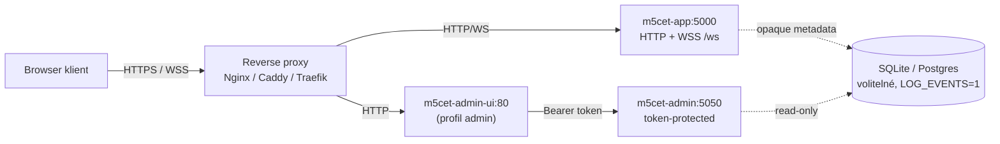

# M5cet — deployment / nasazení

Tento dokument popisuje produkční nasazení mimo `install.sh` happy path.
Pro happy path je `install.sh --install` jediný krok; tady jsou recepty pro
prostředí, kde si chcete řídit reverse proxy / TLS / orchestraci ručně.

> Detaily k jednotlivým platformám viz [`DEPLOYMENT.md`](../DEPLOYMENT.md)
> (DigitalOcean, Railway, Render, Fly.io).

## Topologie



## Minimální požadavky

- 1 vCPU, 512 MB RAM, 1 GB disk pro hlavní službu.
- Node 20.x (pokud běžíte bez Dockeru).
- Public IPv4 nebo CDN front. WebRTC potřebuje secure context (HTTPS / WSS).
- Pokud máte symetrický NAT / carrier-grade NAT na klientech, doplňte vlastní
  TURN server (např. `coturn`) a propagujte ho přes `iceServers` v App.tsx.

## Reverse proxy

### Nginx (referenční)

`install.sh` zapisuje toto, pokud `--enable-nginx`:

```nginx
# Managed by M5cet install.sh
server {
    listen 80;
    server_name chat.example.com;
    location /.well-known/acme-challenge/ {
        root /var/www/letsencrypt;
    }
    location / {
        return 301 https://$host$request_uri;
    }
}

server {
    listen 443 ssl http2;
    server_name chat.example.com;

    ssl_certificate     /etc/letsencrypt/live/chat.example.com/fullchain.pem;
    ssl_certificate_key /etc/letsencrypt/live/chat.example.com/privkey.pem;

    add_header X-Robots-Tag "noindex, nofollow" always;
    add_header Strict-Transport-Security "max-age=31536000" always;

    proxy_buffering off;
    proxy_read_timeout 3600s;
    proxy_send_timeout 3600s;

    location /ws {
        proxy_pass http://127.0.0.1:5000/ws;
        proxy_http_version 1.1;
        proxy_set_header Upgrade $http_upgrade;
        proxy_set_header Connection "upgrade";
        proxy_set_header Host $host;
        proxy_set_header X-Forwarded-For $proxy_add_x_forwarded_for;
    }

    location / {
        proxy_pass http://127.0.0.1:5000;
        proxy_http_version 1.1;
        proxy_set_header Host $host;
        proxy_set_header X-Forwarded-For $proxy_add_x_forwarded_for;
    }
}
```

### Caddy (alternativa)

```caddy
chat.example.com {
    encode zstd gzip
    header X-Robots-Tag "noindex, nofollow"
    @ws { path /ws* }
    reverse_proxy @ws 127.0.0.1:5000
    reverse_proxy 127.0.0.1:5000
}
```

### Cloudflare

- WSS přes Cloudflare Free tier funguje, ale s 100 s timeoutem na idle.
  `connection-keeper` je proti tomu obraněný (heartbeat ~25 s default).
- Vypněte "Brotli" / aggressive minification — nezasahovat do JS bundle.

## TLS

`install.sh --enable-tls` vyvolá certbot s `--nginx`. Manuální:

```bash
sudo certbot --nginx -d chat.example.com --email admin@example.com --agree-tos
```

Auto-renewal je ošetřený certbot timerem.

## Docker Compose

`docker-compose.yml` má tři služby:

```yaml
services:
  app:        # main signaling, port 5000
  admin:      # admin API, port 5050, profile=admin
  admin-ui:   # static GUI, port 5051, profile=admin
```

Spuštění:

```bash
# Pouze app (default)
docker compose up -d

# App + admin stack
docker compose --profile admin up -d
```

Override portů přes `.env`:

```dotenv
ADMIN_PORT=15050
ADMIN_UI_PORT=15051
ADMIN_API_TOKEN=<32+B random>
VAPID_PUBLIC_KEY=...
VAPID_PRIVATE_KEY=...
```

## Bare-metal (bez Dockeru)

```bash
git clone https://github.com/m5ike/cipherroom-secure-chat /opt/m5cet
cd /opt/m5cet
npm ci
npm run build

# systemd unit
sudo tee /etc/systemd/system/m5cet.service >/dev/null <<'EOF'
[Unit]
Description=M5cet signaling
After=network.target

[Service]
WorkingDirectory=/opt/m5cet
EnvironmentFile=/opt/m5cet/.env
ExecStart=/usr/bin/node /opt/m5cet/dist/index.cjs
Restart=always
User=m5cet
NoNewPrivileges=true
ProtectSystem=strict
ProtectHome=true
PrivateTmp=true

[Install]
WantedBy=multi-user.target
EOF

sudo systemctl daemon-reload
sudo systemctl enable --now m5cet
```

## Observability

- `GET /api/health` pro liveness probe.
- `GET /admin/metrics` (token) pro RAM, uptime, push subscribers, events
  backend.
- Standard Node `process.memoryUsage()` přístupný přes admin metrics.
- Pro Prometheus přidejte sidecar exportér; M5cet sám expozici nedělá
  (záměrně, ať server má minimum surface).

## Backup

- `data/` (pokud používáte SQLite events backend).
- `.env` (`ADMIN_API_TOKEN`, VAPID, `DATABASE_URL`).
- Konfiguraci Nginx a TLS certifikáty.

`install.sh` automatický backup dělá při každém upgrade pod
`/var/backups/m5cet/<timestamp>/`.

## Hardening checklist

- [ ] HTTPS / WSS s validním certifikátem.
- [ ] HSTS header.
- [ ] Silný `ADMIN_API_TOKEN` (≥32 B base64).
- [ ] Admin port není exponovaný do internetu (firewall / reverse proxy
      access list).
- [ ] `LOG_EVENTS=0`, pokud kompliance nevyžaduje opak.
- [ ] OS auto-updates zapnuté.
- [ ] Docker images regulérně přetagovat (`docker compose pull`).
- [ ] Backup `.env` v sejfu.
