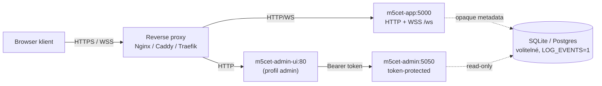

# M5cet — deployment / nasazení

Běžná cesta je [`install.sh`](../install.sh) — viz [`INSTALL.md`](../INSTALL.md):
zjistí systém, doinstaluje závislosti, nasadí (native nebo docker), nastaví
Nginx/TLS a uloží konfiguraci pro `update.sh` a `uninstall.sh`. Tento dokument
je pro případy, kdy si reverse proxy, TLS nebo orchestraci řídíte ručně, a pro
hostované platformy.

M5cet potřebuje **dlouho běžící proces**: `/ws` je trvalé WebSocket spojení pro
signalizaci WebRTC. Čistě statický hosting umí obsloužit frontend, ale ne
backend.

## Topologie


```mermaid
flowchart LR
    Klient[Browser klient]
    LB[Reverse proxy<br/>Nginx / Caddy / Traefik]
    App["m5cet-app:5000<br/>HTTP + WSS /ws"]
    Admin["m5cet-admin:5050<br/>token-protected"]
    AdminUI["m5cet-admin-ui:80<br/>(profil admin)"]
    DB[(SQLite / Postgres<br/>volitelné, LOG_EVENTS=1)]

    Klient -- HTTPS / WSS --> LB
    LB -- HTTP/WS --> App
    LB -- HTTP --> AdminUI
    AdminUI -- Bearer token --> Admin
    App -. opaque metadata .-> DB
    Admin -. read-only .-> DB
```

## Hostované platformy (PaaS)

Konfigurace jsou v repozitáři; všechny staví z `Dockerfile` nebo přes
`npm ci && npm run check && npm run build` a hlídají `GET /api/health`.

| Platforma | Soubor | Postup |
|---|---|---|
| DigitalOcean App Platform | [`.do/app.yaml`](../.do/app.yaml) | Create App → GitHub repo → Dockerfile, nebo použít app spec |
| Railway | [`railway.json`](../railway.json) | Connect repo → Deploy |
| Render | [`render.yaml`](../render.yaml) | New Web Service → Render načte `render.yaml` |
| Fly.io | [`fly.toml`](../fly.toml) | `fly launch --no-deploy --name m5cet --region fra && fly deploy` |

Proměnné prostředí (VAPID, TURN, `LOG_EVENTS`, …) nastavte v administraci
platformy — viz [`modes.md`](modes.md) a `install.sh --list-params`. Verzi
Node určuje `engines` v `package.json` (≥ 22).

**Netlify / Vercel** se hodí jen pro statický frontend. Backend pak musí běžet
jinde a frontend se sestaví s `VITE_SIGNALING_URL=wss://backend.example/ws`.
**Cloudflare Workers + Durable Objects** by signalizaci zvládly, ale
vyžadovaly by přepis `server/routes.ts`.

## Minimální požadavky

- 1 vCPU, 512 MB RAM, 1 GB disk pro hlavní službu.
- Node.js ≥ 22, doporučeno 24 LTS (pokud běžíte bez Dockeru). Node 20 je EOL.
- Public IPv4 nebo CDN front. WebRTC potřebuje secure context (HTTPS / WSS).
- Pokud máte symetrický NAT / carrier-grade NAT na klientech, doplňte vlastní
  TURN server (např. `coturn`) a propagujte ho přes `iceServers` v App.tsx.

## Reverse proxy

### Nginx (referenční)

`install.sh` generuje vlastní web včetně omezení počtu WebSocket spojení na
klienta (`limit_req` / `limit_conn` pro `/ws`) — to je podstatné, protože
limiter uvnitř aplikace se při WS upgradu nespouští. Ruční minimum vypadá takto
(doplňte si stejné limity):

```nginx
# Managed by M5cet install.sh
server {
    listen 80;
    server_name chat.example.com;
    location /.well-known/acme-challenge/ {
        root /var/www/letsencrypt;
    }
    location / {
        return 301 https://$host$request_uri;
    }
}

server {
    listen 443 ssl http2;
    server_name chat.example.com;

    ssl_certificate     /etc/letsencrypt/live/chat.example.com/fullchain.pem;
    ssl_certificate_key /etc/letsencrypt/live/chat.example.com/privkey.pem;

    add_header X-Robots-Tag "noindex, nofollow" always;
    add_header Strict-Transport-Security "max-age=31536000" always;

    proxy_buffering off;
    proxy_read_timeout 3600s;
    proxy_send_timeout 3600s;

    location /ws {
        proxy_pass http://127.0.0.1:5000/ws;
        proxy_http_version 1.1;
        proxy_set_header Upgrade $http_upgrade;
        proxy_set_header Connection "upgrade";
        proxy_set_header Host $host;
        proxy_set_header X-Forwarded-For $proxy_add_x_forwarded_for;
    }

    location / {
        proxy_pass http://127.0.0.1:5000;
        proxy_http_version 1.1;
        proxy_set_header Host $host;
        proxy_set_header X-Forwarded-For $proxy_add_x_forwarded_for;
    }
}
```

### Caddy (alternativa)

```caddy
chat.example.com {
    encode zstd gzip
    header X-Robots-Tag "noindex, nofollow"
    @ws { path /ws* }
    reverse_proxy @ws 127.0.0.1:5000
    reverse_proxy 127.0.0.1:5000
}
```

### Cloudflare

- WSS přes Cloudflare Free tier funguje, ale s 100 s timeoutem na idle.
  `connection-keeper` je proti tomu obraněný (heartbeat ~25 s default).
- Vypněte "Brotli" / aggressive minification — nezasahovat do JS bundle.

## TLS

`install.sh --enable-tls` vyvolá certbot s `--nginx`. Manuální:

```bash
sudo certbot --nginx -d chat.example.com --email admin@example.com --agree-tos
```

Auto-renewal je ošetřený certbot timerem.

## Docker Compose

Referenční `docker-compose.yml` v kořeni má dvě služby ze **stejného image**
(admin je jen jiný `command` a své GUI servíruje sám na `/`):

```yaml
services:
  app:        # signalizace, 127.0.0.1:${APP_PORT:-5005} -> 5000
  admin:      # admin API + GUI, 127.0.0.1:${ADMIN_PORT:-5050}, profile=admin
```

Obě běží s `read_only`, `cap_drop: ALL` a `no-new-privileges`. Produkční
instalace si generuje vlastní soubor do `<dir>/.m5cet/docker-compose.yml`
a tajemství předává přes `env_file`, ne v compose souboru.

Spuštění:

```bash
# Pouze app (default)
docker compose up -d

# App + admin stack
docker compose --profile admin up -d
```

Override portů přes `.env`:

```dotenv
APP_PORT=15000
ADMIN_PORT=15050
ADMIN_API_TOKEN=<32+B random>
VAPID_PUBLIC_KEY=...
VAPID_PRIVATE_KEY=...
```

## Bare-metal (bez Dockeru)

```bash
# Doporučeno: sudo ./install.sh --mode native  — vytvoří uživatele, unit
# s hardeningem, .env s právy 0640 a uloží konfiguraci pro update/uninstall.
# Ručně:
git clone https://github.com/m5ike/cipherroom-secure-chat /opt/m5cet
cd /opt/m5cet
npm ci
npm run build          # dist/ je soběstačné; node_modules pak lze smazat

# systemd unit
sudo tee /etc/systemd/system/m5cet.service >/dev/null <<'EOF'
[Unit]
Description=M5cet signaling
After=network.target

[Service]
WorkingDirectory=/opt/m5cet
EnvironmentFile=/opt/m5cet/.env
ExecStart=/usr/bin/node /opt/m5cet/dist/index.cjs
Restart=always
User=m5cet
NoNewPrivileges=true
ProtectSystem=strict
ProtectHome=true
PrivateTmp=true

[Install]
WantedBy=multi-user.target
EOF

sudo systemctl daemon-reload
sudo systemctl enable --now m5cet
```

## Úložiště (od 2.10.0)

Server ukládá data do `$DATA_DIR/storage` (SQLite + SQLCipher, viz
[`storage.md`](storage.md)). Adresář **musí být zapisovatelný** — systemd
unit z instalátoru proto má `StateDirectory=m5cet` a `DATA_DIR=/var/lib/m5cet`.
U starší instalace doplňte do unitu:

```ini
StateDirectory=m5cet
StateDirectoryMode=0700
Environment=DATA_DIR=/var/lib/m5cet
```

SQLCipher přináší nativní modul `better-sqlite3-multiple-ciphers`, vedený
jako volitelná závislost. Většinou se stáhne předkompilovaný; jinak ho `npm
ci` přeloží (`build-essential`, `python3`). Když modul chybí, server běží dál
bez úložiště a `GET /api/storage/status` vrací `available: false` — takže po
nasazení stojí za to se na ten endpoint podívat.

Doporučeno nastavit `STORAGE_MASTER_KEY` (32 bajtů hex/base64) v `.env` a
zálohovat ho; jinak si server vygeneruje `storage.key` v adresáři úložiště.

## Observability

- `GET /api/health` pro liveness probe.
- `GET /admin/metrics` (token) pro RAM, uptime, push subscribers, events
  backend.
- Standard Node `process.memoryUsage()` přístupný přes admin metrics.
- Pro Prometheus přidejte sidecar exportér; M5cet sám expozici nedělá
  (záměrně, ať server má minimum surface).

## Backup

- `data/` (pokud používáte SQLite events backend).
- `.env` (`ADMIN_API_TOKEN`, VAPID, `DATABASE_URL`).
- Konfiguraci Nginx a TLS certifikáty.

`update.sh` zálohuje před každou změnou do `BACKUP_ROOT`
(`/var/backups/m5cet/<čas>-<akce>/`, u uživatelské instalace
`<dir>/.m5cet/backups/`) a drží posledních `BACKUP_KEEP` (5) záloh;
`update.sh --rollback` se k poslední vrátí.

## Hardening checklist

- [ ] HTTPS / WSS s validním certifikátem.
- [ ] HSTS header.
- [ ] Silný `ADMIN_API_TOKEN` (≥32 B base64).
- [ ] Admin port není exponovaný do internetu (firewall / reverse proxy
      access list).
- [ ] `LOG_EVENTS=0`, pokud kompliance nevyžaduje opak.
- [ ] OS auto-updates zapnuté.
- [ ] Docker images regulérně přetagovat (`docker compose pull`).
- [ ] Backup `.env` v sejfu.
