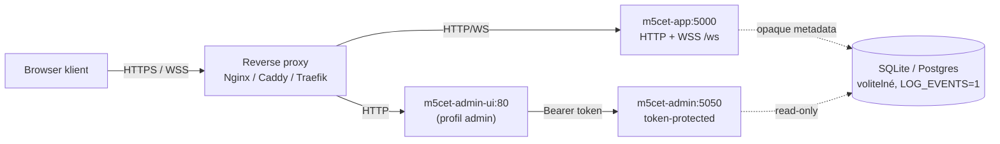

# M5cet — deployment / nasazení

Běžná cesta je [`install.sh`](../install.sh) — viz [`INSTALL.md`](../INSTALL.md):
zjistí systém, doinstaluje závislosti, nasadí (native nebo docker), nastaví
Nginx/TLS a uloží konfiguraci pro `update.sh` a `uninstall.sh`. Tento dokument
je pro případy, kdy si reverse proxy, TLS nebo orchestraci řídíte ručně, a pro
hostované platformy.

M5cet potřebuje **dlouho běžící proces**: `/ws` je trvalé WebSocket spojení pro
signalizaci WebRTC. Čistě statický hosting umí obsloužit frontend, ale ne
backend.

## Topologie


```mermaid
flowchart LR
    Klient[Browser klient]
    LB[Reverse proxy<br/>Nginx / Caddy / Traefik]
    App["m5cet-app:5000<br/>HTTP + WSS /ws"]
    Admin["m5cet-admin:5050<br/>token-protected"]
    AdminUI["m5cet-admin-ui:80<br/>(profil admin)"]
    DB[(SQLite / Postgres<br/>volitelné, LOG_EVENTS=1)]

    Klient -- HTTPS / WSS --> LB
    LB -- HTTP/WS --> App
    LB -- HTTP --> AdminUI
    AdminUI -- Bearer token --> Admin
    App -. opaque metadata .-> DB
    Admin -. read-only .-> DB
```

## Hostované platformy (PaaS)

Konfigurace jsou v repozitáři; všechny staví z `Dockerfile` nebo přes
`npm ci && npm run check && npm run build` a hlídají `GET /api/health`.

| Platforma | Soubor | Postup |
|---|---|---|
| DigitalOcean App Platform | [`.do/app.yaml`](../.do/app.yaml) | Create App → GitHub repo → Dockerfile, nebo použít app spec |
| Railway | [`railway.json`](../railway.json) | Connect repo → Deploy |
| Render | [`render.yaml`](../render.yaml) | New Web Service → Render načte `render.yaml` |
| Fly.io | [`fly.toml`](../fly.toml) | `fly launch --no-deploy --name m5cet --region fra && fly deploy` |

Proměnné prostředí (VAPID, TURN, `LOG_EVENTS`, …) nastavte v administraci
platformy — viz [`modes.md`](modes.md) a `install.sh --list-params`. Verzi
Node určuje `engines` v `package.json` (≥ 22).

**Netlify / Vercel** se hodí jen pro statický frontend. Backend pak musí běžet
jinde a frontend se sestaví s `VITE_SIGNALING_URL=wss://backend.example/ws`.
**Cloudflare Workers + Durable Objects** by signalizaci zvládly, ale
vyžadovaly by přepis `server/routes.ts`.

## Minimální požadavky

- 1 vCPU, 512 MB RAM, 1 GB disk pro hlavní službu.
- Node.js ≥ 22, doporučeno 24 LTS (pokud běžíte bez Dockeru). Node 20 je EOL.
  **6.7:** sandbox Funkcí startuje Node s permission modelem — na Node
  22.13+ / 23.5+ přepínačem `--permission`, na starším 22.x / 23.x
  `--experimental-permission` (`permissionFlag`,
  `server/functions/sandbox/pool.ts`). Ověřeno na Node 24 (CI, Docker);
  starší 22.x jen jednotkovým testem volby přepínače.
- Public IPv4 nebo CDN front. WebRTC potřebuje secure context (HTTPS / WSS).
- Pokud máte symetrický NAT / carrier-grade NAT na klientech, doplňte vlastní
  TURN server (např. `coturn`) a propagujte ho přes `iceServers` v App.tsx.

## Reverse proxy

### Nginx (referenční)

`install.sh` generuje vlastní web včetně omezení počtu WebSocket spojení na
klienta (`limit_req` / `limit_conn` pro `/ws`). Od 3.0 má i aplikace vlastní
bránu spojení (`WS_CONNECTS_PER_MINUTE`, `WS_CONNECTIONS_PER_CLIENT`,
`WS_CONNECTIONS_TOTAL`); limity v proxy jsou druhá vrstva. Posílá-li proxy
vlastní `Content-Security-Policy`, musí od 3.1 obsahovat
`script-src 'self' 'wasm-unsafe-eval'` (Argon2id) — viz
[`deploy/nginx/m5cet.conf`](../deploy/nginx/m5cet.conf). Více instancí za
jedním upstreamem: [dokumentace › Více instancí](site/index.html#cluster).
**6.7:** referenční `deploy/nginx/m5cet.conf` (statika ze `dist/public`)
nově směruje na aplikaci i `location /hooks/` (webhooky Funkcí,
`client_max_body_size 6m`, `proxy_read_timeout 120s`) a
`location = /fn-sandbox.html` (rám, ve kterém běží prohlížečový kód funkcí)
a CSP statiky má `frame-src 'self'` — bez toho za ní webhooky modelů ani
`m5.browser.run` nefungovaly (audit S16). Konfigurace z instalátoru posílá
na aplikaci všechno a změnu nepotřebuje.
Ruční minimum vypadá takto (doplňte si stejné limity):

```nginx
# Managed by M5cet install.sh
server {
    listen 80;
    server_name chat.example.com;
    location /.well-known/acme-challenge/ {
        root /var/www/letsencrypt;
    }
    location / {
        return 301 https://$host$request_uri;
    }
}

server {
    listen 443 ssl http2;
    server_name chat.example.com;

    ssl_certificate     /etc/letsencrypt/live/chat.example.com/fullchain.pem;
    ssl_certificate_key /etc/letsencrypt/live/chat.example.com/privkey.pem;

    add_header X-Robots-Tag "noindex, nofollow" always;
    add_header Strict-Transport-Security "max-age=31536000" always;

    proxy_buffering off;
    proxy_read_timeout 3600s;
    proxy_send_timeout 3600s;

    location /ws {
        proxy_pass http://127.0.0.1:5000/ws;
        proxy_http_version 1.1;
        proxy_set_header Upgrade $http_upgrade;
        proxy_set_header Connection "upgrade";
        proxy_set_header Host $host;
        proxy_set_header X-Forwarded-For $proxy_add_x_forwarded_for;
    }

    location / {
        proxy_pass http://127.0.0.1:5000;
        proxy_http_version 1.1;
        proxy_set_header Host $host;
        proxy_set_header X-Forwarded-For $proxy_add_x_forwarded_for;
    }
}
```

#### Passkeys na Androidu: `/.well-known/assetlinks.json` (od 6.4.0)

Aplikace pro Android používá passkeys serveru jen tehdy, když
`https://<doména>/.well-known/assetlinks.json` dorazí z internetu až
k aplikaci. Hostingové panely (ISPConfig, Plesk…) často zakazují všechny
cesty s tečkou (`location ~ /\. { deny all; }`) nebo si `/.well-known/`
drží pro certifikáty — soubor pak vrací 403 nebo HTML stránku a každé
přihlášení passkeyem na Androidu selže („The incoming request cannot be
validated“). Přesná `location =` má přednost před regexem, stačí ji přidat
do bloku `server` (v panelu do vlastních direktiv nginx):

```nginx
location = /.well-known/assetlinks.json {
    proxy_pass http://127.0.0.1:5000;
    proxy_http_version 1.1;
    proxy_set_header Host              $host;
    proxy_set_header X-Forwarded-For   $proxy_add_x_forwarded_for;
    proxy_set_header X-Forwarded-Proto $scheme;
}
```

Pak `sudo nginx -t && sudo systemctl reload nginx` a v konzoli Android ›
Security › *Passkeys on Android* „Re-check“ (Google si soubor pár minut
drží v mezipaměti). Konfigurace z instalátoru a `deploy/nginx/m5cet.conf`
ho propouštějí už teď; `update.sh` po každé aktualizaci upozorní, když ne.
Podrobně `docs/registration.md`.

### Caddy (alternativa)

```caddy
chat.example.com {
    encode zstd gzip
    header X-Robots-Tag "noindex, nofollow"
    @ws { path /ws* }
    reverse_proxy @ws 127.0.0.1:5000
    reverse_proxy 127.0.0.1:5000
}
```

### Cloudflare

- WSS přes Cloudflare Free tier funguje, ale s 100 s timeoutem na idle.
  `connection-keeper` je proti tomu obraněný (heartbeat ~25 s default).
- Vypněte "Brotli" / aggressive minification — nezasahovat do JS bundle.

## TLS

`install.sh --enable-tls` vyvolá certbot s `--nginx`. Manuální:

```bash
sudo certbot --nginx -d chat.example.com --email admin@example.com --agree-tos
```

Auto-renewal je ošetřený certbot timerem.

## Docker Compose

Referenční `docker-compose.yml` v kořeni má dvě služby ze **stejného image**
(admin je jen jiný `command` a své GUI servíruje sám na `/`):

```yaml
services:
  app:        # signalizace, 127.0.0.1:${APP_PORT:-5005} -> 5000
  admin:      # admin API + GUI, 127.0.0.1:${ADMIN_PORT:-5050}, profile=admin
```

Obě běží s `read_only`, `cap_drop: ALL` a `no-new-privileges`. Produkční
instalace si generuje vlastní soubor do `<dir>/.m5cet/docker-compose.yml`
a tajemství předává přes `env_file`, ne v compose souboru.

Spuštění:

```bash
# Pouze app (default)
docker compose up -d

# App + admin stack
docker compose --profile admin up -d
```

Override portů přes `.env`:

```dotenv
APP_PORT=15000
ADMIN_PORT=15050
ADMIN_API_TOKEN=<32+B random>
VAPID_PUBLIC_KEY=...
VAPID_PRIVATE_KEY=...
```

## Bare-metal (bez Dockeru)

```bash
# Doporučeno: sudo ./install.sh --mode native  — vytvoří uživatele, unit
# s hardeningem, .env s právy 0640 a uloží konfiguraci pro update/uninstall.
# Ručně:
git clone https://github.com/m5ike/cipherroom-secure-chat /opt/m5cet
cd /opt/m5cet
npm ci
npm run build          # dist/ je soběstačné; node_modules pak lze smazat

# systemd unit
sudo tee /etc/systemd/system/m5cet.service >/dev/null <<'EOF'
[Unit]
Description=M5cet signaling
After=network.target

[Service]
WorkingDirectory=/opt/m5cet
EnvironmentFile=/opt/m5cet/.env
ExecStart=/usr/bin/node /opt/m5cet/dist/index.cjs
Restart=always
User=m5cet
NoNewPrivileges=true
ProtectSystem=strict
ProtectHome=true
PrivateTmp=true

[Install]
WantedBy=multi-user.target
EOF

sudo systemctl daemon-reload
sudo systemctl enable --now m5cet
```

## Úložiště (od 2.10.0)

Server ukládá data do `$DATA_DIR/storage` (SQLite + SQLCipher, viz
[`storage.md`](storage.md)). Adresář **musí být zapisovatelný** — systemd
unit z instalátoru proto má `StateDirectory=m5cet` a `DATA_DIR=/var/lib/m5cet`.
U starší instalace doplňte do unitu:

```ini
StateDirectory=m5cet
StateDirectoryMode=0700
Environment=DATA_DIR=/var/lib/m5cet
```

SQLCipher přináší nativní modul `better-sqlite3-multiple-ciphers`, vedený
jako volitelná závislost. Předkompilované binárky jsou přímo v balíčku, takže
překladač na serveru potřeba není; `npm ci` se o build i tak pokusí (s
`build-essential` a `python3` uspěje, jinak se tiše přeskočí). Po nasazení
stojí za to se podívat na `GET /api/storage/status` — `available: false`
znamená, že se data neukládají.

Doporučeno nastavit `STORAGE_MASTER_KEY` (32 bajtů hex/base64) v `.env` a
zálohovat ho; jinak si server vygeneruje `storage.key` v adresáři úložiště.

## Observability

- `GET /api/health` pro liveness probe (verze, build, protokol, `cluster`).
- `GET /metrics` — Prometheus text (od 3.1); token `METRICS_TOKEN` nebo
  administrátor. Scrape config:

  ```yaml
  - job_name: m5cet
    scheme: https
    authorization: { credentials: "<METRICS_TOKEN>" }
    static_configs: [{ targets: ["chat.example.com"] }]
  ```
- Alerty (bezpečnostní varování, chyby, event loop, heap, mrtvé položky
  fronty, selhání zálohy/integrity/auditu) s webhookem `ALERT_WEBHOOK_URL`;
  prahy `ALERT_<PRAVIDLO>` nebo v konzoli.
- Konzole `/console/` ukazuje živý provoz, audit a zdraví (včetně clusteru).

### Limit veřejného API (od 6.8 nastavitelný)

Obecný limit na `/api` počítá požadavky **z jedné adresy klienta** (jak ji
pozná `TRUST_PROXY`) v klouzavém okně; po překročení vrací `429`
s `{"message":"Too many requests, please try again later."}` a hlavičkami
`RateLimit-*` (kolik zbývá, za kolik sekund se okno obnoví).

| Proměnná | Výchozí | Rozsah | Význam |
|---|---|---|---|
| `API_RATE_LIMIT` | 100 | 10–100000 | požadavků na adresu za okno |
| `API_RATE_WINDOW_MIN` | 15 | 1–1440 | délka okna v minutách |

Nastavení: `update.sh --set API_RATE_LIMIT=600` (nebo řádek v `.env`)
a restart; server hodnotu vypíše při startu (`API limit 600 / 15 min per
address`), neplatnou ohlásí a použije výchozí. Do obecného limitu se
**nepočítají** cesty s vlastním limitem: dlaždice mapy (`/api/map/tile/…`,
300 za minutu), přihlášení a registrace passkey a obnova účtu (30 za 10 min),
trezor, úložiště, konzole, aplikace pro Android a profily. Do 6.8 se
dlaždice počítaly: stránka s několika mapami limit vyčerpala a další
přihlášení passkey skončilo `429`. Co limit vyčerpalo, ukáže konzole:
*Audit* (událost `http.rate-limited` s cestou) a *Provoz* (požadavky podle
cest).

## Backup

- Od 3.1 zálohuje server sám: s `BACKUP_DIR` každých
  `BACKUP_INTERVAL_HOURS` (24) hodin, drží `BACKUP_KEEP` (7) záloh — globální
  DB (online backup), šifrované DB uživatelů, účty, administrátory a
  `manifest.json` se SHA-256; ručně z konzole (Úložiště). Obnova: zastavit
  službu, zkopírovat obsah zálohy zpět do `$DATA_DIR`, ověřit
  `sha256sum` proti manifestu, spustit.
- **Master klíč úložiště** (`storage.key` / `STORAGE_MASTER_KEY`) zálohujte zvlášť — v záloze
  záměrně není. Od 6.12 z něj vzniká i klíč `functions.db` / `telephony.db`, hashů místností a podpisů auditního deníku (`audit-signing.key` už není; dřívější klíč je připnutý v `audit-signing.pin`) — bez master klíče se tyto databáze neotevřou.
- `.env` (`ADMIN_API_TOKEN`, VAPID, `TURN_SECRET`, `CLUSTER_SECRET`).
- Konfiguraci Nginx a TLS certifikáty.

`update.sh` zálohuje před každou změnou do `BACKUP_ROOT`
(`/var/backups/m5cet/<čas>-<akce>/`, u uživatelské instalace
`<dir>/.m5cet/backups/`) a drží posledních `BACKUP_KEEP` (5) záloh;
`update.sh --rollback` se k poslední vrátí.

## Přechod na 6.11

Nové proměnné prostředí (všechny volitelné; instalátor je zná — `update.sh --set
PROMĚNNÁ=hodnota`):

| Proměnná | Výchozí | Význam |
|---|---|---|
| `FUNCTIONS_DNS_TIMEOUT_MS` | 4000 (250–15 000) | nejdelší čekání jednoho `m5.dns.resolve`; pak chyba `timeout` (volání může chtít vlastní `timeoutMs`) |
| `FUNCTIONS_DNS_SERVERS` | systémové | jmenné servery pro funkce, čárkami („1.1.1.1, 8.8.8.8:53“, nejvýš 4) |
| `FUNCTIONS_SSE_PING_MS` | 15 000 | udržovací `: ping` streamu běhu |
| `FUNCTIONS_WAIT_NOTICE_MS` | 10 000 | po jak dlouhém čekání na hostitele (DNS, HTTP, AI…) běh ohlásí `progress` „Waiting for …“ |
| `FUNCTIONS_WAIT_EVERY_MS` | 10 000 | nejdelší ticho mezi dvěma takovými ohlášeními |

Co si operátor po nasazení všimne:

- **Aplikace vzdá příkaz po 30 s bez známky života** (web i Android 6.11): žádný výstup,
  průběh, otázka ani ohlášené čekání — pingy se nepočítají, otevřený formulář nebo NFC hodiny
  zastaví. Aplikace pak stream zavře a **server běh zruší** (stav `cancelled`). Model, který
  počítá déle bez výstupu, musí hlásit průběh (`m5.run.progress`); čekání na hostitele hlásí
  server sám (tabulka výše).
- **Odchod volajícího běh zruší** — stream i obyčejná JSON odpověď `POST /api/functions/run`:
  kdo zavře spojení před odpovědí, běh ukončí (otevřené dotazy, HTTP a AI požadavky, sandbox).
  Integrace, které spustily běh a nečekaly na odpověď, ať na ni počkají (nebo použijí webhook).
- **Chybné parametry:** `400 bad-input` nese navíc `problems[]`, `command` (definice modelu)
  a `usageLine`; `message` zůstává. Se streamem je to jediná událost `error` bez `start`.
  Server ověří všechny vstupy, ne jen první chybný.
- **DNS z funkcí má limit 4 s na dotaz.** Za pomalým resolverem (VPN, filtrující DNS) nastavte
  `FUNCTIONS_DNS_SERVERS` nebo zvyšte `FUNCTIONS_DNS_TIMEOUT_MS`. `/mail` odpoví vždy do 20 s;
  co DNS nestihlo, označí „⏱ no answer in time“.
- **Modely mají ikonu a návod** (*Functions › Models* › *Icon*, *Usage*; sloupce `icon`
  a `usage` přidá migrace při startu). Vestavěné balíčky se aktualizují na 1.4.0 a ikony
  a návody dostanou jednou i starší instalace.
- **Vypnuté vestavěné modely** (telefonie, NFC) dostávaly v 6.10 a starších při každé
  aktualizaci druhý model se stejným klíčovým slovem; 6.11 už ne, ale existující kopie
  nesmaže — v *Functions › Models* zkontrolujte, jestli tam vypnuté modely nejsou dvakrát.
- **`/hlr +420…` spustí placený dotaz HLR hned** (tel-hlr 1.1.0; dřív vždy nejdřív formulář);
  `/hlr` samo dál ukáže formulář. Balíček se dál instaluje vypnutý.
- **Odpovědi modelů** chodí od `system-messenger` s názvem a ikonou modelu. `system-messenger`,
  `system-messenger:*` a `function:*` peer jako odesílatele použít nesmí — zpráva s takovým
  odesílatelem se zahodí.
- **Aplikace pro Android:** build výchozího designu potřebuje aplikaci 6.11 (`minAppCode`
  61100); starší telefony si nechají build, který mají.

## Přechod na 6.10

Bezpečnostní revize 6.10 ([`security-analysis.md`](security-analysis.md) › 12, nálezy G-05,
G-06, G-08, G-12 – G-16) mění chování telefonie, editoru TSA a webu. Nové proměnné prostředí
tyto opravy nepřinášejí; nové limity jsou v *Telephony › Permissions* (soubor uložený verzí 6.9
je nemá — platí výchozí hodnoty z tabulky).

**Po aktualizaci nejdřív (první kolo revize, G-01 – G-04, G-10):**

- **Neověřený webhook hovoru už nic nespustí.** Telnyx bez `TELNYX_PUBLIC_KEY` a Vonage bez
  `VONAGE_SIGNATURE_SECRET` přestanou směrovat příchozí hovory přes pravidla, TSA a audio most
  (dřív tím šlo hovor padělat). Doplňte klíč podpisu, nebo — vědomě — `TELEPHONY_ALLOW_UNSIGNED=1`
  (Overview pak varuje).
- **Telefonní panel webu potřebuje pravidlo modulu** Telephony & SIP: bez něj
  `POST /api/telephony/call|sms` odmítne (dřív modul bez pravidla dovolil hovory a SMS komukoli
  z internetu). Web neposílá token účtu, takže pravidlo má dát `call` / `sms` skupině `guest`
  (nebo jen přihlášeným, pokud panel posílá token).
- **Cesty konzole a API rozlišují velikost písmen** (`/admin/telephony/LOG/…` už nevede na stejný
  handler jako `/log/…` a neobejde práva).
- Čtenář konzole bez práva `settings` vidí route kódy a slepá ID místností zamaskované.

**Aplikace pro Android 6.10:**

- **Build výchozího designu potřebuje aplikaci 6.10** (`minAppCode` 61000 — gesta bublin, citace,
  profil, šablony NFC); starší telefony si nechají build, který mají.
- **Design už nesmí** do citlivých akcí (`lib.run`, `url.open`, `profile.public`, `fn.run`, klíč
  `setting.set` / `look.set` / `setting.toggle`) dát počítaný argument z dat zpráv a nesmí měnit
  soukromé volby (záznam hovorů, konverzace, upozornění, poloha, zabezpečení, hlas, potvrzení
  přečtení, kontakty); každá volba má schéma hodnot. **Vlastní design operátora**, který na tom
  stavěl, akci neprovede („Tuto akci vzhledu aplikace neprovedla: mohla by z telefonu odnést data nebo změnit nastavení soukromí.") — upravte ho.
- Oznámení se při zámku aplikace přepíšou na neutrální text; intent s cizím `room` aplikace
  ignoruje (jen vlastní zapečetěný).

**NFC (web i Android):** šablony `apduTemplates` mají nový formát (kroky — úplné čtení typu
karty); staré záznamy běží dál, ale **Console › Android › Define › Load standard templates** je
nahradí úplnou sadou. Šablony i surová APDU z modelu jsou **jen ke čtení** (zápis, VERIFY,
GENERATE AC se odmítnou); výsledek čtení spuštěného modelem odejde serveru až po souhlasu
uživatele (výchozí maskovaný).

**Telephony & SIP — aplikace (TSA):**

- **Prázdné `outbound.countries` znamená pro TSA jen vaše vlastní země.** SMS a přepojení (Dial)
  z TSA řídí kdokoli, kdo zavolá, a číslo volajícího jde podvrhnout (SMS pumping). Vlastní země
  se odvodí z čísel serveru (`TWILIO_FROM`, `TELNYX_FROM`, `VONAGE_FROM`, `TELEPHONY_DID_POOL`,
  DID a caller ID SIP trunků) a z čísla, na které se volalo. Funkce, aplikace a testy konzole
  s prázdným seznamem smějí dál kamkoli. **Kdo z TSA posílá SMS nebo přepojuje do zahraničí,
  musí země vyjmenovat**, nebo zadat `*` (celý svět, i pro TSA — validátor pak varuje u SMS na
  `{call.from}`). Odmítnutí je v logu (`route`, `tsa`) a uzel jde do `on_failed`.
- **Dial / transfer prochází stejnými kontrolami jako `m5.telephony.call`** (`planOutbound`
  s klíčem rozpočtu `tsa:<id>`): země, blokovaná čísla, souběh odchozích hovorů, **odchozí
  pravidla** — pravidlo se stavem odmítne přepojení i při *Route through: application / SIP
  trunk* (6.9 je obešlo) — a nejdelší hovor: přepojení dostane časový limit
  `outbound.maxMinutes` (nejvýš zbytek *Longest call* ze Startu TSA; Twilio `timeLimit`, Vonage
  `limit`, Telnyx `time_limit_secs`). Přepojení jedné TSA za hodinu nejvýš `callsPerHour`.
- **SMS z TSA má vlastní hodinový rozpočet** (`smsPerHour` pod klíčem `tsa:<id>`, dřív sdílené
  `anonymous`).
- **Route kódy:** zvolený snadno uhodnutelný kód (`0000`, `1234`, `1212`, rok…) se **odmítne**
  (`bad-argument`, 6.9 jen varovala); kód s platností nad 10 minut musí mít **6 číslic** (zvolený
  kratší se odmítne, náhodný se prodlouží); živých kódů jedné délky je nejvýš 10 (4 číslice),
  100 (5) a 1000 (6) — pak `inroute-limit`. Špatné kódy se počítají i na volané číslo a za celý
  modul; po vyčerpání rozpočtu se kódy na tom čísle, resp. všude, **pozastaví** (1 min,
  opakovaně až 60 min) — i správný kód pak dostane `on_code_error`. Kód, který dosáhne
  `maxAttemptsPerCall` (výchozí 3), **ukončí hovor** krátkou omluvou (6.9: `on_code_error` dál).
  Každá pauza je varování v logu a bezpečnostní událost auditu `telephony.inroute.lockout`
  (počítá se do alertu *security-warnings*).
- **Webhooky:** podepsaný webhook Telnyx / Vonage, který server už zpracoval (stejné id události,
  `jti`, `sig`), dostane `200` s `{"ok":true,"duplicate":true}` (odpověď hovoru Vonage prázdné
  NCCO) a nezpracuje se. Týká se i opakovaného doručení téže události poskytovatelem.
- **Editor TSA:** neuložená místní kopie a schránka jsou v `sessionStorage` (jen ta karta
  prohlížeče, zmizí se zavřením a odhlášením) a bez hodnot hlaviček, které vypadají jako
  tajemství; kopie, které 6.9 nechala v `localStorage`, editor při otevření převezme a odtud
  smaže. **TSA s doslovným tajemstvím v hlavičce nástroje HTTP** (`Authorization: Bearer …`,
  `X-Api-Key: …`, `Cookie: …`, JWT) **nejde publikovat** — dejte hodnotu do prostředí serveru jako
  `TSA_SECRET_<JMÉNO>` a do hlavičky `{secret:JMÉNO}`. Už publikovaná verze běží dál.

| Oprávnění | Výchozí | Rozsah | Význam |
|---|---|---|---|
| `inroute.maxFailuresPerDidPerHour` | 30 | 1–10 000 | špatné kódy na jedno volané číslo za hodinu, pak pauza kódů na něm |
| `inroute.maxFailuresPerMinute` | 10 | 1–1000 | špatné kódy za minutu v celém modulu, pak pauza všude |
| `inroute.maxFailuresPerHour` | 100 | 1–10 000 | totéž za hodinu |
| `outbound.countries` | `[]` | ISO kódy nebo `*` | nově `*` = kamkoli; `[]` = kamkoli, ale TSA jen vlastní země |

**Web:**

- Soubor z panelu *Soubory*, poloha (jednorázová i průběžná) a text z panelu *Řeč* jdou jen
  vybraným příjemcům, jako zpráva (6.9 vždy celé místnosti). Průběžná poloha si výběr zafixuje
  při spuštění; když je vybraný jen nepřítomný člověk, nespustí se.
- Příloha nese klikací a mizející volbu; co u souboru nejde (individuální šifrování, u velkého
  souboru všechny volby), aplikace vyjmenuje a zeptá se. *Přeposlat* zachová klikací a mizející
  zprávu a vlastní individuálně šifrovanou zprávu znovu zašifruje jejím kódem; zprávu, jejíž kód
  nemá, přeposlat nedovolí.
- *Poslat jako hlas*: pod polem stojí „Jako hlas — text čte server" a první hlasová zpráva
  v místnosti jmenuje službu převodu řeči a zeptá se. Odpověď funkci s volbou *Individuálně
  šifrovaná* se odmítne (text čte server).

## Přechod na 6.9

Telephony & SIP je v 6.9 přestavěné (stránka konzole, pravidla, TSA, route
kódy, log, testy — přehled v [`telephony.md`](telephony.md) › 0). Co si
operátor po aktualizaci všimne:

- **Příchozí hovor bez pravidla dostane „busy“.** Do 6.9 příchozí hovor na
  číslo, které nepůjčil audio most, prošel starou logikou webhooků; teď ho
  rozhodují příchozí pravidla a bez shody platí výchozí cíl
  (*Telephony › Permissions › Defaults*, výchozí `busy`). Po aktualizaci
  založte příchozí pravidla (nebo změňte výchozí cíl), jinak volající uslyší
  obsazeno. Čísla půjčená audio mostem (`m5.telephony.did`) fungují dál.
- **Odchozí hovory a SMS prochází oprávněními a pravidly** (blokovaná
  prémiová čísla, země, hodinové rozpočty, souběžné hovory, nejdelší hovor).
  Výchozí blokuje mj. `+1900*`, `+4290*`, `+42097*`, satelitní `+881*`–`+883*`.
- **Nová práva modulu** (Modules & groups › Telephony & SIP): `inroute`
  (funkce: `m5.telephony.inroute.*`) a pro konzoli `routing`, `tsa`, `log`
  vedle `settings` a `test`. Skupiny bez `*` je potřebují přidat, jinak
  uvidí pravidla a aplikace jen ke čtení a detail logu vůbec.
- **`PUBLIC_BASE_URL` musí být https** a proxy musí pouštět `/wh/`
  (i nové `/wh/tsa/…` — zvuk TTS a nahrané soubory pro poskytovatele)
  a WebSockety `/media/tel/…` — referenční nginx i instalátor to dělají.
- **Nová data:** `telephony-tsa.json` vedle `telephony.json` (TSA; přesune
  ho `TSA_DATA_FILE`), v `telephony.db` tabulky `tel_log`, `inroute`,
  `inroute_failures`, `tsa_sessions`, `tsa_graphs`, `tsa_audio`,
  `tsa_marks`; v `telephony.json` sekce `permissions`, `rules`, `testSip`
  (zálohujte jako dřív).

| Proměnná | Výchozí | Význam |
|---|---|---|
| `TSA_DATA_FILE` | `telephony-tsa.json` vedle `telephony.json` | kde jsou TSA |
| `TSA_SECRET_<JMÉNO>` | — | hodnota pro `{secret:JMÉNO}` v hlavičkách nástroje HTTP v TSA |
| `TELEPHONY_ROUTE_LANGUAGE` | `cs` | jazyk přepisu a upozornění při směrování zvuku hovoru do místnosti (textový režim) |

## Přechod na 6.7

Nové proměnné prostředí (všechny volitelné; instalátor je zná, takže je
nastaví `update.sh --set PROMĚNNÁ=hodnota`, a řádky přidané do `.env` ručně
zachová):

| Proměnná | Výchozí | Význam |
|---|---|---|
| `PRESENCE_MAX_AWAY_DAYS` | 7 | kolik dní zůstane v seznamu místnosti člen, jehož spojení spadlo (desetinná čísla jdou, `0` = navždy) |
| `ACCOUNTS_MAX` | 5000 | strop účtů; plné úložiště nejdřív (nejvýš jednou za 10 min) odstraní až 100 nikdy nepoužitých registrací starších než týden, pak registrace vrací `409` a audit `accounts.full` |
| `STORAGE_SESSION_BUDGET_MB` | 2048 | sdílený rozpočet bajtů všech anonymních databází relací; navíc nejvýš 20 živých relací na adresu klienta |
| `FUNCTIONS_NFC_RUN_HOURS` | 24 (min. 1) | jak dlouho se drží běh funkce, který přečetl kartu (`m5.nfc`), i s logy — ostatní běhy dál `FUNCTIONS_RUNS_DAYS` |
| `VONAGE_ALLOW_UNSIGNED_SMS` | — | `1` = přijmout Vonage SMS bez `sig` (jako neověřené), i když je nastaven `VONAGE_SIGNATURE_SECRET` |
| `TELEPHONY_ALLOW_UNSIGNED` | — | 6.10: `1` = neověřený webhook hovoru (Telnyx bez `TELNYX_PUBLIC_KEY`, Vonage bez `VONAGE_SIGNATURE_SECRET`) smí spustit pravidla, TSA a audio most — jen pro zkoušky, hovor pak může padělat kdokoli |
| `ANDROID_DESIGN_IMAGE_HOSTS` | žádný | hostitelé (čárkami), ze kterých smí design Androidu brát pevné https obrázky |
| `NOTIFY_DIR` | `$DATA_DIR/notify` | nastavení upozornění (`config.json`, `accounts.json`; SMTP se nastavuje v konzoli, proměnné `SMTP_*` neexistují) |

Co si operátor po nasazení všimne:

- **Aplikaci pro Android 6.7 nasaďte spolu se serverem 6.7.** Aplikace 6.7
  použije jen politiku zámku **podepsanou** serverem pro dané zařízení; se
  starším serverem změny politiky ignoruje (zařízení drží poslední uloženou,
  nově zapsané výchozí hodnoty aplikace). Server 6.7 posílá podepsanou
  i nepodepsanou politiku, takže starší aplikace fungují dál — bez té
  ochrany.
- **Design Androidu:** obrázek s počítanou adresou (`=…`, `{…}`) smí být jen
  `asset:` nebo `data:image/`, vzdálený https obrázek jen jako pevná adresa
  z hostitele v `ANDROID_DESIGN_IMAGE_HOSTS` (výchozí žádný), `url.open`
  jen pevná https adresa. Uložení takového designu vrátí `400` se seznamem
  problémů. **Uložený `design.json`, který tato pravidla poruší, server při
  čtení nepoužije** — použije výchozí design, zapíše do logu varování
  (`[android] the saved design is not used …`) a konzole to ohlásí, když
  design otevřete. Opravte ho a uložte znovu.
- **Výchozí design 6.7 obaluje řádky místností prvkem `swipe`**, který
  aplikace starší než 6.7 nezná (prázdné řádky). Build, jehož design používá
  prvek nebo akci 6.7, proto dostane `minAppCode` 60700 sám; starší aplikace
  si nechá build, který má, dokud se neaktualizuje.
- **Vonage:** se `VONAGE_SIGNATURE_SECRET` dostane SMS bez `sig` nebo se
  starým `timestamp` `403`, JWT musí mít `iat` nejvýš 10 min starý
  a `payload_hash` u každého těla (viz [`telephony.md`](telephony.md)).
- **Audit zpráv (`/api/chat/message-audit`):** aktér je jen uživatelské
  jméno ověřeného tokenu, jinak `guest` (dřív `guest:<klient>`; id klienta
  je teď v `detail.claimedClient`); rozpočet 300 záznamů / h na adresu hosta
  (IPv6 po /64) a 3000 / h na účet, pak `429`.
- **Funkce:** relace zpracování z doby před 6.7 (bez záznamu, kdo ji
  otevřel) aplikace nepokračuje — každá událost dostane `410` „…is over — run
  the command again“; nový běh funguje. `m5.caller.room` je slepé id
  místnosti (`r3.…`, u místností v2 nic), ne čitelný název — modely, které
  podle názvu rozlišovaly místnosti, je třeba upravit. Aplikace pro Android
  starší než 6.7 posílá ještě čitelný název, takže její pokračování
  sdílených relací dostanou `410`. Hodnoty `m5.session` / `m5.cache`: nejvýš
  1 MiB, klíč 512 znaků, 10 000 klíčů a 64 MiB na scope (`kv-limit`).
- **`/metrics`:** po 30 odmítnutých požadavcích za 15 min z jedné adresy
  `429` i se správným tokenem až do konce okna — zkontrolujte `TRUST_PROXY`.
- **WebSocket:** upgrade na jinou cestu než `/ws`, telefonní média nebo Vite
  HMR dostane `404` a socket se zavře.
- **Instalace pod adresářem s tečkou** (např. `~/.local/share/m5cet`) už
  nevrací 404 na assety ani konzoli.
- Starší řádky serverové historie hosta uložené pod čitelným názvem
  místnosti (3.0) se už nečtou.

## Hardening checklist

Většinu bodů (a mnohé další — nginx, TLS, firewall, sysctl, systemd, práva
souborů, zálohy) ověří `sudo /opt/m5cet/check.sh`, viz
[`install-check.md`](install-check.md); po každém `update.sh` běží jeho část
pro balíček, konfiguraci a běh.

- [ ] `check.sh` bez FAIL; WARN opravené nebo vědomě přijaté.
- [ ] HTTPS / WSS s validním certifikátem.
- [ ] HSTS header.
- [ ] Silný `ADMIN_API_TOKEN` (≥32 B base64).
- [ ] Admin port není exponovaný do internetu (firewall / reverse proxy
      access list).
- [ ] `LOG_EVENTS=0`, pokud kompliance nevyžaduje opak.
- [ ] OS auto-updates zapnuté.
- [ ] Docker images regulérně přetagovat (`docker compose pull`).
- [ ] Backup `.env` v sejfu.
