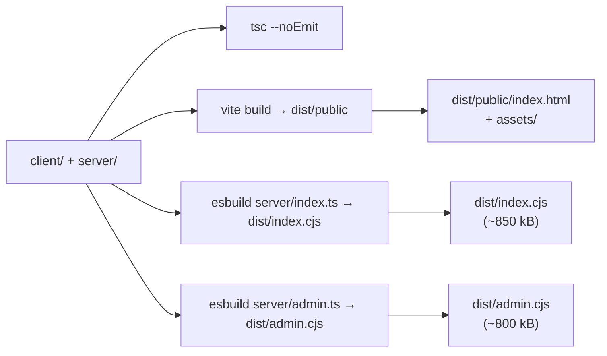

# M5cet — vývojářský průvodce

Stručná mapa kódu, build flow a konvence pro nové přispěvatele.

## Struktura repozitáře

```
.
├── client/                  React + Vite frontend
│   ├── public/              static assets, manifest, sw.js
│   └── src/
│       ├── App.tsx          hlavní komponenta (signaling, mesh, šifrování)
│       ├── main.tsx         vstupní bod
│       ├── components/      sdílené UI (Modal, panels, M5Logo, ui/*)
│       ├── hooks/           use-mobile, use-toast
│       ├── lib/             feature moduly (calls, files, push, nfc, ...)
│       └── pages/           not-found
├── server/                  Express + WS backend
│   ├── index.ts             entry pro hlavní službu
│   ├── routes.ts            HTTP + WS routes (signaling broker)
│   ├── admin.ts             samostatná admin služba
│   ├── routes-admin-shared.ts shared queue + audit + allowlist
│   ├── modules.ts           module manifest publisher
│   ├── push.ts              web-push wrapper
│   ├── events.ts            optional metadata logging
│   ├── static.ts            production static handler
│   └── vite.ts              dev middleware
├── shared/schema.ts         cross-cut typy
├── admin-ui/public/         Admin GUI (single-page HTML)
├── docs/                    tato dokumentace
├── script/build.ts          Vite + esbuild orchestrátor
├── install.sh               interaktivní installer
├── docker-compose.yml       app + admin + admin-ui
├── Dockerfile               app image
└── Dockerfile.admin         admin image
```

## Toolchain

- Node 20.x (vyžadováno v `engines`).
- TypeScript 5.6, strict mode (`tsconfig.json`).
- Vite 7 pro client, esbuild 0.25 pro server bundle.
- React 18, Wouter (router), Tailwind 3.4, Radix UI primitivy.

## Skripty

```bash
npm ci                # čistá instalace
npm run dev           # dev server: tsx server/index.ts + Vite middleware
npm run check         # tsc --noEmit
npm run build         # client (Vite) + server bundle (esbuild minified)
npm start             # node dist/index.cjs (production)
npm run admin         # node dist/admin.cjs
npm run admin:dev     # ENABLE_ADMIN=1 tsx server/admin.ts
npm run health        # curl /api/health, exit 1 on fail
npm run db:push       # drizzle-kit (zatím není v default flow)
```

## Konvence

### TypeScript

- `strict: true`. Každá nová funkce má explicitní return typ, nebo je TS
  odvodí (preferuj prosté `function name(args): RetType`).
- Žádné `any`. Pro neznámou strukturu z wire `unknown` + zod.
- Veřejné funkce v `lib/*` mají JSDoc se shrnutím a zmínkou o limitech.

### Komentáře

- **Module header** vysvětluje *proč modul existuje a co (ne)dělá*.
- **JSDoc** nad veřejnými funkcemi se zmínkou o:
  - co očekávají na vstupu a co vrací,
  - bezpečnostních invariantech (např. "nikdy necachovat IV"),
  - prohlížečových omezeních,
  - dependencích na ENV / capability.
- **Triviální** komentáře nepiš. Když by čtenář pochopil bez nich, jsou šum.

### Styly

- Tailwind utilities, žádné CSS-in-JS.
- Sdílené UI primitivy v `client/src/components/ui/*` (shadcn-style).
- Témata jsou data-attribute na `<html>`, viz `lib/themes.ts`.

### State

- Žádné Redux. `useState` + custom hooks + `@tanstack/react-query` pro fetch.
- WebSocket ref a peer mapa žije v `App.tsx` (single component).

### Crypto

- **Vždy** používat `crypto.subtle`. Nikdy ručně implementovat AES nebo HMAC.
- Klíč je `extractable: false`. Salt prefix je verzovaný (`CipherRoom:v1:`).
- IV vždy přes `crypto.getRandomValues(new Uint8Array(12))`.

### WebSocket / wire

- Server validuje `type` field a discriminates message kind. Nikdy `eval`
  na client payloadu.
- Admin příkazy procházejí allowlist v `routes-admin-shared.ts`.

## Build flow



`script/build.ts` drží **allowlist** balíčků, které se bundlují (např. `ws`,
`express`, `web-push`). Ostatní zůstávají externí, takže jsou
loadovány z `node_modules` runtime.

## Spouštění a testování

```bash
# Dev
npm run dev
# → vite middleware obslouží React HMR
# → server běží na PORT (default 5000)

# Smoke
PORT=5099 NODE_ENV=production node dist/index.cjs &
curl http://127.0.0.1:5099/api/health
kill %1

# Admin smoke
ADMIN_API_TOKEN=test ENABLE_ADMIN=1 ADMIN_PORT=5098 node dist/admin.cjs &
curl http://127.0.0.1:5098/admin/health
curl -H "Authorization: Bearer test" http://127.0.0.1:5098/admin/metrics
kill %1
```

Browser smoke (manuální):

1. `npm run dev`.
2. Otevřít dvě okna `http://localhost:5000` v Chromium.
3. V obou stejné `room` + `passphrase`.
4. Poslat zprávu, ověřit doručení.
5. Otevřít devtools → Network → `/ws` frame: vidět typy `signal`/`ping`,
   nikdy ne plaintext.

## Přidání nového modulu

1. Vytvořit `client/src/lib/<feature>.ts` s module header.
2. Přidat detection do `lib/capabilities.ts` (pokud má browser-specific limity).
3. Vystavit přes `lib/cipherroom-api.ts` (pokud chceme embedder API).
4. Přidat manifest entry do `server/modules.ts`.
5. Doplnit user-facing string do `lib/i18n.ts` (cs/en/de).
6. Připsat sekci do README a vlastní `docs/<feature>.md`.

## Branching

- `master` — stabilní release line.
- `feature/m5cet-*` — vývoj jednotlivých iterací.
- `release/m5cet-*-hardening` — release candidate, content freeze.
- `release/m5cet-v-next-hardening` — current release-hardening branch
  (verze `2.1.0-rc.1`).

## Kontrolní seznam před PR

- [ ] `npm run check` čistý.
- [ ] `npm run build` prochází.
- [ ] Smoke `/api/health` 200, `/admin/health` 200.
- [ ] Nové public funkce mají JSDoc.
- [ ] Změny v wire formátu jsou verzované (např. nový salt prefix).
- [ ] Změny chování zaznamenané v `CHANGELOG.md`.
