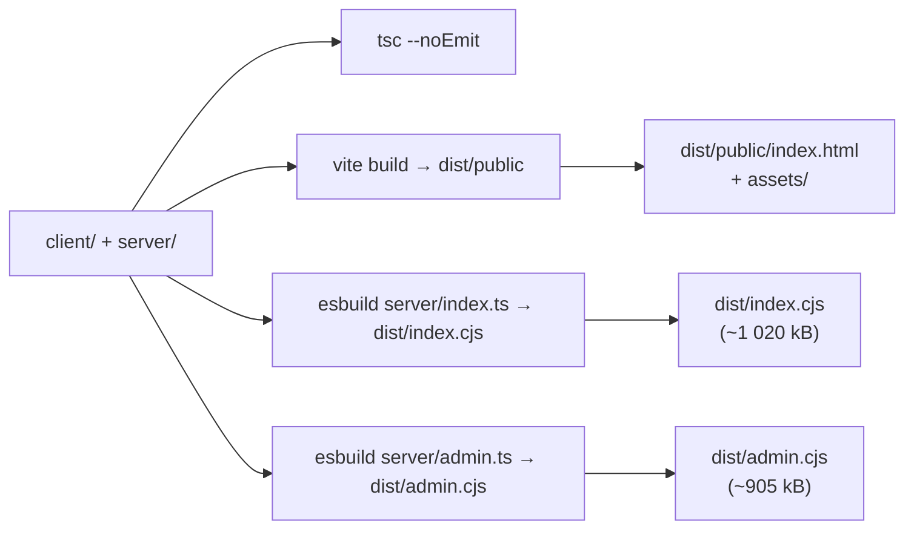

# M5cet — vývojářský průvodce

Stručná mapa kódu, build flow a konvence pro nové přispěvatele.

## Struktura repozitáře

```
.
├── client/                  React + Vite frontend
│   ├── public/              static assets, manifest, sw.js
│   └── src/
│       ├── App.tsx          hlavní komponenta (signaling, mesh, šifrování)
│       ├── main.tsx         vstupní bod
│       ├── components/      Modal, panels, MainMenu, TransferCard, M5Logo
│       ├── lib/             feature moduly:
│       │   ├── crypto.ts            odvození klíče, AES-GCM obálka, base64 kodek
│       │   ├── connection-keeper.ts heartbeat + reconnect signalizace
│       │   ├── file-transfer.ts     chunked šifrovaný přenos (P2P / proxy)
│       │   ├── fingerprint.ts       TOFU otisky peerů
│       │   └── rtc, push, nfc, speech, maps, preferences, i18n, themes, ...
├── server/                  Express + WS backend
│   ├── env.ts               načtení .env (process.loadEnvFile) — vždy 1. import
│   ├── index.ts             entry pro hlavní službu
│   ├── routes.ts            HTTP + WS routes (signaling broker)
│   ├── file-proxy.ts        relay šifrovaných chunků, když P2P kanál není
│   ├── retention.ts         retenční politika metadat
│   ├── admin.ts             samostatná admin služba
│   ├── routes-admin-shared.ts shared queue + audit + allowlist
│   ├── modules.ts           module manifest publisher
│   ├── push.ts              web-push wrapper
│   ├── events.ts            optional metadata logging
│   ├── static.ts            production static handler
│   └── vite.ts              dev middleware
├── admin-ui/public/         Admin GUI (single-page HTML)
├── docs/                    tato dokumentace
├── test/                    vitest (*.test.ts, *.test.tsx) + e2e/ (Playwright)
├── scripts/                 pre-commit-check.sh (guard MainMenu)
├── .githooks/pre-commit     wrapper guardu (git config core.hooksPath .githooks)
├── .github/workflows/ci.yml typecheck · guard · vitest · build
├── script/build.ts          Vite + esbuild orchestrátor
├── install.sh / update.sh / uninstall.sh   instalační sada (viz INSTALL.md)
├── installer/lib/           sdílená knihovna skriptů (bash >= 3.2)
├── docker-compose.yml       referenční: app + admin (profil) ze stejného image
└── Dockerfile               jediný image; admin = jiný command
```

## Toolchain

- **Node ≥ 22** (`engines`); CI a Docker na 24 LTS. Node 20 je od 04/2026 EOL.
- **TypeScript 7** (nativní kompilátor), strict. Pozor: `baseUrl` už
  neexistuje — aliasy `@/*` a `@shared/*` jsou v `paths` relativně k tsconfig.
  `"jsx": "react-jsx"` je povinné (hlídá ho pre-commit guard).
- **Vite 8** (rolldown + oxc minifikace) pro klienta, **esbuild 0.28** pro
  server bundly, **Vitest 5** + happy-dom + Testing Library pro testy.
- **React 19**, Tailwind 3.4 (bez pluginů), lucide-react 1.x. Žádný router,
  žádná knihovna na fetch/cache, žádné Radix ani shadcn komponenty — aplikace
  je jedna obrazovka s modálními panely a vlastními třídami v `index.css`.
- **Express 5** + `ws` 8 + Helmet 8 + express-rate-limit 8 + web-push.
- Bez `dotenv`: `.env` čte `server/env.ts` přes `process.loadEnvFile()`.

Runtime závislostí je záměrně jen **8**: `express`, `express-rate-limit`,
`helmet`, `web-push`, `ws`, `react`, `react-dom`, `lucide-react`. Novou
přidávejte jen s důvodem; nepoužitý kód v `client/src` navíc nafukuje CSS,
protože Tailwind skenuje názvy tříd ve všech souborech. Express 5 poznámka: holé `"*"` v cestě
vyhazuje výjimku — catch-all se píše `"/{*path}"`.

## Skripty

```bash
npm ci                # čistá instalace
npm run dev           # dev server: tsx server/index.ts + Vite middleware
npm run check         # tsc --noEmit
npm test              # vitest run — unit + komponentové testy
npm run test:watch    # vitest watch
npm run test:e2e      # Playwright: UI smoke + dva peeři proti reálnému serveru
                      # (nejdřív npm run build; Chromium: npx playwright install chromium,
                      #  nebo image mcr.microsoft.com/playwright — viz CI)
npm run check:menu    # guard invariantů MainMenu (= pre-commit hook)
npm run build         # client (Vite) + oba server bundly (esbuild), souběžně
npm start             # node dist/index.cjs (production)
npm run admin         # node dist/admin.cjs
npm run admin:dev     # ENABLE_ADMIN=1 tsx server/admin.ts
npm run health        # curl /api/health, exit 1 on fail
```

## Konvence

### TypeScript

- `strict: true`. Každá nová funkce má explicitní return typ, nebo je TS
  odvodí (preferuj prosté `function name(args): RetType`).
- Žádné `any`. Neznámá struktura z wire je `unknown` a validuje se ručními
  guardy (`safeString`, `safeId`, `sanitizeMeta` v `server/util.ts`). `zod`
  v projektu není.
- Bajty předávané do `crypto.subtle` / `Blob` typuj jako `Bytes`
  (`Uint8Array<ArrayBuffer>` z `lib/crypto.ts`) — holé `Uint8Array` zahrnuje
  i SharedArrayBuffer a TS ≥ 5.7 ho pro WebCrypto právem odmítne.
- Veřejné funkce v `lib/*` mají JSDoc se shrnutím a zmínkou o limitech.

### Komentáře

- **Module header** vysvětluje *proč modul existuje a co (ne)dělá*.
- **JSDoc** nad veřejnými funkcemi se zmínkou o:
  - co očekávají na vstupu a co vrací,
  - bezpečnostních invariantech (např. "nikdy necachovat IV"),
  - prohlížečových omezeních,
  - dependencích na ENV / capability.
- **Triviální** komentáře nepiš. Když by čtenář pochopil bez nich, jsou šum.

### Styly

- Tailwind utilities, žádné CSS-in-JS.
- Vlastní komponentové třídy (`.composer-*`, `.user-chip`, `.menu-*`) žijí
  v `client/src/index.css` a berou barvy z tokenů tématu (`hsl(var(--…))`),
  takže fungují ve všech třech tématech bez úprav.
- Témata jsou data-attribute na `<html>`, viz `lib/themes.ts`.

### State

- Žádné Redux ani query knihovna. `useState` + refy; `fetch` přímo.
- **Hooky jen na úrovni komponenty.** Asynchronní handlery čtou aktuální stav
  přes ref (`transfersRef`), ne voláním hooku uvnitř handleru — to za běhu
  vyhodí výjimku (skutečná chyba, kterou odhalil až e2e test).
- WebSocket ref a peer mapa žije v `App.tsx` (single component).

### Crypto

- **Vždy** používat `crypto.subtle`. Nikdy ručně implementovat AES nebo HMAC.
- Klíč je `extractable: false`. Salt prefix je verzovaný (`CipherRoom:v1:`).
- IV vždy přes `crypto.getRandomValues(new Uint8Array(12))`. Nikdy ho
  necachuj, neodvozuj z čítače a nesdílej mezi rámci.
- Obálka na drátě je **přesně** `{ iv, ciphertext }` (base64). Nic dalšího do
  ní nepatří — hlídá to test „emits only iv + ciphertext".
- Base64 jen přes `toBase64` / `fromBase64` z `lib/crypto.ts` (nativní
  ES2026 API s fallbackem); nepiš další kopie.
- Klíč se odvozuje jednou za join. Necachuj ho podle místnosti ani passphrase.

### WebSocket / wire

- Server validuje `type` field a discriminates message kind. Nikdy `eval`
  na client payloadu.
- Admin příkazy procházejí allowlist v `routes-admin-shared.ts`.

## Build flow


```mermaid
flowchart LR
    Sources[client/ + server/]
    TSC[tsc --noEmit]
    Vite[vite build → dist/public]
    Esbuild_app[esbuild server/index.ts → dist/index.cjs]
    Esbuild_admin[esbuild server/admin.ts → dist/admin.cjs]
    Sources --> TSC
    Sources --> Vite
    Sources --> Esbuild_app
    Sources --> Esbuild_admin
    Vite --> Static["dist/public/index.html<br/>+ assets/"]
    Esbuild_app --> Out1["dist/index.cjs<br/>(~1 020 kB)"]
    Esbuild_admin --> Out2["dist/admin.cjs<br/>(~905 kB)"]
```

`script/build.ts` drží **allowlist** balíčků, které se bundlují: `express`,
`express-rate-limit`, `helmet`, `web-push`, `ws` — tedy všechno, co server za
běhu potřebuje. `dist/*.cjs` jsou proto soběstačné a poběží i bez
`node_modules` (toho využívá runtime stage v Dockerfile). Externí zůstávají
jen volitelné nativní addony (`bufferutil`), které se do bundlu dát nedají.
Oba server bundly staví jedno volání esbuild, souběžně s Vite.

## Spouštění a testování

```bash
# Dev
npm run dev
# → vite middleware obslouží React HMR
# → server běží na PORT (default 5000)

# Smoke
PORT=5099 NODE_ENV=production node dist/index.cjs &
curl http://127.0.0.1:5099/api/health
kill %1

# Admin smoke
ADMIN_API_TOKEN=test ENABLE_ADMIN=1 ADMIN_PORT=5098 node dist/admin.cjs &
curl http://127.0.0.1:5098/admin/health
curl -H "Authorization: Bearer test" http://127.0.0.1:5098/admin/metrics
kill %1
```

Browser smoke (manuální):

1. `npm run dev`.
2. Otevřít dvě okna `http://localhost:5000` v Chromium.
3. V obou stejné `room` + `passphrase`.
4. Poslat zprávu, ověřit doručení.
5. Otevřít devtools → Network → `/ws` frame: vidět typy `signal`/`ping`,
   nikdy ne plaintext.

## Přidání nového modulu

1. Vytvořit `client/src/lib/<feature>.ts` s module header.
2. Přidat detection do `lib/capabilities.ts` (pokud má browser-specific limity).
3. Vystavit přes `lib/cipherroom-api.ts` (pokud chceme embedder API).
4. Přidat manifest entry do `server/modules.ts`.
5. Doplnit user-facing string do `lib/i18n.ts` (cs/en/de).
6. Připsat sekci do README a vlastní `docs/<feature>.md`.

## Pravidla, která se vyplatila

- **Tvrzení o výkonu jen s měřením** — viz [`optimizations.md`](optimizations.md).
- **Krypto se nepřepisuje „pro rychlost".** Kontrakt `lib/crypto.ts` hlídají
  testy wire formátu; změna soli nebo tvaru obálky je verzovaná migrace.
- **Dokumentace se ověřuje proti kódu, ne naopak.** Ukázky kódu v docs nejsou
  zdroj pravdy.
- **Zelené testy nestačí, když se nespouští.** `.tsx` testy i celá e2e sada
  dlouho tiše neběžely. Sledujte *počet* testů, ne jen „passed".
- **Commit podle přečteného seznamu souborů**, ne `git add -A` — v pracovním
  stromu mohou být cizí rozpracované změny.

## Branching

- `master` — stabilní release line.
- `feature/m5cet-*` — vývoj jednotlivých iterací.
- `release/m5cet-*-hardening` — release candidate, content freeze.

## Kontrolní seznam před PR

- [ ] `npm run check` čistý.
- [ ] `npm test` zelené — a **počet** souborů/testů neklesl (aktuálně 10 / 106).
- [ ] `npm run test:e2e` zelené (10 testů), pokud se měnil `App.tsx`.
- [ ] `shellcheck -x -S warning install.sh update.sh uninstall.sh installer/lib/*.sh`, pokud se měnil instalátor.
- [ ] `npm run check:menu` 8/8.
- [ ] `npm run build` prochází.
- [ ] Smoke `/api/health` 200, `/admin/health` 200.
- [ ] Nové public funkce mají JSDoc.
- [ ] Změny v wire formátu jsou verzované (např. nový salt prefix).
- [ ] Změny chování zaznamenané v `CHANGELOG.md`.
